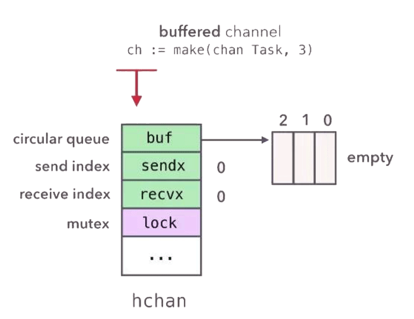
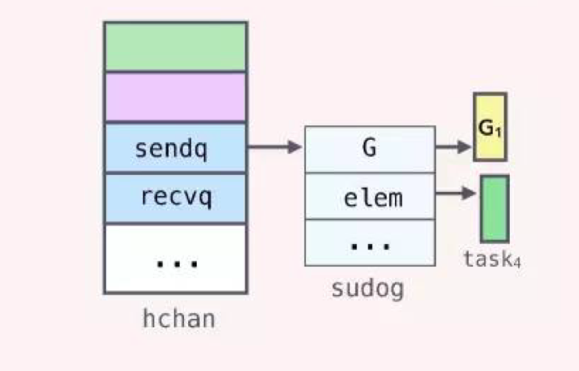
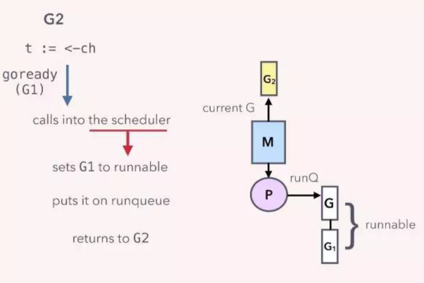

# 1. channel 

源码路径： https://github.com/golang/go/blob/master/src/runtime/chan.go

```go
type hchan struct {
	qcount   uint           // total data in the queue
	dataqsiz uint           // size of the circular queue
	buf      unsafe.Pointer // points to an array of dataqsiz elements
	elemsize uint16
	closed   uint32
	elemtype *_type // element type
	sendx    uint   // send index
	recvx    uint   // receive index
	recvq    waitq  // list of recv waiters
	sendq    waitq  // list of send waiters

	// lock protects all fields in hchan, as well as several
	// fields in sudogs blocked on this channel.
	//
	// Do not change another G's status while holding this lock
	// (in particular, do not ready a G), as this can deadlock
	// with stack shrinking.
	lock mutex
}
```

<!-- more -->

### 1.1 说明

buf 指向底层循环数组，只有缓冲型的 channel 才有。

sendx，recvx 均指向底层循环数组，表示当前可以发送和接收的元素位置索引值（相对于底层数组）。

sendq，recvq 分别表示被阻塞的 goroutine，这些 goroutine 由于尝试读取 channel 或向 channel 发送数据而被阻塞。

lock 用来保证每个读 channel 或写 channel 的操作都是原子的。

底层有个 buf, 有缓冲的 channel 才有, 还有一个发送和接收的索引, 发送和接收的 goutine.

### 1.2 使用

```go
ch := make(chan Task, 3)
```

创建channel实际上就是在内存中实例化了一个`hchan`的结构体，并返回一个ch指针，我们使用过程中channel在函数之间的传递都是用的这个指针，这就是为什么函数传递中无需使用channel的指针，而直接用channel就行了，因为channel本身就是一个指针。

+ 发送中




+ 发送满

  当G1向buf已经满了的ch发送数据的时候，当runtine检测到对应的hchan的buf已经满了，会通知调度器，调度器会将G1的状态设置为waiting, 移除与线程M的联系，然后从P的runqueue中选择一个goroutine在线程M中执行，此时G1就是阻塞状态，但是不是操作系统的线程阻塞，所以这个时候只用消耗少量的资源。

  ```go
  type hchan struct { 
      ... 
      recvq waitq // list of recv waiters 
      sendq waitq // list of send waiters 
      ... 
  } 
  // 
  type waitq struct { 
      first *sudog 
      last *sudog 
  } 
  ```

  实际上，当G1变为waiting状态后，会创建一个代表自己的sudog的结构，然后放到sendq这个list中，sudog结构中保存了channel相关的变量的指针(如果该Goroutine是sender，那么保存的是待发送数据的变量的地址，如果是receiver则为接收数据的变量的地址)

  

+ 取出数据

  当G2从ch中接收一个数据时，会通知调度器，设置G1的状态为runnable，然后将加入P的runqueue里，等待线程执行.

  


# 2. goroutine

//TODO:

# 3. interface

源码路径： https://github.com/golang/go/blob/master/src/runtime/runtime2.go

```go
type iface struct {
	tab  *itab
	data unsafe.Pointer
}

type eface struct {
	_type *_type
	data  unsafe.Pointer
}
```

继续看源码: https://github.com/golang/go/blob/master/src/runtime/type.go

```go

type _type struct {
	size       uintptr
	ptrdata    uintptr // size of memory prefix holding all pointers
	hash       uint32
	tflag      tflag
	align      uint8
	fieldAlign uint8
	kind       uint8
	// function for comparing objects of this type
	// (ptr to object A, ptr to object B) -> ==?
	equal func(unsafe.Pointer, unsafe.Pointer) bool
	// gcdata stores the GC type data for the garbage collector.
	// If the KindGCProg bit is set in kind, gcdata is a GC program.
	// Otherwise it is a ptrmask bitmap. See mbitmap.go for details.
	gcdata    *byte
	str       nameOff
	ptrToThis typeOff
}
```


### 3.1 介绍

根据 interface 是否包含有 method，底层实现上用两种 struct 来表示：iface 和 eface。`eface`表示不含 method 的 interface 结构，或者叫 empty interface。

`iface` 表示 non-empty interface 的底层实现。相比于 empty interface，non-empty 要包含一些 method。method 的具体实现存放在 itab.fun 变量里。如果 interface 包含多个 method，这里只有一个 fun 变量怎么存呢？这个下面再细说。


### 3.2 itab

```go
type itab struct {
	inter *interfacetype
	_type *_type
	hash  uint32 // copy of _type.hash. Used for type switches.
	_     [4]byte
	fun   [1]uintptr // variable sized. fun[0]==0 means _type does not implement inter.
}
```

+ interfacetype

   interfacetype 包含了一些关于 interface 本身的信息，比如 package path，包含的 method。

  ```go
  type interfacetype struct {
      typ     _type
      pkgpath name
      mhdr    []imethod
  }

  type imethod struct {   //这里的 method 只是一种函数声明的抽象，比如  func Print() error
      name nameOff
      ityp typeOff
  }
  ```

+ _type 

  _type 表示 concrete type。

+ fun

  fun 表示的 interface 里面的 method 的具体实现。

  比如 interface type 包含了 method A, B，则通过 fun 就可以找到这两个 method 的具体实现。这里有个问题 fun 是长度为 1 的 uintptr 数组，那么怎么表示多个 method 呢？我们看一下 runtime 包的 additab 函数。

  ```go
  func additab(m *itab, locked, canfail bool) {
      ...
      *(*unsafe.Pointer)(add(unsafe.Pointer(&m.fun[0]), uintptr(k)*sys.PtrSize)) = ifn
      ...
  }
  ```

  上面的代码的意思是在 fun[0] 的地址后面依次写入其他 method 对应的函数指针。熟悉 C++ 的同学可以类比 C++ 的虚函数表指针来看。

# 4. 参考资料

+ https://zhuanlan.zhihu.com/p/27917262
+ https://draveness.me/golang/docs/part3-runtime/ch06-concurrency/golang-channel/
+ https://www.cnblogs.com/qcrao-2018/p/11220651.html
+ https://draveness.me/golang/docs/part2-foundation/ch04-basic/golang-interface
+ http://legendtkl.com/2017/07/01/golang-interface-implement/
