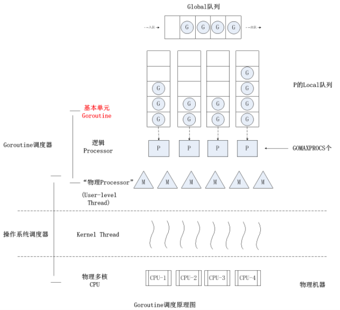
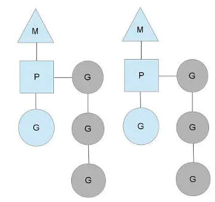
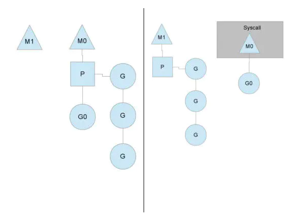
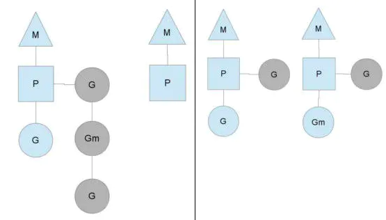

# 1. 基础术语

### 1.1 并发和并行

+ 并发: 一个cpu上能同时执行多项任务，在很短时间内，cpu来回切换任务执行(在某段很短时间内执行程序a，然后又迅速得切换到程序b去执行)，有时间上的重叠（宏观上是同时的，微观仍是顺序执行）,这样看起来多个任务像是同时执行，这就是并发。

+ 并行: 当系统有多个CPU时,每个CPU同一时刻都运行任务，互不抢占自己所在的CPU资源，同时进行，称为并行。

<!-- more -->

### 1.2 进程,线程和协程

+ **进程**: cpu在切换程序的时候，如果不保存上一个程序的状态（也就是我们常说的context--上下文），直接切换下一个程序，就会丢失上一个程序的一系列状态，于是引入了进程这个概念，用以划分好程序运行时所需要的资源。因此进程就是一个程序运行时候的所需要的基本资源单位（也可以说是程序运行的一个实体）。
+ **线程**: cpu切换多个进程的时候，会花费不少的时间，因为切换进程需要切换到内核态，而每次调度需要内核态都需要读取用户态的数据，进程一旦多起来，cpu调度会消耗一大堆资源，因此引入了线程的概念，线程本身几乎不占有资源，他们共享进程里的资源，内核调度起来不会那么像进程切换那么耗费资源。
+ **协程**: 协程拥有自己的寄存器上下文和栈。协程调度切换时，将寄存器上下文和栈保存到其他地方，在切回来的时候，恢复先前保存的寄存器上下文和栈。因此，协程能保留上一次调用时的状态（即所有局部状态的一个特定组合），每次过程重入时，就相当于进入上一次调用的状态，换种说法：进入上一次离开时所处逻辑流的位置。线程和进程的操作是由程序触发系统接口，最后的执行者是系统；协程的操作执行者则是用户自身程序，goroutine也是协程。


# 2. 协程

### 2.1 协程的意义

goroutine是Go语言实现的用户态线程，主要用来解决操作系统线程太“重”的问题，所谓的太重，主要表现在以下两个方面：

- 创建和切换太重：操作系统线程的创建和切换都需要进入内核，而进入内核所消耗的性能代价比较高，开销较大；
- 内存使用太重：一方面，为了尽量避免极端情况下操作系统线程栈的溢出，内核在创建操作系统线程时默认会为其分配一个较大的栈内存（虚拟地址空间，内核并不会一开始就分配这么多的物理内存），然而在绝大多数情况下，系统线程远远用不了这么多内存，这导致了浪费；另一方面，栈内存空间一旦创建和初始化完成之后其大小就不能再有变化，这决定了在某些特殊场景下系统线程栈还是有溢出的风险。

相对的，用户态的goroutine则轻量得多：

- goroutine是用户态线程，其创建和切换都在用户代码中完成而无需进入操作系统内核，所以其开销要远远小于系统线程的创建和切换；
- goroutine启动时默认栈大小只有**2k**，这在多数情况下已经够用了，即使不够用，goroutine的栈也会自动扩大，同时，如果栈太大了过于浪费它还能自动收缩，这样既没有栈溢出的风险，也不会造成栈内存空间的大量浪费。

### 2.2 工作原理

goroutine建立在操作系统线程基础之上，它与操作系统线程之间实现了一个**多对多(M:N)**的两级线程模型。

这里的 M:N 是指M个goroutine运行在N个操作系统线程之上，内核负责对这N个操作系统线程进行调度，而这N个系统线程又负责对这M个goroutine进行调度和运行。

所谓的对goroutine的调度，是指程序代码按照一定的算法在适当的时候挑选出合适的goroutine并放到CPU上去运行的过程，这些负责对goroutine进行调度的程序代码我们称之为goroutine调度器。

用极度简化了的伪代码来描述goroutine调度器的工作流程大概是下面这个样子：

```go
// 程序启动时的初始化代码
for i := 0; i < N; i++ { // 创建N个操作系统线程执行schedule函数
    create_os_thread(schedule) // 创建一个操作系统线程执行schedule函数
}

//schedule函数实现调度逻辑
func schedule() {
   for { //调度循环
         // 根据某种算法从M个goroutine中找出一个需要运行的goroutine
         g := find_a_runnable_goroutine_from_M_goroutines()
         run_g(g) // CPU运行该goroutine，直到需要调度其它goroutine才返回
         save_status_of_g(g) // 保存goroutine的状态，主要是寄存器的值
    }
}

```

这段伪代码表达的意思是，程序运行起来之后创建了N个由内核调度的操作系统线程（为了方便描述，我们称这些系统线程为工作线程）去执行shedule函数，而schedule函数在一个调度循环中反复从M个goroutine中挑选出一个需要运行的goroutine并跳转到该goroutine去运行，直到需要调度其它goroutine时才返回到schedule函数中通过save_status_of_g保存刚刚正在运行的goroutine的状态然后再次去寻找下一个goroutine。

### 2.3 MPG 协程并发模型 (线程,上下文,协程)

Go语言中支撑整个scheduler实现的主要有4个重要结构，分别是M、G、P、Sched。

- Sched结构就是调度器，它维护有存储M和G的队列以及调度器的一些状态信息等。
- M结构是Machine，系统线程，一个M就是一个线程, 它由操作系统管理的，goroutine就是跑在M之上的； M是一个很大的结构，里面维护小对象内存cache（mcache）、当前执行的goroutine、随机数发生器等等非常多的信息。
- P结构是Processor，处理器，它的主要用途就是用来执行goroutine的，它维护了一个goroutine队列，即runqueue。Processor是让我们从N:1调度到M:N调度的重要部分。
- G代表一个goroutine, 实现的核心结构，它包含了栈，指令指针，以及其他对调度goroutine很重要的信息，例如其阻塞的channel。


### 2.3 M-P-G三者的关系与特点

1. 每一个运行的 M 都必须绑定一个 P，线程M 创建后会去检查并执行G (goroutine)对象

   每一个 P 保存着一个协程G 的**队列**,  除了每个 P 自身保存的 G 的队列外，调度器还拥有一个全局的 G 队列, G任务的执行顺序是，先从本地队列找，本地没有则从全局队列找

2. P 的个数就是`GOMAXPROCS`（最大256），启动时固定的，一般不修改,  P 是用一个全局数组（255）来保存的，并且维护着一个全局的 P 空闲链表. M 的个数和 P 的个数不一定一样多（会有休眠的M 或 P不绑定M ）


### 2.4 Gorutine从入队到执行

1. 当我们创建一个G对象，就是 `gorutine`，它会加入到本地队列或者全局队列
2. 如果还有空闲的P，则创建一个M 绑定该 P ，注意！这里，P 此前必须还没绑定过M 的，否则不满足空闲的条件。
3. 新创建的 M 所绑的 P 的初始化队列会从其他 G 队列中取任务过来
4. M 会启动一个`底层线程`，`循环执行`能找到的 G 任务。当前 M 所绑的 P 队列中找, 去别的 P 的队列中找, 去全局 G 队列中找
5. 程序启动的时候，首先跑的是主线程，然后这个主线程会绑定第一个 P, 入口 main 函数，其实是作为一个 goroutine 来执行


### 2.5 执行步骤

协程的切换时间片是10ms，也就是说 goroutine 最多执行10ms就会被 M 切换到下一个 G。这个过程，又被称为 `中断，挂起`。

中断的时候将寄存器里的栈信息，保存到自己的 G 对象里面,  当再次轮到自己执行时，将自己保存的栈信息复制到寄存器里面，这样就接着上次之后运行。

go程序启动时会首先创建一个特殊的内核线程 `sysmon`，用来监控和管理，其内部是一个循环：

+ 记录所有 P 的 G 任务的`计数 schedtick`，schedtick会在每执行一个G任务后递增
+ 如果检查到 `schedtick` 一直没有递增，说明这个 P 一直在执行同一个 G 任务，如果超过10ms，就在这个G任务的栈信息里面加一个 tag 标记
+ 然后这个 G 任务在执行的时候，如果遇到非内联函数调用，就会检查一次这个标记，然后中断自己，把自己加到队列末尾，执行下一个G
+ 如果没有遇到`非内联函数` 调用（有时候正常的小函数会被优化成内联函数）的话，那就会一直执行这个G任务，直到它自己结束；如果是个死循环，并且 GOMAXPROCS=1 的话。那么一直只会只有一个 P 与一个 M，且队列中的其他 G 不会被执行！


### 2.6 GOMAXPROCS

`GOMAXPROCS` 就是 go 中 runtime 包的一个函数。它设置了 P 的最多的个数。这也就直接导致了 M 最多的个数是多少，而 M 的个数就决定了各个 G 队列能同时被多少个 M 线程来进行调取执行！

故，我们一般将 GOMAXPROCS 的个数设置为 CPU 的核数


# TODO: 2. golang 调度模型

### 2.1 调度器的三个基本对象




### 2.2 调度实现



从上图中看，有2个物理线程M，每一个M都拥有一个处理器P，每一个也都有一个正在运行的goroutine。

+ P的数量可以通过GOMAXPROCS() 来设置，它其实也就代表了真正的并发度，即有多少个goroutine可以同时运行。
+ 图中灰色的那些goroutine并没有运行，而是出于ready的就绪态，正在等待被调度。P维护着这个队列（称之为runqueue）
+ Go语言里，启动一个goroutine很容易：go function 就行，所以每有一个go语句被执行，runqueue队列就在其末尾加入一个

### 2.3 线程阻塞

当一个OS线程M0陷入阻塞时（如下图)， 例如协程G0遇到阻塞调用（比如系统调用syscall）超过10ms时 ，这个G0连同M0 会被剥离出P，产生一个新的M1 来接手P(或者从线程缓存中取出)




当MO返回时，它必须尝试取得一个P来运行goroutine，一般情况下，它会从其他的OS线程那里拿一个P过来，如果没有拿到的话，它就把goroutine放在一个global runqueue里，然后自己睡眠（放入线程缓存里）。

所有的P也会周期性的检查global runqueue并运行其中的goroutine，否则global runqueue上的goroutine永远无法执行。 

### 2.4 工作量窃取

P所分配的任务G很快就执行完了（分配不均），这就导致了这个处理器P很忙，但是其他的P还有任务，此时如果global runqueue没有任务G了，那么P不得不从其他的P里拿一些G来执行。

一般来说，如果P从其他的P那里要拿任务的话，一般就拿run queue的一半，这就确保了每个OS线程都能充分的使用，如下图：




# 3. 调度过程

### 3.1 术语

1. **全局队列**（Global Queue）：存放等待运行的G。
2. **P的本地队列**：同全局队列类似，存放的也是等待运行的G，存的数量有限，不超过256个。新建G'时，G'优先加入到P的本地队列，如果队列满了，则会把本地队列中一半的G移动到全局队列。
3. **P列表**：所有的P都在程序启动时创建，并保存在数组中，最多有`GOMAXPROCS`(可配置)个。
4. **M**：线程想运行任务就得获取P，从P的本地队列获取G，P队列为空时，M也会尝试从全局队列**拿**一批G放到P的本地队列，或从其他P的本地队列**偷**一半放到自己P的本地队列。M运行G，G执行之后，M会从P获取下一个G，不断重复下去。

Goroutine调度器和OS调度器是通过M结合起来的，每个M都代表了1个内核线程，OS调度器负责把内核线程分配到CPU的核上执行。


### 3.2 有关P和M的个数问题

1、P的数量：

- 由启动时环境变量`$GOMAXPROCS`或者是由`runtime`的方法`GOMAXPROCS()`决定。这意味着在程序执行的任意时刻都只有`$GOMAXPROCS`个goroutine在同时运行。

2、M的数量:

- go语言本身的限制：go程序启动时，会设置M的最大数量，默认10000.但是内核很难支持这么多的线程数，所以这个限制可以忽略。
- runtime/debug中的SetMaxThreads函数，设置M的最大数量
- 一个M阻塞了，会创建新的M。

M与P的数量没有绝对关系，一个M阻塞，P就会去创建或者切换另一个M，所以，即使P的默认数量是1，也有可能会创建很多个M出来。


### 3.3 P和M何时会被创建

1、P何时创建：在确定了P的最大数量n后，运行时系统会根据这个数量创建n个P。

2、M何时创建：没有足够的M来关联P并运行其中的可运行的G。比如所有的M此时都阻塞住了，而P中还有很多就绪任务，就会去寻找空闲的M，而没有空闲的，就会去创建新的M。


### 3.4 调度器的设计策略

**复用线程**：避免频繁的创建、销毁线程，而是对线程的复用。

+ work stealing机制 当本线程无可运行的G时，尝试从其他线程绑定的P偷取G，而不是销毁线程。

+ hand off机制 当本线程因为G进行系统调用阻塞时，线程释放绑定的P，把P转移给其他空闲的线程执行。

+ 利用并行：`GOMAXPROCS`设置P的数量，最多有`GOMAXPROCS`个线程分布在多个CPU上同时运行。`GOMAXPROCS`也限制了并发的程度，比如`GOMAXPROCS = 核数/2`，则最多利用了一半的CPU核进行并行。

+ 抢占：在coroutine中要等待一个协程主动让出CPU才执行下一个协程，在Go中，一个goroutine最多占用CPU 10ms，防止其他goroutine被饿死，这就是goroutine不同于coroutine的一个地方。

+ 全局G队列：在新的调度器中依然有全局G队列，但功能已经被弱化了，当M执行work stealing从其他P偷不到G时，它可以从全局G队列获取G。


# 4. 其他问题

### 4.1 io密集型增大 GOMAXPROCS有效吗

> 有效

并发一般都是被内核通过时间片或者中断来控制的，一旦遇到IO阻塞或者时间片用完，就会转移线程的使用权。单核不可能有并行，同一时间只能有一个任务在调度。

Go中runtime.GOMAXPROCS可以设置多核执行任务。并行比较适合cpu计算密集型。如果IO密集型使用多核反而会增加cpu切换的成本。

P值设置太小的话，会影响 M 的数量，然后 M 被 IO 阻塞，效率会下降很多。应该配置到硬件线程数目的5倍以上, 最大不要超过1024。


# 5. 参考资料

+ https://studygolang.com/articles/26795
+ https://www.cnblogs.com/sunsky303/p/9705727.html
+ [一道问题引发的golang调度](https://txiner.top/post/一道问题引发的golang调度/)
+ https://my.oschina.net/90design/blog/1837570
+ https://github.com/LeoYang90/Golang-Internal-Notes/blob/master/Go%20%E5%8D%8F%E7%A8%8B%E8%B0%83%E5%BA%A6%E2%80%94%E2%80%94%E5%9F%BA%E6%9C%AC%E5%8E%9F%E7%90%86%E4%B8%8E%E5%88%9D%E5%A7%8B%E5%8C%96.md

