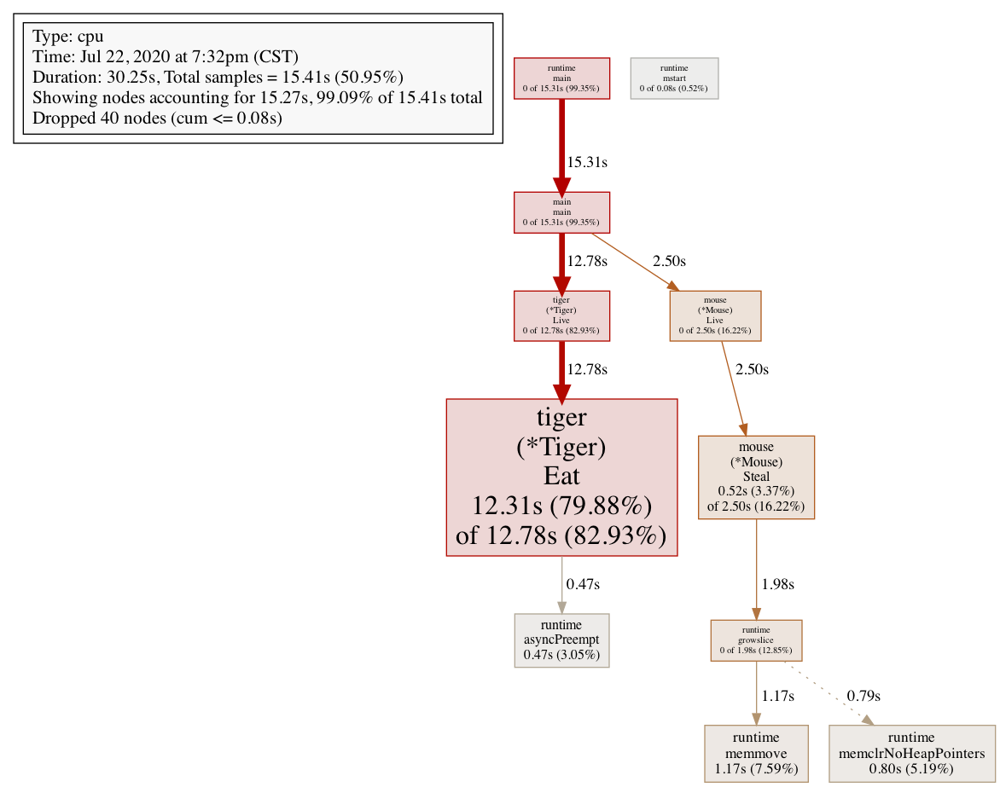
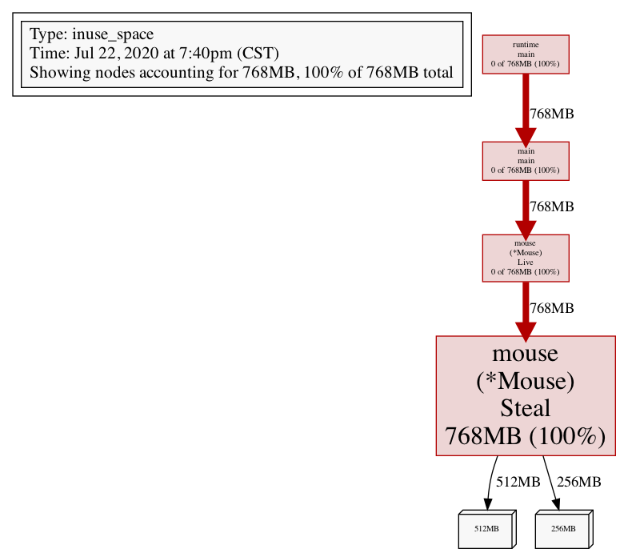
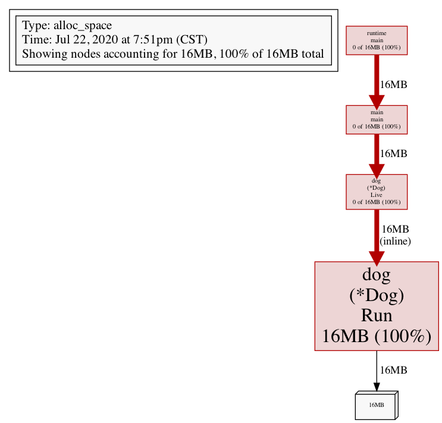
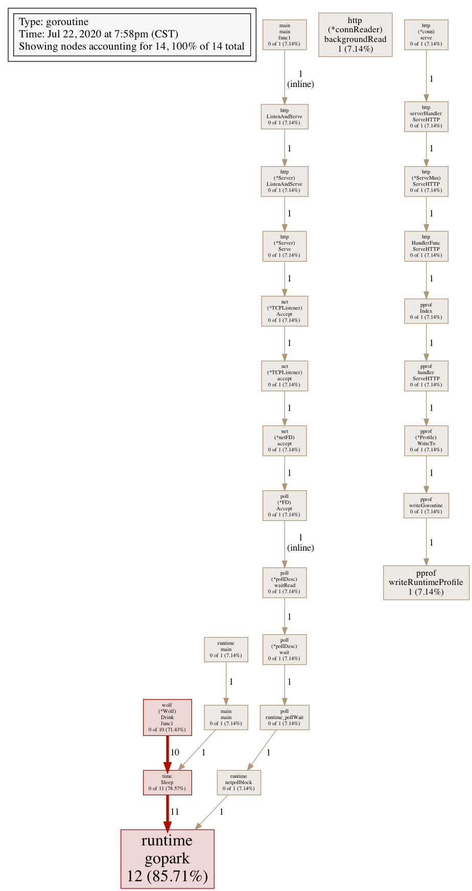
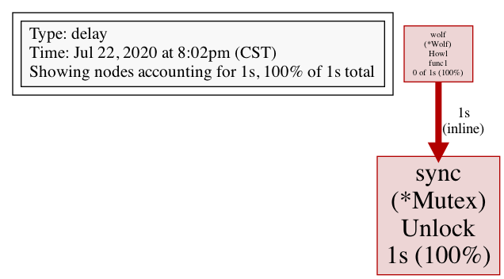
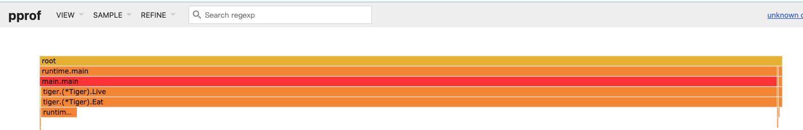

# 1. quick start

```go
package main

import (
	"log"
	"net/http"
	_ "net/http/pprof"
)

func main() {
	log.Println(http.ListenAndServe("localhost:6060", nil))
}

```

<!-- more -->

打开浏览器, 输入 `http://localhost:6060/debug/pprof/`, 内容显示如下:

```bash
/debug/pprof/

Types of profiles available:
Count	Profile
1	allocs # 内存分配情况的采样信息
0	block	 # 阻塞操作情况的采样信息
0	cmdline #	显示程序启动命令及参数
4	goroutine # 当前所有协程的堆栈信息
1	heap # 堆上内存使用情况的采样信息
0	mutex # 锁争用情况的采样信息
0	profile # CPU 占用情况的采样信息
5	threadcreate # 系统线程创建情况的采样信息
0	trace # 程序运行跟踪信息
full goroutine stack dump
```

上面每一个都是一个超链接, 可以点进去, 看到堆栈信息


# 2. 命令查看

+ mac需要安装graphviz

    ```bash
    brew install graphviz
    # 如果一直下载不成功, 修改brew源
    ```
    
+ 查看内存使用情况

  ```bash
  go tool pprof http://localhost:6060/debug/pprof/heap
  # 进入如下gdb交互模式:
  
  # top 查看前10个的内存分配情况
  (pprof) top
  Showing nodes accounting for 1.16MB, 100% of 1.16MB total
        flat  flat%   sum%        cum   cum%
      1.16MB   100%   100%     1.16MB   100%  runtime/pprof.writeGoroutineStacks
           0     0%   100%     1.16MB   100%  net/http.(*ServeMux).ServeHTTP
           0     0%   100%     1.16MB   100%  net/http.(*conn).serve
           0     0%   100%     1.16MB   100%  net/http.HandlerFunc.ServeHTTP
           0     0%   100%     1.16MB   100%  net/http.serverHandler.ServeHTTP
           0     0%   100%     1.16MB   100%  net/http/pprof.Index
           0     0%   100%     1.16MB   100%  net/http/pprof.handler.ServeHTTP
           0     0%   100%     1.16MB   100%  runtime/pprof.(*Profile).WriteTo
           0     0%   100%     1.16MB   100%  runtime/pprof.writeGoroutine
           
           
  # tree 以树状显示
  (pprof) tree
  Showing nodes accounting for 1.16MB, 100% of 1.16MB total
  ----------------------------------------------------------+-------------
        flat  flat%   sum%        cum   cum%   calls calls% + context
  ----------------------------------------------------------+-------------
                                              1.16MB   100% |   runtime/pprof.writeGoroutine
      1.16MB   100%   100%     1.16MB   100%                | runtime/pprof.writeGoroutineStacks
      
      
  # png 以图片格式输出,在当前目录下
  (pprof) png
  Generating report in profile001.png
  
  # svg 生成浏览器可以识别的svg文件,在当前目录下, 直接点开在浏览器查看
  (pprof) png
  Generating report in profile001.png
  ```
  
  
  
  | 列名  | 含义                                                         |
  | ----- | ------------------------------------------------------------ |
  | flat  | 本函数的执行耗时                                             |
  | flat% | flat 占 CPU 总时间的比例。程序总耗时 16.22s, Eat 的 16.19s 占了 99.82% |
  | sum%  | 前面每一行的 flat 占比总和                                   |
  | cum   | 累计量。指该函数加上该函数调用的函数总耗时                   |
  | cum%  | cum 占 CPU 总时间的比例                                      |
  
  


# 3. 实践

```bash
# 下载测试项目
git clone https://github.com/wolfogre/go-pprof-practice

# 执行
go build
./go-pprof-practice
```


### 3.1 排查CPU

```bash
go tool pprof http://localhost:6060/debug/pprof/profile

# top 查看
(pprof) top
Showing nodes accounting for 15270ms, 99.09% of 15410ms total
Dropped 40 nodes (cum <= 77.05ms)
Showing top 10 nodes out of 11
      flat  flat%   sum%        cum   cum%
   12310ms 79.88% 79.88%    12780ms 82.93%  github.com/wolfogre/go-pprof-practice/animal/felidae/tiger.(*Tiger).Eat
    1170ms  7.59% 87.48%     1170ms  7.59%  runtime.memmove
     800ms  5.19% 92.67%      800ms  5.19%  runtime.memclrNoHeapPointers
     520ms  3.37% 96.04%     2500ms 16.22%  github.com/wolfogre/go-pprof-practice/animal/muridae/mouse.(*Mouse).Steal
     470ms  3.05% 99.09%      470ms  3.05%  runtime.asyncPreempt
         0     0% 99.09%    12780ms 82.93%  github.com/wolfogre/go-pprof-practice/animal/felidae/tiger.(*Tiger).Live
         0     0% 99.09%     2500ms 16.22%  github.com/wolfogre/go-pprof-practice/animal/muridae/mouse.(*Mouse).Live
         0     0% 99.09%    15310ms 99.35%  main.main
         0     0% 99.09%     1980ms 12.85%  runtime.growslice
         0     0% 99.09%    15310ms 99.35%  runtime.main
         
         
很明显，CPU 占用过高是 github.com/wolfogre/go-pprof-practice/animal/felidae/tiger.(*Tiger).Eat 造成的。   

# 输入 list Eat，查看问题具体在代码的哪一个位置：

(pprof) list Eat
Total: 15.41s
ROUTINE ======================== github.com/wolfogre/go-pprof-practice/animal/felidae/tiger.(*Tiger).Eat in /Users/liuwei/golang/pkg/mod/github.com/wolfogre/go-pprof-practice@v0.0.0-20190402114113-8ce266a210ee/animal/felidae/tiger/tiger.go
    12.31s     12.78s (flat, cum) 82.93% of Total
         .          .     19:}
         .          .     20:
         .          .     21:func (t *Tiger) Eat() {
         .          .     22:   log.Println(t.Name(), "eat")
         .          .     23:   loop := 10000000000
    12.31s     12.78s     24:   for i := 0; i < loop; i++ {
         .          .     25:           // do nothing
         .          .     26:   }
         .          .     27:}
         .          .     28:
         .          .     29:func (t *Tiger) Drink() {
         

可以看到，是第 24 行那个一百亿次空循环占用了大量 CPU 时间，至此，问题定位成功！


# 输入 web, 会在浏览器弹出一个图
图中，tiger.(*Tiger).Eat 函数的框特别大，箭头特别粗，pprof 生怕你不知道这个函数的 CPU 占用很高。
```




### 3.2 排查内存

```bash
# 把死循环代码注释, 接着测试, 看内存使用, 注意是 heap
go tool pprof http://localhost:6060/debug/pprof/heap

# 看 top
(pprof) top
Showing nodes accounting for 768MB, 100% of 768MB total
      flat  flat%   sum%        cum   cum%
     768MB   100%   100%      768MB   100%  github.com/wolfogre/go-pprof-practice/animal/muridae/mouse.(*Mouse).Steal
         0     0%   100%      768MB   100%  github.com/wolfogre/go-pprof-practice/animal/muridae/mouse.(*Mouse).Live
         0     0%   100%      768MB   100%  main.main
         0     0%   100%      768MB   100%  runtime.main

# 查看占用最多的这个函数
(pprof) list Steal
Total: 768MB
ROUTINE ======================== github.com/wolfogre/go-pprof-practice/animal/muridae/mouse.(*Mouse).Steal in /Users/liuwei/golang/pkg/mod/github.com/wolfogre/go-pprof-practice@v0.0.0-20190402114113-8ce266a210ee/animal/muridae/mouse/mouse.go
     768MB      768MB (flat, cum)   100% of Total
         .          .     45:
         .          .     46:func (m *Mouse) Steal() {
         .          .     47:   log.Println(m.Name(), "steal")
         .          .     48:   max := constant.Gi
         .          .     49:   for len(m.buffer) * constant.Mi < max {
     768MB      768MB     50:           m.buffer = append(m.buffer, [constant.Mi]byte{})
         .          .     51:   }
         .          .     52:}
         
可以看到，这里有个循环会一直向 m.buffer 里追加长度为 1 MiB 的数组，直到总容量到达 1 GiB 为止，且一直不释放这些内存，这就难怪会有这么高的内存占用了。

# 输入 web, 再次在浏览器感受一下, 也可以输入 png
```




### 3.3 排查 GC

```bash
# 频繁的 GC 对 golang 程序性能的影响也是非常严重的。虽然现在这个程序内存使用量并不高，但这会不会是频繁 GC 之后的假象呢？

# 为了获取程序运行过程中 GC 日志，我们需要先退出炸弹程序，再在重新启动前赋予一个环境变量，同时为了避免其他日志的干扰，使用 grep 筛选出 GC 日志查看：
GODEBUG=gctrace=1 ./go-pprof-practice | grep gc

gc 1 @0.003s 2%: 0.004+0.44+0.004 ms clock, 0.004+0.21/0.11/0+0.004 ms cpu, 16->16->0 MB, 17 MB goal, 1 P
gc 2 @6.201s 0%: 0.041+2.9+0.004 ms clock, 0.041+0.31/0/0+0.004 ms cpu, 7->7->6 MB, 8 MB goal, 1 P
gc 3 @6.204s 0%: 0.026+6.2+0.003 ms clock, 0.026+0.23/0/0+0.003 ms cpu, 14->14->12 MB, 15 MB goal, 1 P
gc 4 @6.211s 0%: 0.038+10+0.003 ms clock, 0.038+0.23/0/0+0.003 ms cpu, 28->28->24 MB, 29 MB goal, 1 P
gc 5 @6.223s 0%: 0.023+26+0.002 ms clock, 0.023+0/0.23/0+0.002 ms cpu, 56->56->48 MB, 57 MB goal, 1 P
gc 6 @6.251s 0%: 0.038+47+0.003 ms clock, 0.038+0/0.25/0+0.003 ms cpu, 112->112->96 MB, 113 MB goal, 1 P
gc 7 @6.301s 0%: 0.051+93+0.003 ms clock, 0.051+0/0.24/0+0.003 ms cpu, 224->224->192 MB, 225 MB goal, 1 P
gc 8 @6.407s 0%: 0.023+192+0.004 ms clock, 0.023+0/0.28/0+0.004 ms cpu, 448->448->384 MB, 449 MB goal, 1 P
gc 9 @6.631s 0%: 0.053+397+0.003 ms clock, 0.053+0/0.25/0+0.003 ms cpu, 896->896->768 MB, 897 MB goal, 1 P
gc 10 @7.080s 0%: 0.052+1205+0.003 ms clock, 0.052+0/0.24/0+0.003 ms cpu, 1792->1792->1536 MB, 1793 MB goal, 1 P


可以看到，GC 差不多每 3 秒就发生一次，且每次 GC 都会从 16MB 清理到几乎 0MB，说明程序在不断的申请内存再释放，这是高性能 golang 程序所不允许的。

所以接下来使用 pprof 排查时，我们在乎的不是什么地方在占用大量内存，而是什么地方在不停地申请内存，这两者是有区别的。

#由于内存的申请与释放频度是需要一段时间来统计的，所有我们保证炸弹程序已经运行了几分钟之后，再运行命令：
go tool pprof http://localhost:6060/debug/pprof/allocs

# top
(pprof) top
Showing nodes accounting for 16MB, 100% of 16MB total
      flat  flat%   sum%        cum   cum%
      16MB   100%   100%       16MB   100%  github.com/wolfogre/go-pprof-practice/animal/canidae/dog.(*Dog).Run (inline)
         0     0%   100%       16MB   100%  github.com/wolfogre/go-pprof-practice/animal/canidae/dog.(*Dog).Live
         0     0%   100%       16MB   100%  main.main
         0     0%   100%       16MB   100%  runtime.main
         
# list Run         
(pprof) list Run
Total: 16MB
ROUTINE ======================== github.com/wolfogre/go-pprof-practice/animal/canidae/dog.(*Dog).Run in /Users/liuwei/golang/pkg/mod/github.com/wolfogre/go-pprof-practice@v0.0.0-20190402114113-8ce266a210ee/animal/canidae/dog/dog.go
      16MB       16MB (flat, cum)   100% of Total
         .          .     38:   log.Println(d.Name(), "pee")
         .          .     39:}
         .          .     40:
         .          .     41:func (d *Dog) Run() {
         .          .     42:   log.Println(d.Name(), "run")
      16MB       16MB     43:   _ = make([]byte, 16 * constant.Mi)
         .          .     44:}
         .          .     45:
         .          .     46:func (d *Dog) Howl() {
         .          .     47:   log.Println(d.Name(), "howl")
         .          .     48:}
         
         
可以看到 github.com/wolfogre/go-pprof-practice/animal/canidae/dog.(*Dog).Run 会进行无意义的内存申请，而这个函数又会被频繁调用，这才导致程序不停地进行 GC
```



### 3.4 排查协程泄露

```bash
go tool pprof http://localhost:6060/debug/pprof/goroutine

# top 查看
(pprof) top
Showing nodes accounting for 14, 100% of 14 total
Showing top 10 nodes out of 27
      flat  flat%   sum%        cum   cum%
        12 85.71% 85.71%         12 85.71%  runtime.gopark
         1  7.14% 92.86%          1  7.14%  net/http.(*connReader).backgroundRead
         1  7.14%   100%          1  7.14%  runtime/pprof.writeRuntimeProfile
         0     0%   100%         10 71.43%  github.com/wolfogre/go-pprof-practice/animal/canidae/wolf.(*Wolf).Drink.func1
         0     0%   100%          1  7.14%  internal/poll.(*FD).Accept
         0     0%   100%          1  7.14%  internal/poll.(*pollDesc).wait
         0     0%   100%          1  7.14%  internal/poll.(*pollDesc).waitRead (inline)
         0     0%   100%          1  7.14%  internal/poll.runtime_pollWait
         0     0%   100%          1  7.14%  main.main
         0     0%   100%          1  7.14%  main.main.func1

# list 函数
(pprof) list Drink
Total: 14
ROUTINE ======================== github.com/wolfogre/go-pprof-practice/animal/canidae/wolf.(*Wolf).Drink.func1 in /Users/liuwei/golang/pkg/mod/github.com/wolfogre/go-pprof-practice@v0.0.0-20190402114113-8ce266a210ee/animal/canidae/wolf/wolf.go
         0         10 (flat, cum) 71.43% of Total
         .          .     29:
         .          .     30:func (w *Wolf) Drink() {
         .          .     31:   log.Println(w.Name(), "drink")
         .          .     32:   for i := 0; i < 10; i++ {
         .          .     33:           go func() {
         .         10     34:                   time.Sleep(30 * time.Second)
         .          .     35:           }()
         .          .     36:   }
         .          .     37:}
         .          .     38:
         .          .     39:func (w *Wolf) Shit() {
         
可以看到，Drink 函数每次回释放 10 个协程出去，每个协程会睡眠 30 秒再退出，而 Drink 函数又会被反复调用，这才导致大量协程泄露，试想一下，如果释放出的协程会永久阻塞，那么泄露的协程数便会持续增加，内存的占用也会持续增加，那迟早是会被操作系统杀死的。         
```



### 3.5 排查锁的争用

```bash
go tool pprof http://localhost:6060/debug/pprof/mutex


# top 查看
(pprof) top
Showing nodes accounting for 1s, 100% of 1s total
      flat  flat%   sum%        cum   cum%
        1s   100%   100%         1s   100%  sync.(*Mutex).Unlock (inline)
         0     0%   100%         1s   100%  github.com/wolfogre/go-pprof-practice/animal/canidae/wolf.(*Wolf).Howl.func1
         
# list 函数       
(pprof) list Howl
Total: 1s
ROUTINE ======================== github.com/wolfogre/go-pprof-practice/animal/canidae/wolf.(*Wolf).Howl.func1 in /Users/liuwei/golang/pkg/mod/github.com/wolfogre/go-pprof-practice@v0.0.0-20190402114113-8ce266a210ee/animal/canidae/wolf/wolf.go
         0         1s (flat, cum)   100% of Total
         .          .     53:
         .          .     54:   m := &sync.Mutex{}
         .          .     55:   m.Lock()
         .          .     56:   go func() {
         .          .     57:           time.Sleep(time.Second)
         .         1s     58:           m.Unlock()
         .          .     59:   }()
         .          .     60:   m.Lock()
         .          .     61:}
         
这个锁由主协程 Lock，并启动子协程去 Unlock，主协程会阻塞在第二次 Lock 这儿等待子协程完成任务，但由于子协程足足睡眠了一秒，导致主协程等待这个锁释放足足等了一秒钟。         
```



### 3.6 排查阻塞操作

```bash
go tool pprof http://localhost:6060/debug/pprof/block

# top list web 大法
```


# 4. 火焰图

```bash
# 在上面例子中
go tool pprof -seconds 10 http://127.0.0.1:6060/debug/pprof/profile

go tool pprof -http=:8081 ~/pprof/pprof.samples.cpu.002.pb.gz

# 可以在页面中 view->flamegraph 查看火焰图
http://localhost:8081/ui/flamegraph
```




# 5. 参考资料

+ https://golang.org/pkg/net/http/pprof/
+ https://blog.wolfogre.com/posts/go-ppof-practice/


