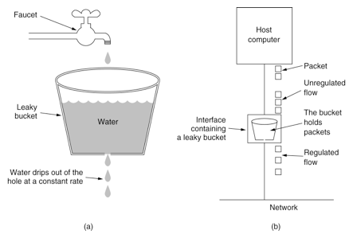
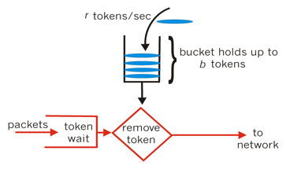

### 限流算法

限流算法，一般有漏桶算法和令牌桶算法两种限流算法。

+ 漏桶算法

漏桶算法(Leaky Bucket)是网络世界中流量整形（Traffic Shaping）或速率限制（Rate Limiting）时经常使用的一种算法，它的主要目的是控制数据注入到网络的速率，平滑网络上的突发流量。漏桶算法提供了一种机制，通过它，突发流量可以被整形以便为网络提供一个稳定的流量。

漏桶可以看作是一个带有常量服务时间的单服务器队列，如果漏桶（包缓存）溢出，那么数据包会被丢弃。 在网络中，漏桶算法可以控制端口的流量输出速率，平滑网络上的突发流量，实现流量整形，从而为网络提供一个稳定的流量。

如图所示，把请求比作是水，水来了都先放进桶里，并以限定的速度出水，当水来得过猛而出水不够快时就会导致水直接溢出，即拒绝服务。


<!-- more -->
+ 令牌桶算法

令牌桶算法是网络流量整形（Traffic Shaping）和速率限制（Rate Limiting）中最常使用的一种算法。典型情况下，令牌桶算法用来控制发送到网络上的数据的数目，并允许突发数据的发送。

令牌桶算法的原理是系统会以一个恒定的速度往桶里放入令牌，而如果请求需要被处理，则需要先从桶里获取一个令牌，当桶里没有令牌可取时，则拒绝服务。从原理上看，令牌桶算法和漏桶算法是相反的，一个“进水”，一个是“漏水”。



+ 漏桶算法和令牌桶算法的选择

漏桶算法与令牌桶算法在表面看起来类似，很容易将两者混淆。但事实上，这两者具有截然不同的特性，且为不同的目的而使用。

漏桶算法与令牌桶算法的区别在于，漏桶算法能够强行限制数据的传输速率，令牌桶算法能够在限制数据的平均传输速率的同时还允许某种程度的突发传输。

需要注意的是，在某些情况下，漏桶算法不能够有效地使用网络资源，因为漏桶的漏出速率是固定的，所以即使网络中没有发生拥塞，漏桶算法也不能使某一个单独的数据流达到端口速率。因此，漏桶算法对于存在突发特性的流量来说缺乏效率。而令牌桶算法则能够满足这些具有突发特性的流量。通常，漏桶算法与令牌桶算法结合起来为网络流量提供更高效的控制。


### golang rate.Limiter

```
func NewLimiter(r Limit, b int) *Limiter {
	return &Limiter{
		limit: r,
		burst: b,
	}
}
```
Limter限制时间的发生频率，采用令牌池的算法实现。这个池子一开始容量为b，装满b个令牌，然后每秒往里面填充r个令牌。 

由于令牌池中最多有b个令牌，所以一次最多只能允许b个事件发生，一个事件花费掉一个令牌。


```
l := rate.NewLimiter(1, 3) 
//第一个参数为每秒发生多少次事件，第二个参数是最大可运行多少个事件
```


### Allow/AllowN 当没有可用事件时，返回false

AllowN标识在时间now的时候，n个事件是否可以同时发生(也意思就是now的时候是否可以从令牌池中取n个令牌)。如果你需要在事件超出频率的时候丢弃或跳过事件，就使用AllowN,否则使用Reserve或Wait.


```
package main

import (
	"fmt"
	"time"

	"golang.org/x/time/rate"
)

func main() {
	l := rate.NewLimiter(1, 3) //刚开始有3个, 一秒填1个

	for {
		if l.AllowN(time.Now(), 1) { //当前从令牌池取出 n 个令牌
			fmt.Println(time.Now().Format("04:05.000")) //先把池子的3个消耗完毕, 以后1秒进入令牌池一个
		} else {
			time.Sleep(1 * time.Second / 10)
			fmt.Println(time.Now().Format("Second 04:05.000"))
		}
	}
}


43:32.534
43:32.534
43:32.534
Second 43:32.635
Second 43:32.737
Second 43:32.838
Second 43:32.938
Second 43:33.039
Second 43:33.144
Second 43:33.249
Second 43:33.350
Second 43:33.451
Second 43:33.552
43:33.552
Second 43:33.653
Second 43:33.753
Second 43:33.854
Second 43:33.955
Second 43:34.055
```


### Wait/WaitN 当没有可用事件时，将阻塞等待

WaitN 阻塞当前直到limit允许n个事件的发生。

 - 如果n超过了令牌池的容量大小则报错。

 - 如果Context被取消了则报错。

 - 如果limit的等待时间超过了Context的超时时间则报错。


```
import (
	"context"
	"fmt"
	"time"

	"golang.org/x/time/rate"
)

func main() {
	l := rate.NewLimiter(1, 3)

	c, _ := context.WithCancel(context.TODO())
	for {
		l.WaitN(c, 1)
		fmt.Println(time.Now().Format("04:05.000"))
	}
}


39:58.446
39:58.446
39:58.446
39:59.451
40:00.451
40:01.450
40:02.450
```


### Reserve/ReserveN

当没有可用事件时返回对象Reservation ，标识调用者需要等多久才能等到n个事件发生(意思就是等多久令牌池中至少含有n个令牌)。

如果ReserveN 传入的n大于令牌池的容量b，那么返回false.

如果希望根据频率限制等待和降低事件发生的速度而不丢掉事件，就使用这个方法。

我认为这里要表达的意思就是如果事件发生的频率是可以由调用者控制的话，可以用ReserveN 来控制事件发生的速度而不丢掉事件。如果要使用context的截止日期或cancel方法的话，使用WaitN。


```
package main

import (
	"fmt"
	"time"

	"golang.org/x/time/rate"
)

func main() {
	l := rate.NewLimiter(1, 3)

	for {
		r := l.ReserveN(time.Now(), 1)
		s := r.Delay()
		time.Sleep(s)
		fmt.Println(s, time.Now().Format("04:05.000"))
	}
}


0s 44:54.118
0s 44:54.119
0s 44:54.119
999.857594ms 44:55.124
994.670516ms 44:56.124
994.778299ms 44:57.124
994.763486ms 44:58.124
```
