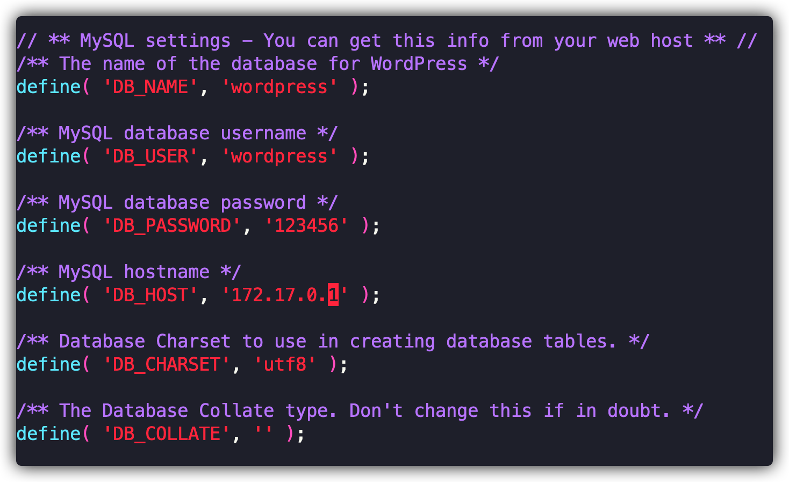
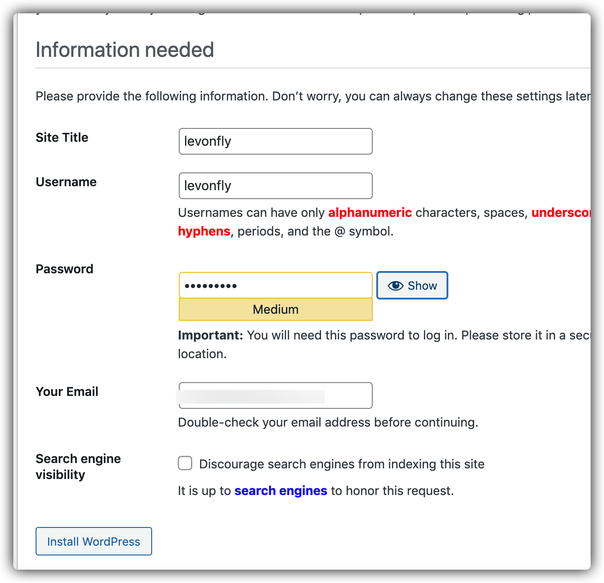
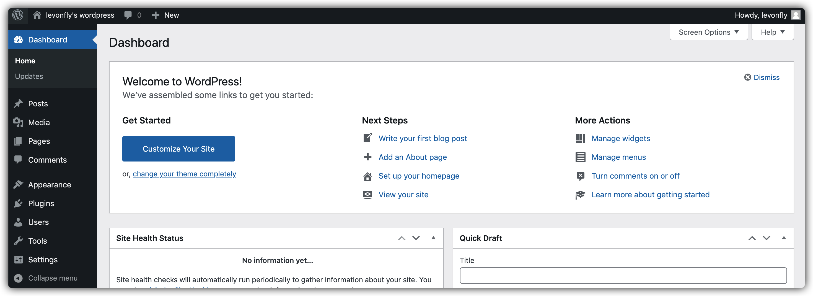

WordPress是使用PHP语言开发的博客平台，用户可以在支持PHP和MySQL数据库的服务器上架设属于自己的网站。也可以把 WordPress当作一个内容管理系统（CMS）来使用。

网站: https://cn.wordpress.org/

<!-- more -->

# 1. 安装

### 1.1 域名绑定

首先有自己的域名和服务器, 我的域名是 `wordpress.httprun.com` 绑定到了我的服务器 IP


### 1.2 安装 php

参考:  https://www.liuvv.com/p/ad42ac48.html


### 1.3 安装 mysql

 因为使用的是 docker 安装, 所以后面的 ip 不是`localhost`  , 而是 `172.17.0.1`

+ 安装 mysql 

  ```bash
  docker pull mysql:5.7
  
  docker run -p 3306:3306 --name mysql-wordpress -v /opt/data/wordpress/conf:/etc/mysql -v \
  /opt/data/wordpress/data:/var/lib/mysql  -e MYSQL_ROOT_PASSWORD=123456 -d mysql:5.7
  ```

+ 创建用户和数据库

  ```mysql
  docker exec -it mysql-wordpress bash
  mysql -u root -p     //输入密码
  
  CREATE DATABASE wordpress;
  CREATE USER 'wordpress'@'172.17.0.1' IDENTIFIED BY '123456';
  GRANT ALL PRIVILEGES ON *.* TO 'wordpress'@'172.17.0.1' WITH GRANT OPTION;
  FLUSH PRIVILEGES;
  EXIT;
  ```


### 1.4 配置wordpress

+ 下载 wordpress

  ```bash
  wget https://wordpress.org/latest.tar.gz
  tar -xzvf latest.tar.gz 
  
  mv wordpress/ /var/www/
  ```


+ 修改 wordpress 的mysql 链接

  ``` bash
  cd /var/www/wordpress/
  cp wp-config-sample.php wp-config.php
  vi wp-config.php
  # 修改的内容包括DB_NAME，DB_USER，DB_PASSWORD以及下面的唯一key
  ```

  

### 1.5 配置nginx

```bash
cd /etc/nginx/sites-enabled
vi wordpress.conf
```

配置文件: 
```nginx
server {
        listen       80;
        server_name  wordpress.httprun.com;

        root   /var/www/wordpress/;

        location / {
            index  index.html index.htm index.php;
        }
  
        location ~ \.php {
                fastcgi_pass   127.0.0.1:9000;
                fastcgi_index  index.php;
                fastcgi_param  SCRIPT_FILENAME  $document_root$fastcgi_script_name;
                include        fastcgi_params;
        }
}
```


启动nginx

```bash
 nginx -t
 nginx -s reload
```

另外要保证 php-fpm的启动,  参考安装 php


### 1.6 安装wordpress

打开域名+`/wp-admin/install.php`:   http://wordpress.httprun.com/wp-admin/install.php

傻瓜式安装即可

+ 安装图


+ 后台
http://wordpress.httprun.com/wp-admin/



+ 前台
http://wordpress.httprun.com


# 2. 参考资料

+ https://wordpress.org/support/article/how-to-install-wordpress/

