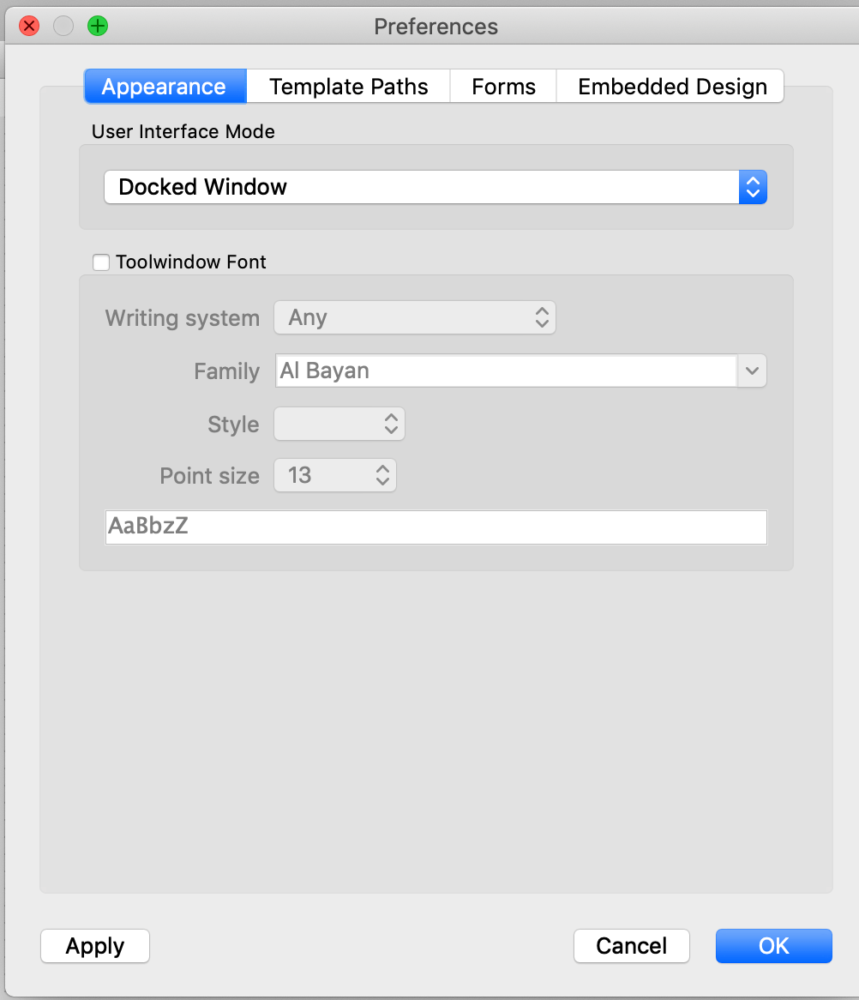
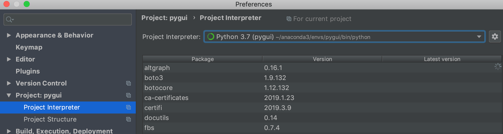
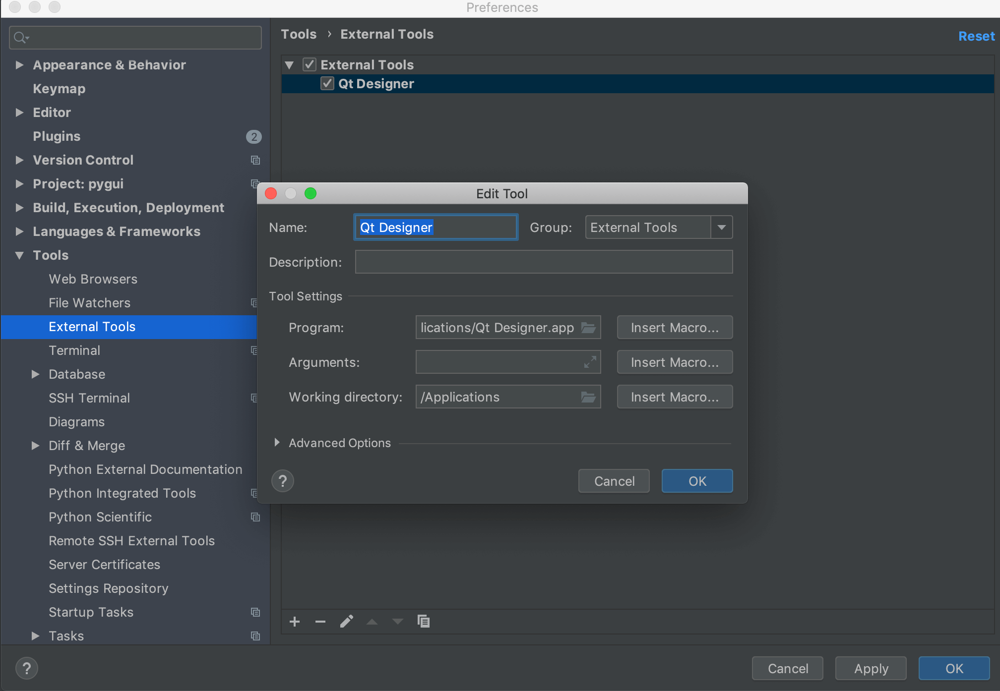
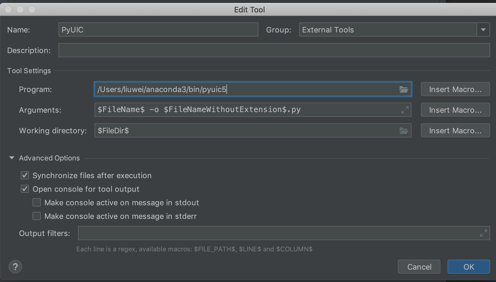

最近准备开发一个GUI程序, 考察了一些能选用的技术,  在windows下有多门语言可以选择(包括易语言哈哈). 

但是最初的想法是不仅要快捷开发而且最好跨平台, 跨平台基本没得选了只能用qt了, 但短时间内用c++开发还是没有勇气的, 于是举棋不定选python.


### 1. 下载 qt designer

因为 Qt Creator实在太大了, 选用Qt Designer.下载链接: https://build-system.fman.io/qt-designer-download

安装成功后, 最好设置`Appearance`里为 `Dockerd Window`, 要不然很别扭

<!-- more -->




### 2. 下载安装pyqt

```shell
conda create --name pygui python=3.7   # 强烈建议使用conda, 创建一个新的虚拟环境
conda activate pygui  # 启用虚拟环境


conda install pip  # 安装pip
pip install PyQt5
pip install fbs            
pip install PyInstaller
```


### 3. pycharm配置QtDesigner和PyUIC

+ 配置conda

  pycharm 设置 `Project Interpreter` 为 pygui下的python

  


+ 配置Qt Designer

  Program:  你的Qt Designer的路径

  


+ 配置PyUIC

  Program:   你的pyuic5路径
  Arguments:  `$FileName$ -o $FileNameWithoutExtension$.py`
  Working directory:  `$FileDir$`

  


### 4. 使用pyqt

+ pyqt教程
  http://zetcode.com/gui/pyqt5/    

  **应该花至少一个下午的时间先撸一遍这个教程**


+ qt designer教程

  https://doc-snapshots.qt.io/qt5-5.9/qtdesigner-manual.html

  **应该花至少一个上午的时间先撸一遍这个教程**

  


  使用qt designer 设计程序后, 保存为.ui文件.  然后用pycharm的 External tools -> PyUIC 生成 py文件

  在生成的py下面加入这些话, 可以运行

  ```python
  if __name__ == '__main__':
      import sys
      app = QtWidgets.QApplication(sys.argv)
      MainWindow = QtWidgets.QMainWindow()
      ui = Ui_MainWindow()
      ui.setupUi(MainWindow)
      MainWindow.show()
      sys.exit(app.exec_())
  ```


### 5. 打包安装程序

请参考: 

+ https://github.com/mherrmann/fbs
+ https://github.com/mherrmann/fbs-tutorial


### 6. pyqt5教程

+ http://zetcode.com/gui/pyqt5/

+ https://zhuanlan.zhihu.com/p/48373518