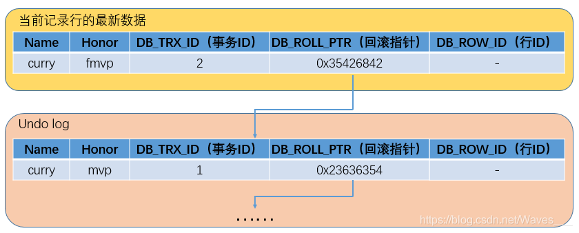
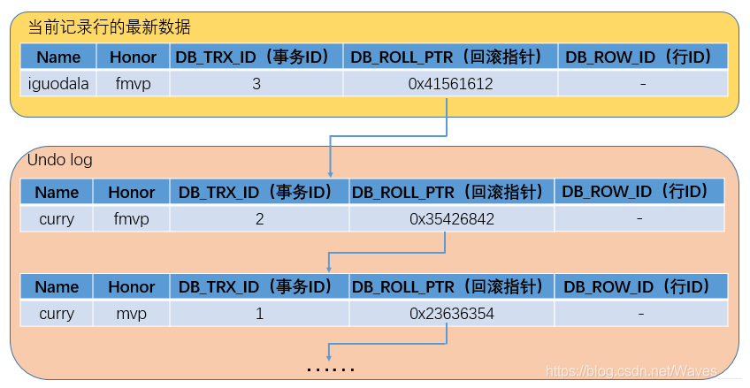
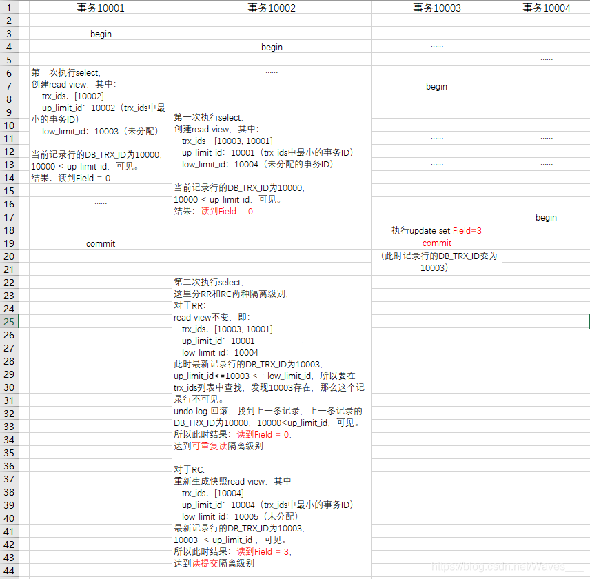

# 1. MVCC概念

多版本控制（Multiversion Concurrency Control）: 指的是一种提高并发的技术。最早的数据库系统，只有读读之间可以并发，读写，写读，写写都要阻塞。

引入MVCC之后，只有写写之间相互阻塞，其他三种操作都可以并行，这样大幅度提高了InnoDB的并发度。在内部实现中，InnoDB通过undo log保存每条数据的多个版本，并且能够找回数据历史版本提供给用户读，每个事务读到的数据版本可能是不一样的。在同一个事务中，用户只能看到该事务创建快照之前已经提交的修改和该事务本身做的修改。

**MVCC在 Read Committed 和 Repeatable Read两个隔离级别下工作。**

MySQL的InnoDB存储引擎默认事务隔离级别是RR(可重复读)，是通过 "行级锁+MVCC"一起实现的，正常读的时候不加锁，写的时候加锁。而 MVCC 的实现依赖：隐藏字段、Read View、Undo log。

<!-- more -->

### 1.1 隐藏字段

InnoDB存储引擎在每行数据的后面添加了三个隐藏字段：

+ DB_TRX_ID(6字节)：表示最近一次对本记录行作修改（insert | update）的事务ID。至于delete操作，InnoDB认为是一个update操作，不过会更新一个另外的删除位，将行表示为deleted。并非真正删除。

+ DB_ROLL_PTR(7字节)：回滚指针，指向当前记录行的undo log信息

+ DB_ROW_ID(6字节)：随着新行插入而单调递增的行ID。理解：当表没有主键或唯一非空索引时，innodb就会使用这个行ID自动产生聚簇索引。如果表有主键或唯一非空索引，聚簇索引就不会包含这个行ID了。(这个DB_ROW_ID跟MVCC关系不大)。

注意隐藏字段并没有什么创建版本、删除版本(网上流传)。


### 1.2 Read View

Read View（读视图），主要是用来做可见性判断的, 里面保存了“**对本事务不可见的其他活跃事务**”。(select 语句时候产生)

其中包括几个变量

+  low_limit_id：目前出现过的最大的事务ID+1，即下一个将被分配的事务ID。
+ up_limit_id：活跃事务列表trx_ids中最小的事务ID，如果trx_ids为空，则up_limit_id 为 low_limit_id。
+ trx_ids：Read View创建时其他未提交的活跃事务ID列表。意思就是创建Read View时，将当前未提交事务ID记录下来，后续即使它们修改了记录行的值，对于当前事务也是不可见的。
+ creator_trx_id：当前创建事务的ID，是一个递增的编号


### 1.3 Undo log    

Undo log中存储的是老版本数据，当一个事务需要读取记录行时，如果当前记录行不可见，可以顺着undo log链找到满足其可见性条件的记录行版本。

大多数对数据的变更操作包括 insert/update/delete，在InnoDB里，undo log分为如下两类：

+ insert undo log : 事务对insert新记录时产生的undo log, 只在事务回滚时需要, 并且在事务提交后就可以立即丢弃。
+ update undo log : 事务对记录进行delete和update操作时产生的undo log，不仅在事务回滚时需要，快照读也需要，只有当数据库所使用的快照中不涉及该日志记录，对应的回滚日志才会被purge线程删除。

##### 1.3.1 Purge线程

为了实现InnoDB的MVCC机制，更新或者删除操作都只是设置一下旧记录的deleted_bit，并不真正将旧记录删除。
为了节省磁盘空间，InnoDB有专门的purge线程来清理deleted_bit为true的记录。purge线程自己也维护了一个read view，如果某个记录的deleted_bit为true，并且DB_TRX_ID相对于purge线程的read view可见，那么这条记录一定是可以被安全清除的。

##### 1.3.2 其他log-binlog

是mysql服务层产生的日志，常用来进行数据恢复、数据库复制，常见的mysql主从架构，就是采用slave同步master的binlog实现的, 另外通过解析binlog能够实现mysql到其他数据源（如ElasticSearch)的数据复制。

##### 1.3.3 其他log-redolog

记录了数据操作在物理层面的修改，mysql中使用了大量缓存，缓存存在于内存中，修改操作时会直接修改内存，而不是立刻修改磁盘，当内存和磁盘的数据不一致时，称内存中的数据为脏页(dirty page)。

为了保证数据的安全性，事务进行中时会不断的产生redo log，在事务提交时进行一次flush操作，保存到磁盘中, redo log是按照顺序写入的，磁盘的顺序读写的速度远大于随机读写。

当数据库或主机失效重启时，会根据redo log进行数据的恢复，如果redo log中有事务提交，则进行事务提交修改数据。这样实现了事务的原子性、一致性和持久性。


# 2. MVCC流程

### 2.1 版本链

  假设有一条记录行如下，字段有Name和Honor，值分别为"curry"和"mvp"，最新修改这条记录的事务ID为1。


+ 现在事务A（事务ID为2）对该记录的Honor做出了修改，将Honor改为"fmvp"：

  
  
  ```ini
  ①事务A先对该行加排它锁
  
  ②然后把该行数据(修改前)拷贝到undo log中，作为旧版本
  
  ③拷贝完毕后，修改该行的Honor为"fmvp"，并且修改DB_TRX_ID为2（事务A的ID）, 回滚指针指向拷贝到undo log的旧版本。（然后还会将修改后的最新数据写入redo log）
  
  ④事务提交，释放排他锁
  ```


+ 接着事务B（事务ID为3）修改同一个记录行，将Name修改为"iguodala"：

	
	
	```ini
	①事务B先对该行加排它锁
	
	②然后把该行数据拷贝到undo log中，作为旧版本
	
	③拷贝完毕后，修改该行Name为"iguodala"，并且修改DB_TRX_ID为3（事务B的ID）, 回滚指针指向拷贝到undo log最新的旧版本。
	
	④事务提交，释放排他锁

 

从上面可以看出，不同事务或者相同事务的对同一记录行的修改，会使该记录行的undo log成为一条链表，undo log的链首就是最新的旧记录，链尾就是最早的旧记录。

### 2.2 记录可见性

 在innodb中，创建一个新事务后，执行第一个select语句的时候，innodb会创建一个快照（read view），快照中会保存系统当前不应该被本事务看到的其他活跃事务id列表（即trx_ids）。当用户在这个事务中要读取某个记录行的时候，innodb会将该记录行的DB_TRX_ID与该Read View中的一些变量进行比较，判断是否满足可见性条件。

假设当前事务要读取某一个记录行，该记录行的DB_TRX_ID（即最新修改该行的事务ID）为trx_id，Read View的活跃事务列表trx_ids中最早的事务ID为up_limit_id，将在生成这个Read Vew时系统出现过的最大的事务ID+1记为low_limit_id（即还未分配的事务ID）。

具体的比较算法如下（可以照着后面的 例子）:

```bash
1. 如果 trx_id < up_limit_id, 那么表明“最新修改该行的事务”在“当前事务”创建快照之前就提交了，所以该记录行的值对当前事务是可见的。跳到步骤5。

2. 如果 trx_id >= low_limit_id, 那么表明“最新修改该行的事务”在“当前事务”创建快照之后才修改该行，所以该记录行的值对当前事务不可见。跳到步骤4。

3. 如果 up_limit_id <= trx_id < low_limit_id, 表明“最新修改该行的事务”在“当前事务”创建快照的时候可能处于“活动状态”或者“已提交状态”；所以就要对活跃事务列表trx_ids进行查找（源码中是用的二分查找，因为是有序的）：

  3.1 如果在活跃事务列表trx_ids中能找到 id 为 trx_id 的事务，表明①在“当前事务”创建快照前，“该记录行的值”被“id为trx_id的事务”修改了，但没有提交；或者②在“当前事务”创建快照后，“该记录行的值”被“id为trx_id的事务”修改了（不管有无提交）；这些情况下，这个记录行的值对当前事务都是不可见的，跳到步骤4；

  3.2 在活跃事务列表中找不到，则表明“id为trx_id的事务”在修改“该记录行的值”后，在“当前事务”创建快照前就已经提交了，所以记录行对当前事务可见，跳到步骤5。

4. 在该记录行的 DB_ROLL_PTR 指针所指向的undo log回滚段中，取出最新的的旧事务号DB_TRX_ID, 将它赋给trx_id，然后跳到步骤1重新开始判断。

5. 将该可见行的值返回。
```


### 2.3 例子

| 假设原始数据行： |           |           |             |
| ---------------- | --------- | --------- | ----------- |
| Field            | DB_ROW_ID | DB_TRX_ID | DB_ROLL_PTR |
| 0                | 10        | 10000     | 0x13525342  |

流程如下:




# 3. 快照读和当前读

### 3.1 快照读(snapshot read)

快照读是指读取数据时不是读取最新版本的数据，而是基于历史版本读取的一个快照信息（mysql读取undo log历史版本) ，快照读可以使普通的SELECT 读取数据时**不用对表数据进行加锁**。

比如事务A开始后，执行普通select语句，创建了快照；之后事务B执行insert语句；然后事务A再执行普通select语句，得到的还是之前B没有insert过的数据，因为这时候A读的数据是符合快照可见性条件的数据。


### 3.2 当前读(current read)

当前读是读取的数据库最新的数据，当前读和快照读不同，因为要读取最新的数据而且要保证事务的隔离性，所以当前读是需要对数据进行加锁的（select ... lock in share mode，select ... for update，insert，update，delete 语句）

也就是说，在只有MVCC时，A先执行 select ... where nid between 1 and 10 … for update；然后事务B再执行  insert … nid = 5 …；然后 A 再执行 select ... where nid between 1 and 10 … for update，就会发现，多了一条B insert进去的记录。这就产生幻读了，所以单独靠MVCC并不能完全防止幻读。

因此，InnoDB在实现RR隔离级别时，不仅使用了MVCC，还会对“当前读语句”读取的记录行加记录锁（record lock）和间隙锁（gap lock），禁止其他事务在间隙间插入记录行，来防止幻读。也就是前文说的"行级锁+MVCC"。


### 3.3 RR和RC的Read View

查看数据的事务隔离级别:  `SELECT @@tx_isolation;`

1. Read Committed级别, 事务在begin之后，执行每条select（读操作）语句时，快照会被重置，即会重新创建一个快照(read view)。

2. Repeatable Read级别, 只有事务在begin之后，执行第一条select（读操作）时, 才会创建一个快照(read view)，将当前系统中活跃的其他事务记录起来；并且事务之后都是使用的这个快照，不会重新创建，直到事务结束。


# 4. 参考资料

+ https://zhuanlan.zhihu.com/p/66791480
+ https://zhuanlan.zhihu.com/p/52977862
+ https://blog.csdn.net/Waves___/article/details/105295060 (重点)
