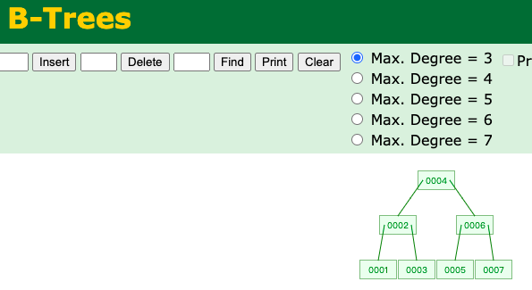

# 1. 索引

### 1.1 索引是什么？有什么作用以及优缺点？

- 是一种快速查询表中内容的机制，类似于新华字典的目录
- 运用在表中某个些字段上，但存储时，独立于表之外，有一张专门的索引表

<!-- more -->

### 1.2 什么时候要创建索引

- 表经常进行 SELECT 操作
- 表很大(记录超多)，记录内容分布范围很广
- 列名经常在 WHERE 子句或连接条件中出现

### 1.3 什么时候不要创建索引

- 表经常进行 INSERT/UPDATE/DELETE 操作
- 表很小(记录超少)
- 列名不经常作为连接条件或出现在 WHERE 子句中
- 字段内容重复很多

# 2. 索引分类

### 2.1 从存储结构上来划分

+ Btree 索引（B+tree，B-tree)

- 哈希索引

  哈希索引一般适用于：不需要做排序**、**范围查询的需求。

  - 哈希索引只包含哈希值和行指针，而不存储字段值，所以不能使用索引中的值来避免读取行。不过，访问内存中的行的速度很快，所以大部分情况下这一点对性能的影响并不明显。
  - 哈希索引数据并不是按照索引值顺序存储的，所以也就无法用于排序。
  - 哈希索引也不支持部分索引列匹配查找，因为哈希索引始终是使用索引列的全部内容来计算哈希值的。例如，在数据列(A, B)上建立哈希索引，如果查询只有数据列A，则无法使用该索引。
  - 哈希索引只支持等值比较查询，包括=、in()、<=>。不支持任何范围查询，例如where price > 100。
  - 访问哈希索引的数据非常快，除非有很多哈希冲突。
  - 如果哈希冲突很多的话，一些索引维护操作的代价也很高。

- full-index 全文索引

- RTree

### 2.2 从应用层次上来划分

- 普通索引：即一个索引只包含单个列，一个表可以有多个单列索引。
- 唯一索引：索引列的值必须唯一，但允许有空值。
  + 普通唯一索引：单个字段上建立唯一索引，需要此字段所在的列上不能有重复的值，属于二级索引。
  + 复合唯一索引：多个字段上联合建立唯一索引，属于二级索引。
- 复合索引：一个索引包含多个列。

##### 2.2.1 唯一索引和主键索引区别

+ 主键就是唯一索引，但是唯一索引不一定是主键

+ 唯一索引可以为空，但是空值只能有一个，主键不能为空。

##### 2.2.2 复合索引最左前缀匹配

最左前缀匹配原则。这是非常重要、非常重要、非常重要（重要的事情说三遍）

+ 左边的必须在才走索引!!!
+  (col1, col2, col3)这个复合索引的所有前缀 就是(col1), (col1, col2), (col1, col2, col3), 包含这些列的查询都会启用索引查询.
+ 其他所有不在最左前缀里的列都不会启用索引, 即使包含了联合索引里的部分列也不行. 即上述中的(col2), (col3), (col2, col3) 都不会启用索引去查询.
+ 注意, (col1, col3)会启用(col1)的索引查询.

### 2.3 从表记录的排列顺序和索引的排列顺序是否一致来划分

- 聚集索引

  表记录的排列顺序和索引的排列顺序一致。(类似拼音查字)

  1. 一个表中只能拥有一个聚集索引。

  2. SQL SERVER默认是在主键上建立聚集索引的。

  3. 聚集索引表记录的排列顺序和索引的排列顺序一致，所以查询效率快，因为只要找到第一个索引值记录，其余的连续性的记录在物理表中也会连续存放，一起就可以查询到。

  4. 缺点是新增比较慢，因为为了保证表中记录的物理顺序和索引顺序一致，在记录插入的时候，会对数据页重新排序。

  

- 非聚集索引

  表记录的排列顺序和索引的排列顺序不一致。(类似偏旁部首查字)

  1. 一个表中可以拥有多个非聚集索引。

  2. 索引的逻辑顺序与磁盘上行的物理存储顺序不同，非聚集索引在叶子节点存储的是主键和索引列，当我们使用非聚集索引查询数据时，需要拿到叶子上的主键再去表中查到想要查找的数据。这个过程就是我们所说的回表。

# 3. 建索引的几大原则

### 3.1 最左前缀匹配原则

非常重要的原则. mysql会一直向右匹配直到遇到范围查询(>、<、between、like) 就停止匹配, 复合索引的第一个, 必须先查, 才能继续

1. 如果建立(a,b)顺序的索引

+ 查询 b = 2 ，是匹配不到(a,b)索引的

+ 查询 a = 1 and b = 2 或者 a = 1  又或者  b = 2 and a = 1 都可以，因为优化器会自动调整a,b的顺序。

2. 如果建立(a,b,c,d)顺序的索引

+ a = 1 and b = 2 and c > 3 and d = 4 ，d是用不到索引的，因为c字段是一个范围查询，它之后的字段会停止匹配。

3. 如果建立(a,b,d,c)顺序的索引

+ a = 1 and b = 2 and c > 3 and d = 4 ,  索引则都可以用到，a,b,d的顺序可以任意调整。

### 3.2 = 和 in 可以乱序

比如a = 1 and b = 2 and c = 3 建立(a,b,c)索引可以任意顺序，mysql的查询优化器会帮你优化成索引可以识别的形式。

### 3.3 尽量选择区分度高的列作为索引

区分度的公式是count(distinct col)/count(*)，表示字段不重复的比例，比例越大我们扫描的记录数越少，唯一键的区分度是1。（越大越好）

而一些状态、性别字段可能在大数据面前区分度就是0，那可能有人会问，这个比例有什么经验值吗？使用场景不同，这个值也很难确定，一般需要join的字段我们都要求是0.1以上，即平均1条扫描10条记录。

索引列的基数越大，索引的效果越好。例如，存放出生日期的列具有不同的值，很容易区分行，而用来记录性别的列，只有"M"和"F",则对此进行索引没有多大用处，因此不管搜索哪个值，都会得出大约一半的行。

### 3.4 索引列不能参与计算，保持列“干净”，

比如from_unixtime(create_time) = ’2014-05-29’就不能使用到索引，原因很简单，b+树中存的都是数据表中的字段值，但进行检索时，需要把所有元素都应用函数才能比较，显然成本太大。所以语句应该写成create_time = unix_timestamp(’2014-05-29’)。

### 3.5 尽量的扩展索引，不要新建索引。

比如表中已经有a的索引，现在要加(a,b)的索引，那么只需要修改原来的索引即可。

### 3.6 在合适的列上创建索引

可以考虑使用索引的主要有两种类型的列：在where子句中出现的列, 在join子句中出现的列

而不是在SELECT关键字后选择列表的列

### 3.7 使用短索引

如果对字符串列进行索引，应该指定一个前缀长度，可节省大量索引空间，提升查询速度；

例如，有一个CHAR(200)列，如果在前10个或20个字符内，多数值是唯一的，那么就不要对整个列进行索引。对前10个或者20个字符进行索引能够节省大量索引空间，也可能会使查询更快。

# 4. BTree和 B+Tree

### 4.1 B 树（也就是 B- 树）

- 关键字分布在整棵树的所有节点。
- 任何一个关键字 出现且只出现在一个节点中。
- 搜索有可能在 非叶子节点 结束。
- 其搜索性能等价于在关键字全集内做一次二分查找。如下图所示：

### 4.2 B+ 树

- 非叶子节点的子树指针与关键字个数相同。
- 非叶子节点的子树指针 P[i]，指向关键字属于 [k[i],K[i+1]) 的子树（注意：区间是前闭后开)。
- 为所有叶子节点增加一个链指针。
- 所有关键字都在叶子节点出现。

### 4.3 相对 B 树，B+ 树做索引的优势

1. B+ 树的磁盘读写代价更低。

   B+ 树的内部没有指向关键字具体信息的指针，所以其内部节点相对 B 树更小，如果把所有关键字存放在同一块盘中，那么盘中所能容纳的关键字数量也越多，一次性读入内存的需要查找的关键字也就越多，相应的，IO 读写次数就降低了。

2. 树的查询效率更加稳定。

   B+ 树所有数据都存在于叶子节点，所有关键字查询的路径长度相同，每次数据的查询效率相当。而 B 树可能在非叶子节点就停止查找了，所以查询效率不够稳定。

3. B+ 树只需要去遍历叶子节点就可以实现整棵树的遍历

### 4.4 MongoDB 的索引 B 树，而 MySQL 的索引 B+ 树？

因为 MongoDB 不是传统的关系型数据库，而是以 Json 格式作为存储的 NoSQL 非关系型数据库，目的就是高性能、高可用、易扩展。摆脱了关系模型，所以范围查询和遍历查询的需求就没那么强烈了。

# 5. MyISAM 和 InnoDB 的B+区别

都是用 B+树实现的

### 5.1 MyISAM 非聚集索引

1. MyISAM的索引方式也叫做“非聚集”的，之所以这么称呼是为了与InnoDB的聚集索引区分。

2. 非聚簇索引的`主键索引`和`辅助索引`两棵B+树看上去没什么不同，节点的结构完全一致只是存储的内容不同而已

   主键索引B+树的节点存储了主键，辅助键索引B+树存储了辅助键。

3. 表数据存储在独立的地方，这两颗B+树的叶子节点都使用一个地址指向真正的表数据，对于表数据来说，这两个键没有任何差别。

   由于索引树是独立的，通过辅助键检索无需访问主键的索引树。

4. 索引文件（.MYI）和数据文件（.MYD）文件是分离的,  索引文件仅保存数据记录的地址(指针去查找)。

### 5.2 InnoDB 聚集索引 

1. InnoDB的数据文件本身就是索引文件。

2. 如果一个主键被定义了，那么这个主键就是作为聚集索引。

3. 如果没有主键被定义，那么该表的第一个唯一非空索引被作为聚集索引。

4. 如果没有主键也没有合适的唯一索引，那么innodb内部会生成一个隐藏的主键作为聚集索引，这个隐藏的主键是一个6个字节的列，改列的值会随着数据的插入自增。

5. 因此建议是给每个表都定一个主键。如果该表没有逻辑主键，则创建一个自增的列作为主键。

# 6. 头脑风暴

### 6.1 B+树

走索引是从上往下

全表扫描是从左往右

### 6.2 聚集索引理解

> 只能有一个聚集索引, 索引和数据在一起

其他的索引就做辅助索引, 走索引后,找到的数据时在用聚集索引, 再次回表查询

### 6.3 最左匹配, 如果第一个是范围呢

如果是* 不走索引,  如果就是只查条件, 就走索引

### 6.4 如果select 不是* , 只是select 的 where 索引列

不会在回表了, 就在这记录着索引数据呢

# 7. 参考资料

+ https://tech.meituan.com/2014/06/30/mysql-index.html
+ https://www.infoq.cn/article/OJKWYykjoyc2YGB0Sj2c
+ https://www.cs.usfca.edu/~galles/visualization/BPlusTree.html