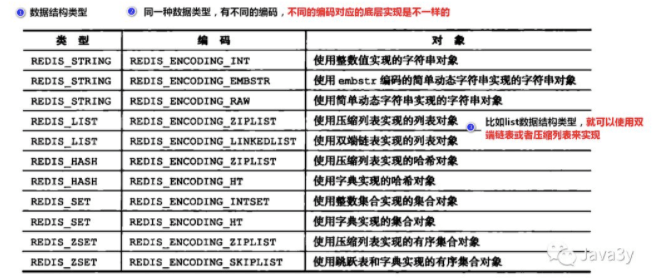
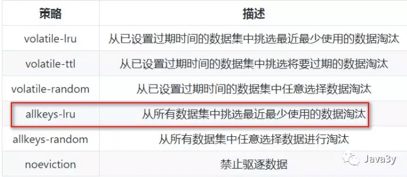

# 0. 前言

Redis是一个开源的，**基于内存的数据结构存储**，可用作于数据库、**缓存**、消息中间件。

- 从官方的解释上，我们可以知道：Redis是基于内存，支持多种数据结构。
- 从经验的角度上，我们可以知道：Redis常用作于缓存。

<!-- more -->

# 1. Redis 底层数据结构


+ 简单动态字符串(Simple dynamic string,SDS)

+ 无环双向链表(linkedlist)

+ 哈希表

+ 跳跃表(shiplist)

+ 整数集合(intset)

+ 压缩列表(ziplist)

# 2. Redis 数据对象

首先还是得声明一下，Redis的存储是以`key-value`的形式的。Redis中的key一定是字符串，value可以是string、list、hash、set、sortset这几种常用的。

| 类型    | 作用                                               | 底层数据结构          |
| ------- | -------------------------------------------------- | --------------------- |
| string  | 简单的key-value                                    | int, embstr(sds), raw |
| list    | 有序列表,可做简单队列                              | 压缩列表,双向链表     |
| hash    | 哈希表, 存储结构化数据                             | 压缩列表,哈希 table   |
| set     | 无序列表(去重), 提供一系列的交集、并集、差集的命令 | 整数集合,哈希 table   |
| sortset | 有序集合映射, 排行榜                               | 压缩列表, 跳跃表      |




### 2.1 字符串(stirng)对象

在上面的图我们知道string类型有三种**编码格式**：

- int：整数值，这个整数值可以使用long类型来表示
  + 如果是浮点数，那就用embstr或者raw编码。具体用哪个就看这个数的长度了

- embstr：字符串值，这个字符串值的长度小于32字节

- raw：字符串值，这个字符串值的长度大于32字节

embstr和raw的**区别**：

- raw分配内存和释放内存的次数是两次，embstr是一次
- embstr编码的数据保存在一块**连续**的内存里面

编码之间的**转换**：

- int类型如果存的**不再是一个整数值**，则会从int转成raw
- embstr是只读的，在修改的时候回从embstr转成raw


### 2.2 列表(list)对象

- ziplist：字符串元素的长度都小于64个字节`&&`总数量少于512个
- linkedlist：字符串元素的长度大于64个字节`||`总数量大于512个

编码之间的**转换：**

- 原本是ziplist编码的，如果保存的数据长度太大或者元素数量过多，会转换成linkedlist编码的。


### 2.3 哈希(hash)对象

- ziplist：key和value的字符串长度都小于64字节`&&`键值对总数量小于512
- hashtable：key和value的字符串长度大于64字节`||`键值对总数量大于512

编码之间的**转换：**

- 原本是ziplist编码的，如果保存的数据长度太大或者元素数量过多，会转换成hashtable编码的。


### 1.4 集合(set)对象

- intset：保存的元素全都是整数`&&`总数量小于512
- hashtable：保存的元素不是整数`||`总数量大于512

编码之间的**转换：**

- 原本是intset编码的，如果保存的数据不是整数值或者元素数量大于512，会转换成hashtable编码的。


### 2.5 有序集合(sortset)对象

- ziplist：元素长度小于64`&&`总数量小于128
- skiplist：元素长度大于64`||`总数量大于128

有序集合(sortset)对象**同时采用skiplist和哈希表来实现**：

- skiplist能够达到插入的时间复杂度为O(logn)，根据成员查分值的时间复杂度为O(1)

编码之间的**转换：**

- 原本是ziplist编码的，如果保存的数据长度大于64或者元素数量大于128，会转换成skiplist编码的。


# 3. Redis 过期策略

Redis服务器中也有数据库这么一个概念。如果不指定具体的数量，默认会有16个数据库(0-15)。数据库与数据库之间的数据是隔离的。

### 3.1 过期时间

因为我们的内存是有限的。所以我们会干掉不常用的数据，保留常用的数据。这就需要我们设置一下键的过期(生存)时间了。

+ 设置键的 生存时间 可以通过EXPIRE或者PEXPIRE命令。

+ 设置键的 过期时间 可以通过EXPIREAT或者PEXPIREAT命令。

其实EXPIRE、PEXPIRE、EXPIREAT这三个命令都是通过PEXPIREAT命令来实现的。

### 3.2 过期策略(3种)

上面我们已经能够了解到：过期键是保存在哈希表中了。那这些过期键到了过期的时间，就会立马被删除掉吗？？

- 定时删除(对内存友好，对CPU不友好)

- - 到时间点上就把所有过期的键删除了。

- 惰性删除(对CPU极度友好，对内存极度不友好)

- - 每次从键空间取键的时候，判断一下该键是否过期了，如果过期了就删除。

- 定期删除(折中)

- - **每隔**一段时间去删除过期键，**限制**删除的执行时长和频率。

Redis采用的是**惰性删除+定期删除**两种策略，所以说，在Redis里边如果过期键到了过期的时间了，未必被立马删除的！


### 3.3 内存淘汰机制(6种)

我们可以设置内存最大使用量，当内存使用量超出时，会施行数据淘汰策略。




一般场景, 使用 Redis 缓存数据时，为了提高缓存命中率，需要保证缓存数据都是热点数据。可以将内存最大使用量设置为热点数据占用的内存量，然后启用allkeys-lru淘汰策略，将最近最少使用的数据淘汰


# 4. Redis 持久化

Redis提供了两种不同的持久化方法来讲数据存储到硬盘里边。

### 4.1 RDB(快照持久化)

RDB持久化可以手动执行，也可以根据服务器配置定期执行。RDB持久化所生成的RDB文件是一个经过压缩的二进制文件，Redis可以将某一时刻的所有数据保存到一个RDB文件中dump.rdb。Redis服务器在启动的时候，如果发现有RDB文件，就会自动载入RDB文件(不需要人工干预)

有两个命令可以生成RDB文件：

+ SAVE	会阻塞Redis服务器进程，服务器不能接收任何请求，直到RDB文件创建完毕为止。

+ BGSAVE `fork`出一个子进程，由子进程来负责创建RDB文件，服务器进程可以继续接收请求。

  

我们可以使用配置的方式来定期执行, 如果以下的条件被触发，就会执行`BGSAVE` 命令

```shell
save 900 1              #在900秒(15分钟)之后，至少有1个key发生变化，
save 300 10             #在300秒(5分钟)之后，至少有10个key发生变化
save 60 10000       	  #在60秒(1分钟)之后，至少有10000个key发生变化
```


### 4.2 AOF(文件追加)

当Redis服务器执行写命令的时候，将执行的写命令保存到AOF文件中。AOF是通过保存Redis服务器所执行的写命令来记录数据库的数据的。

```shell
redis> SET meg "hello"
OK
redis> SADD fruits "apple" "banana" "cherry"
(integer) 3
redis> RPUSH numbers 128 256 512
(integer) 3 
```


每个命令都生成一条记录，存在 AOF 文件中。这些都是以Redis的命令请求协议格式保存的。读取的时候，再把这些命令执行一遍。


```shell
appendfsync always     # 每次有数据修改发生时都会写入AOF文件。
appendfsync everysec   # 每秒钟同步一次，该策略为AOF的默认策略。
appendfsync no         # 从不同步。高效但是数据不会被持久化。
```


Redis将AOF重写程序放到**子进程**里执行(`BGREWRITEAOF`命令)，像`BGSAVE`命令一样fork出一个子进程来完成重写AOF的操作，从而不会影响到主进程。

AOF后台重写是不会阻塞主进程接收请求的，新的写命令请求可能会导致**当前数据库和重写后的AOF文件的数据不一致**！

为了解决数据不一致的问题，Redis服务器设置了一个**AOF重写缓冲区**，这个缓存区会在服务器**创建出子进程之后使用**。


### 4.3 RDB和AOF对过期键的策略

+ RDB持久化对过期键的策略：
  执行SAVE或者BGSAVE命令创建出的RDB文件，程序会对数据库中的过期键检查，已过期的键不会保存在RDB文件中。
  载入RDB文件时，程序同样会对RDB文件中的键进行检查，过期的键会被忽略。

+ AOF持久化对过期键的策略：
  如果数据库的键已过期，但还没被惰性/定期删除，AOF文件不会因为这个过期键产生任何影响(也就说会保留)，当过期的键被删除了以后，会追加一条DEL命令来显示记录该键被删除了
  重写AOF文件时，程序会对RDB文件中的键进行检查，过期的键会被忽略。

+ RDB和AOF用哪个？

  RDB和AOF并不互斥，它俩可以同时使用。

  RDB的优点：载入时恢复数据快、文件体积小。
  RDB的缺点：会一定程度上丢失数据(因为系统一旦在定时持久化之前出现宕机现象，此前没有来得及写入磁盘的数据都将丢失。)
  AOF的优点：丢失数据少(默认配置只丢失一秒的数据)。
  AOF的缺点：恢复数据相对较慢，文件体积大

  如果Redis服务器同时开启了RDB和AOF持久化，服务器会优先使用AOF文件来还原数据(因为AOF更新频率比RDB更新频率要高，还原的数据更完善)


# 5. Redis事件

Redis服务器是一个事件驱动程序，主要处理以下两类事件：

### 5.1 文件事件

文件事件其实就是对Socket操作的抽象，Redis服务器与Redis客户端的通信会产生文件事件，服务器通过监听并处理这些事件来完成一系列的网络操作。

文件事件处理器使用I/O多路复用（EPOLL）程序来同时监听多个Socket。当被监听的Socket准备好执行连接应答(accept)、读取(read)等等操作时，与操作相对应的文件事件就会产生，根据文件事件来为Socket关联对应的事件处理器，从而实现功能。


### 5.2 时间事件

持续运行的Redis服务器会**定期**对自身的资源和状态进行检查和调整，这些定期的操作由**serverCron**函数负责执行，它的主要工作包括：

- 更新服务器的统计信息(时间、内存占用、数据库占用)
- 清理数据库的过期键值对
- AOF、RDB持久化
- 如果是主从服务器，对从服务器进行定期同步
- 如果是集群模式，对进群进行定期同步和连接
- …

Redis服务器将时间事件放在一个链表中，当时间事件执行器运行时，会遍历整个链表。时间事件包括：

+ 周期性事件(Redis一般只执行serverCron时间事件，serverCron时间事件是周期性的)
+ 定时事件


### 5.3 Redis单线程为什么快？

1）纯内存操作
2）核心是基于非阻塞的IO多路复用机制
3）单线程避免了多线程的频繁上下文切换问题


# 6. Redis主从

##### 完整重同步

+ 从服务器向主服务器发送PSYNC命令

+ 主服务器收到PSYNC命令执行`BGSAVE`命令，在后台生成一个`RDB`文件。并用一个缓冲区来记录从现在开始执行的所有写命令。

+ 当主服务器的BGSAVE命令执行完后，将生成的RDB文件发送给从服务器，从服务器接收和载入RBD文件。将自己的数据库状态更新

  至与主服务器执行BGSAVE命令时的状态。
+ 主服务器将所有缓冲区的写命令发送给从服务器，从服务器执行这些写命令，达到数据最终一致性。

##### 部分重同步

复制偏移量：执行复制的双方都会分别维护一个复制偏移量
主服务器每次传播N个字节，就将自己的复制偏移量加上N
从服务器每次收到主服务器的N个字节，就将自己的复制偏移量加上N
通过对比主从复制的偏移量，就很容易知道主从服务器的数据是否处于一致性的状态！

//TODO:


# 7. Redis 其他问题

### 7.1 缓存雪崩

+ Redis 挂掉了，请求全部走数据库。
+ 对缓存数据设置相同的过期时间，导致某段时间内缓存失效，请求全部走数据库。
+ 缓存雪崩如果发生了，很可能就把我们的数据库搞垮，导致整个服务瘫痪！


如何解决缓存雪崩？

+ 在缓存的时候给过期时间加上一个随机值，这样就会大幅度的减少缓存在同一时间过期。

+ 实现 Redis 的高可用 (主从架构 + Sentinel 或者 Redis Cluster)，尽量避免 Redis 挂掉这种情况发生。
+ 万一 Redis 真的挂了，我们可以设置本地缓存 (ehcache)+ 限流 (hystrix)，尽量避免我们的数据库被干掉 (起码能保证我们的服务还是能正常工作的)
+ redis 持久化，重启后自动从磁盘上加载数据，快速恢复缓存数据。

### 7.2 缓存穿透

缓存穿透是指查询一个一定不存在的数据。由于缓存不命中，并且出于容错考虑，如果从数据库查不到数据则不写入缓存，这将导致这个不存在的数据每次请求都要到数据库去查询，失去了缓存的意义。


解决缓存穿透也有两种方案：

+ 由于请求的参数是不合法的(每次都请求不存在的参数)，于是我们可以使用布隆过滤器(BloomFilter)或者压缩filter提前拦截，不合法就不让这个请求到数据库层！

  + 如何在海量元素中(10亿,不定长,不重复) 快速判断一个元素是否存在?

    布隆: 多个 hash 函数, 对应多个 bit

    布隆判断存在, 有可能是错的(别人的 hash 碰撞), 告诉我不存在, 就一定不存在, 先去布隆过滤器查询, 再去 redis

+ 当我们从数据库找不到的时候，我们也将这个空对象设置到缓存里边去。下次再请求的时候，就可以从缓存里边获取了。
  这种情况我们一般会将空对象设置一个较短的过期时间。


### 7.3 缓存与数据库双写一致

##### 7.3.1 一般来说，执行更新操作时，我们会有两种选择：

+ 先操作数据库，再操作缓存
+ 先操作缓存，再操作数据库


##### 7.3.2 操作缓存也有两种方案：

- 更新缓存
- 删除缓存

一般我们都是采取删除缓存缓存策略的，原因如下：

1， 高并发环境下，无论是先操作数据库还是后操作数据库而言，如果加上更新缓存，那就更加容易导致数据库与缓存数据不一致问题。(删除缓存直接和简单很多)

2， 如果每次更新了数据库，都要更新缓存【这里指的是频繁更新的场景，这会耗费一定的性能】，倒不如直接删除掉。等再次读取时，缓存里没有，那我到数据库找，在数据库找到再写到缓存里边(体现懒加载)

基于这两点，对于缓存在更新时而言，都是建议执行删除操作！


##### 7.3.3 先更新数据库，再删除缓存

在高并发下表现不如意，在原子性被破坏时表现优异

- 第一步成功(操作数据库)，第二步失败(删除缓存)，会导致**数据库里是新数据，而缓存里是旧数据**。
- 如果第一步(操作数据库)就失败了，我们可以直接返回错误(Exception)，不会出现数据不一致。


##### 7.3.4 先删除缓存，再更新数据库

在高并发下表现不如意，在原子性被破坏时表现优异

- 第一步成功(删除缓存)，第二步失败(更新数据库)，数据库和缓存的数据还是一致的。
- 如果第一步(删除缓存)就失败了，我们可以直接返回错误(Exception)，数据库和缓存的数据还是一致的。


# 8. 问题总结

+ zest 相同 value 怎么办?

+ 怎么原子操作

  

# 9. 参考资料

+ https://github.com/ZhongFuCheng3y/3y#tvredis

