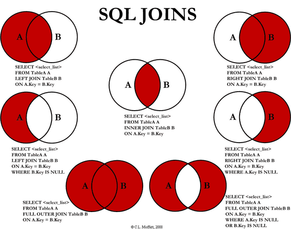

# 1.  join类型

在关系代数中，连接运算是由一个笛卡尔积运算和一个选取运算构成的。首先用笛卡尔积完成对两个数据集合的乘运算，然后对生成的结果集合进行选取运算，确保只把分别来自两个数据集合并且具有重叠部分的行合并在一起。

连接的全部意义在于在水平方向上合并两个数据集合（通常是表），并产生一个新的结果集合，其方法是将一个数据源中的行于另一个数据源中和它匹配的行组合成一个新元组。

SQL提供了多种类型的连接方式，它们之间的区别在于：从相互交叠的不同数据集合中选择用于连接的行时所采用的方法不同。

<!-- more -->

### 1.1  join分类

| 连接类型   | 连接种类         | 定义                                                         |
| ---------- | ---------------- | ------------------------------------------------------------ |
| Inner Join | Inner Join       | 内连接是最常见的一种连接，它也被称为普通连接，只连接匹配的行（仅对满足连接条件的CROSS中的列）。它又分为等值连接（连接条件运算符为"="）和不等值连接（连接条件运算符不为"="，例如between...and）。 |
| Outer Join | Full Outer Join  | FULL JOIN 会从左表 和右表 那里返回所有的行。如果其中一个表的数据行在另一个表中没有匹配的行，那么对面的数据用NULL代替。 |
| Outer Join | Left Outer Join  | LEFT JOIN返回左表的全部行和右表满足ON条件的行，如果左表的行在右表中没有匹配，那么这一行右表中对应数据用NULL代替。 |
| Outer Join | Right Outer Join | RIGHT JOIN返回右表的全部行和左表满足ON条件的行，如果右表的行在左表中没有匹配，那么这一行左表中对应数据用NULL代替。 |
| Cross Join | Cross Join       | CROSS对两个表执行笛卡尔乘积。它为左表行和右表行的每种可能的组合返回一行。返回（左表行数*右表行数）行的表。 |
| 其他       | 自然连接         | 自然连接是一种特殊的等值连接,在连接条件中使用等于(=)运算符比较被连接列的列值，但它使用选择列表指出查询结果集合中所包括的列，并删除连接表中的重复列。 |
| 其他       | 自连接           | 某个表和其自身连接，常用在同一表内不同数据间对同一列的比较   |

### 

### 1.2 常见分类

There are 4 different types of Oracle joins:

- Oracle INNER JOIN (or sometimes called simple join)
- Oracle LEFT OUTER JOIN (or sometimes called LEFT JOIN)
- Oracle RIGHT OUTER JOIN (or sometimes called RIGHT JOIN)
- Oracle FULL OUTER JOIN (or sometimes called FULL JOIN)


### 1.3 注意事项

+  LEFT JOIN and LEFT OUTER JOIN 完全一样
+ RIGHT JOIN and RIGHT OUTER JOIN 完全一样
+ JOIN 默认情况下是 INNER JOIN
+ 对于INNER JOIN，顺序无关紧要, 对于（LEFT，RIGHT或FULL）OUTER JOIN，顺序很重要


# 2. join使用

**Examples**

```
A    B
-    -
1    3
2    4
3    5
4    6
```

**Inner join**

```
select * from a INNER JOIN b on a.a = b.b;
select a.*, b.*  from a,b where a.a = b.b;

a | b
--+--
3 | 3
4 | 4
```

**Left outer join**

```
select * from a LEFT OUTER JOIN b on a.a = b.b;
select a.*, b.*  from a,b where a.a = b.b(+);

a |  b
--+-----
1 | null
2 | null
3 |    3
4 |    4
```

**Right outer join**

```
select * from a RIGHT OUTER JOIN b on a.a = b.b;
select a.*, b.*  from a,b where a.a(+) = b.b;

a    |  b
-----+----
3    |  3
4    |  4
null |  5
null |  6
```


**Full outer join**

```
select * from a FULL OUTER JOIN b on a.a = b.b;

 a   |  b
-----+-----
   1 | null
   2 | null
   3 |    3
   4 |    4
null |    6
null |    5
```


# 3. join区别

### 3.1 inner join, outer join

- An inner join of A and B gives the result of A intersect B
- An outer join of A and B gives the results of A union B




### 3.2 inner join, 多表连查

```
SELECT * FROM
table a INNER JOIN table b
ON a.id = b.id;
```

vs

```
SELECT a.*, b.*
FROM table a, table b
WHERE a.id = b.id;
```

多表连查, 带 where 条件的一般又称为隐式内连接,  在性能方面，它们是完全相同的。


### 3.3  left join, 多表连查

实际项目中, 最常用的两种方式.

+  left join 就是 left outer join, 一般会产生 null
+ 多表查询加 where, 可以理解为 inner join


### 3.4 on, where

+ 对于inner joins, 无关紧要

+ 对于 outer joins, 先 on 后 where

  + `ON` clause - **Before** joining.    在join之前将被过滤,  有些结果可能为null（因为outer join）。

  + `WHERE` clause: **After** joining.   在join之后过滤记录, 一般可以过滤掉 null。

    

“A LEFT JOIN B ON 条件表达式” 中的ON用来决定如何从 B 表中检索数据行。如果 B 表中没有任何一行数据匹配 ON 的条件,将会额外生成一行所有列为 NULL 的数据。仅在匹配阶段完成以后，WHERE 子句条件才会被使用。它将从匹配阶段产生的数据中检索过滤。


所以我们要注意：在使用Left (right) join的时候，一定要在先给出尽可能多的匹配满足条件，减少Where的执行。如：

```
select * from A
inner join B on B.name = A.name
left join C on C.name = B.name
left join D on D.id = C.id
where C.status>1 and D.status=1;

--可以优化成:

select * from A
inner join B on B.name = A.name
left join C on C.name = B.name and C.status>1
left join D on D.id = C.id and D.status=1
```


**Example**

```
    1. documents:
     | id    | name        |
     --------|-------------|
     | 1     | Document1   |
     | 2     | Document2   |
     | 3     | Document3   |
     | 4     | Document4   |
     | 5     | Document5   |


    2. downloads:
     | id   | document_id   | username |
     |------|---------------|----------|
     | 1    | 1             | sandeep  |
     | 2    | 1             | simi     |
     | 3    | 2             | sandeep  |
     | 4    | 2             | reya     |
     | 5    | 3             | simi     |
```


**ON**

```
SELECT documents.name, downloads.id FROM documents LEFT OUTER JOIN downloads
ON documents.id = downloads.document_id
AND username = 'sandeep'

中间表:
    | id(from documents) | name         | id (from downloads) | document_id | username |
    |--------------------|--------------|---------------------|-------------|----------|
    | 1                  | Document1    | 1                   | 1           | sandeep  |
    | 2                  | Document2    | 3                   | 2           | sandeep  |
    | 3                  | Document3    | NULL                | NULL        | NULL     |
    | 4                  | Document4    | NULL                | NULL        | NULL     |
    | 5                  | Document5    | NULL                | NULL        | NULL     |

注意“ documents”中不符合这两个条件的行是如何用“ NULL”值填充的。

最终:
   | name       | id   |
   |------------|------|
   |  Document1 | 1    |
   |  Document2 | 3    | 
   |  Document3 | NULL |
   |  Document4 | NULL | 
   |  Document5 | NULL | 
```


**WHERE**

```
 SELECT documents.name, downloads.id FROM documents LEFT OUTER JOIN downloads
 ON documents.id = downloads.document_id
 WHERE username = 'sandeep'

 先 on 产生中间表:

    | id(from documents) | name         | id (from downloads) | document_id | username |
    |--------------------|--------------|---------------------|-------------|----------|
    | 1                  | Document1    | 1                   | 1           | sandeep  |
    | 1                  | Document1    | 2                   | 1           | simi     |
    | 2                  | Document2    | 3                   | 2           | sandeep  |
    | 2                  | Document2    | 4                   | 2           | reya     |
    | 3                  | Document3    | 5                   | 3           | simi     |
    | 4                  | Document4    | NULL                | NULL        | NULL     |
    | 5                  | Document5    | NULL                | NULL        | NULL     |

最终结果:

   | name         | id |
   |--------------|----|
   | Document1    | 1  |
   | Document2    | 3  | 
```


# 4. cross join

### 4.1 cross join , inner join

交叉联接不会合并行，如果每个表中有100行且一一匹配，则会得到10000个结果，在相同情况下，Innerjoin将仅返回100行。

这两个示例将返回相同的结果：

Cross join

```
select * from table1 cross join table2 where table1.id = table2.fk_id
```

Inner join

```
select * from table1 join table2 on table1.id = table2.fk_id
```

Use the last method


### 4.2 cross join, full outer join

交叉联接会在两个表之间产生笛卡尔乘积，并返回所有行的所有可能组合。 它没有on子句，因为您只是将所有内容连接到所有内容。

使用空表（或结果集）的交叉联接会导致空表（M x N；因此M x 0 = 0)


完全外部联接是左外部联接和右外部联接的组合。 它返回两个表中与查询的where子句匹配的所有行，并且在无法满足这些行的打开条件的情况下，它将为未填充的字段放入空值。

完全外部联接将始终具有行，除非M和N均为0。


### 4.3 mysql 中cross join

在Mysql中,cross join ,inner join和 join所实现的功能是一样的。因此在MYSQL的官方文档中，指明了三者是等价的关系。

https://dev.mysql.com/doc/refman/5.7/en/join.html

In MySQL, JOIN, CROSS JOIN, and INNER JOIN are syntactic equivalents (they can replace each other). In standard SQL, they are not equivalent. INNER JOIN is used with an ON clause, CROSS JOIN is used otherwise.


# 5. 参考资料

+ https://blog.csdn.net/u012861978/article/details/52203818
+ https://stackoverflow.com/a/38578
+ https://stackoverflow.com/a/17759769
+ https://stackoverflow.com/questions/3228871
+ https://stackoverflow.com/questions/44917
+ https://stackoverflow.com/a/28719292
+ https://stackoverflow.com/a/20981676