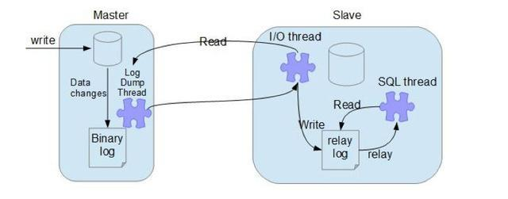

# 1. Mysql主从复制

MySQL主从复制涉及到三个线程

+ 一个运行在主节点（log dump thread）

+ 其余两个(I/O thread, SQL thread)运行在从节点



<!-- more -->

### 1.1 MySQL 复制过程

要实施复制，首先必须打开Master 端的binary log（bin-log）功能，否则无法实现。

+ **主节点 binary log dump 线程**

  当从节点连接主节点时，主节点会创建一个log dump 线程，用于发送bin-log的内容。在读取bin-log中的操作时，此线程会对主节点上的bin-log加锁，当读取完成，甚至在发动给从节点之前，锁会被释放。

+ **从节点I/O线程**

  当从节点上执行`start slave`命令之后，从节点会创建一个I/O线程用来连接主节点，请求主库中更新的bin-log。I/O线程接收到主节点binlog dump 进程发来的更新之后，保存在本地relay-log中。

+ **从节点SQL线程**

  SQL线程负责读取relay log中的内容，解析成具体的操作并执行，最终保证主从数据的一致性。


### 1.2 MySQL 主从复制模式

MySQL 主从复制默认是异步的模式。

MySQL增删改操作会全部记录在binary log中，当slave节点连接master时，会主动从master处获取最新的bin log文件。并把bin log中的sql relay。

+ **异步模式**

  主节点不会主动push bin log到从节点，这样有可能导致failover的情况下，也许从节点没有即时地将最新的bin log同步到本地。

+ **半同步模式(mysql semi-sync)**

  主节点只需要接收到其中一台从节点的返回信息，就会commit；否则需要等待直到超时时间然后切换成异步模式再提交。

  binlog至少传输到了一个从节点上，不能保证从节点将此事务更新到db中。性能上会有一定的降低，响应时间会变长。

+ **全同步模式**

  全同步模式是指主节点和从节点全部执行了commit并确认才会向客户端返回成功。


### 1.3 MySQL 复制方式

+ 基于SQL语句的复制（statement-based replication，SBR）

  就是记录sql语句在bin log中，Mysql 5.1.4 及之前的版本都是使用的这种复制格式。

  优点是只需要记录会修改数据的sql语句到binlog中，减少了binlog日志量，节约I/O，提高性能。

  缺点是在某些情况下，会导致主从节点中数据不一致（比如now()函数等）。

  

+ 基于行的复制（row-based replication，RBR)

  mysql master将SQL语句分解为基于Row更改的语句并记录在bin log中，也就是只记录哪条数据被修改了，修改成什么样。

  优点是不会出现某些特定情况下的存储过程、或者函数、或者trigger的调用或者触发无法被正确复制的问题。

  缺点是会产生大量的日志，尤其是修改table的时候会让日志暴增,同时增加bin log同步时间。也不能通过bin log解析获取执行过的sql语句，只能看到发生的data变更。

  

+ 混合模式复制（mixed-based replication,MBR)

  MySQL NDB cluster 7.3 和7.4 使用的MBR。是以上两种模式的混合，对于一般的复制使用STATEMENT模式保存到binlog，对于STATEMENT模式无法复制的操作则使用ROW模式来保存，MySQL会根据执行的SQL语句选择日志保存方式。


### 1.4 操作

+ docker 运行 mysql

  ```bash
  docker pull mysql:5.7 # 拉取镜像

  docker run --name mysql1 -p 33061:3306 -e MYSQL_ROOT_PASSWORD=123456 -d mysql:5.7 # 运行第一个 mysql
  docker run --name mysql2 -p 33062:3306 -e MYSQL_ROOT_PASSWORD=123456 -d mysql:5.7 # 运行第二个 mysql
  ```

​	第一个当做主服务器, 第二个当做从服务器

+ 主服务器配置

  ```bash
  # 1. 进入容器修改配置文件
  docker exec -it mysql1 /bin/bash

  vi /etc/mysql/mysql.conf.d/mysqld.cnf
  [mysqld]
  server-id=1
  log-bin=mysql-bin

  docker restart mysql1

  # 2. 配置权限, 可以被连接
mysql -u root -p
  grant replication slave on *.* to 'root'@'172.17.0.1' identified by '123456';
  flush privileges;
  show master status\G
  *************************** 1. row ***************************
             File: mysql-bin.000003
           Position: 319
       Binlog_Do_DB:
   Binlog_Ignore_DB:
  Executed_Gtid_Set:
  ```
  
+ 从服务器配置

  ```bash
  # 1. 进入容器修改配置文件
  docker exec -it mysql2 /bin/bash
  
  vi /etc/mysql/mysql.conf.d/mysqld.cnf
[mysqld]
  server-id=2
  log-bin=mysql-bin
  
  docker restart mysql2
  
  
  # 2.开启slave, 可以被访问
  mysql -u root -p
  
  # 172.17.0.1 是docker mac 本机 ip, 33061是 主的端口
  change master to master_host='172.17.0.1',
  master_port=33061,
  master_user='root',
  master_password='123456',
  master_log_file='mysql-bin.000003',
  master_log_pos=319; 
  
  
  start slave;
  show slave status\G
  *************************** 1. row ***************************
                 Slave_IO_State: Waiting for master to send event
                    Master_Host: 172.17.0.1
                    Master_User: root
                    Master_Port: 33061
                  Connect_Retry: 60
                Master_Log_File: mysql-bin.000003
            Read_Master_Log_Pos: 649
                 Relay_Log_File: 9339fdceb667-relay-bin.000002
                  Relay_Log_Pos: 650
          Relay_Master_Log_File: mysql-bin.000003
               Slave_IO_Running: Yes
              Slave_SQL_Running: Yes
  ```
  
+ 测试

  ```bash
  # 主数据库创建
  create database test_1;
  # 从数据查看, 即可以看到
  show databases;
  ```

  

# 2. redis 主从复制

主服务器负责接收写请求, 从服务器负责接收读请求(从服务器无法进行写操作)

### 2.1 同步模式

+ 完整重同步(redis 2.8以前)
  + 从服务器向主服务器发送PSYNC命令
  
  + 收到PSYNC命令的主服务器执行BGSAVE命令，在后台**生成一个RDB文件**。并用一个**缓冲区**来记录从现在开始执行的所有**写命令**。
  
  + 当主服务器的BGSAVE命令执行完后，将生成的RDB文件发送给从服务器，**从服务器接收和载入RDB文件**。将自己的数据库状态更新至与主服务器执行BGSAVE命令时的状态。
  
  + 主服务器将所有缓冲区的**写命令发送给从服务器**，从服务器执行这些写命令，达到数据最终一致性。
  
    
  
+ 部分重同步

  + 主从服务器的复制偏移量

    - 主服务器每次传播N个字节，就将自己的复制偏移量加上N

    - 从服务器每次收到主服务器的N个字节，就将自己的复制偏移量加上N

      

  + 主服务器的复制积压缓冲区

    主服务器进行命令传播时，不仅仅会将写命令发送给所有的从服务器，还会将写命令**入队到复制积压缓冲区**里面(这个大小可以调的)。如果复制积压缓冲区**存在**丢失的偏移量的数据，那就执行部分重同步，否则执行完整重同步。

    

  + 服务器运行的ID(**run ID**)

    服务器运行的ID(**run ID**)实际上就是用来比对ID是否相同。如果不相同，则说明从服务器断线之前复制的主服务器和当前连接的主服务器是两台服务器，这就会进行完整重同步。

    

+ 命令传播

  当完成了同步之后，主从服务器就会进入命令传播阶段。这时主服务器只要将自己的写命令发送给从服务器，而从服务器接收并执行主服务器发送过来的写命令，就可以保证主从服务器一直保持数据一致了！

  在命令传播阶段，从服务器默认会以每秒一次的频率，向服务器发送命令`REPLCONF ACK <replication_offset>` 其中replication_offset是从服务器当前的复制偏移量


### 2.2 操作

+ 下载

  ```bash
  # 下载
  docker pull redis:latest

  # 下载配置文件 
  http://download.redis.io/redis-stable/redis.conf

  # 主redis配置, 无需特殊配置, 因为在 docker 内, 需要修改一下bind
  vi $PWD/redis1/redis.conf
  bind 127.0.0.1 改为 bind 0.0.0.0

  # 修改从redis配置, 修改 redis.conf 文件
  vi $PWD/redis2/redis.conf
  slaveof 172.17.0.1 63791
  ```

+ 启动

  ```bash
  # 主服务器
  docker run \
  -p 63791:6379 \
  -v $PWD/redis1/redis.conf:/etc/redis/redis.conf \
  --privileged=true \
  --name redis1 \
  -d redis redis-server /etc/redis/redis.conf

  # 从服务器
  docker run \
  -p 63792:6379 \
  -v $PWD/redis2/redis.conf:/etc/redis/redis.conf \
  --privileged=true \
  --name redis2 \
  -d redis redis-server /etc/redis/redis.conf
  ```

+ 测试

  ```bash
  # 查看配置文件
  redis-cli info | grep config_file
  
  # 查看从的状态, 看到master_link_status:up就是成功
  redis-cli info | grep master
  master_host:172.17.0.1
  master_port:63791
  master_link_status:up

	# 然后在主服务器 set key, 在从服务器 get 即可
  ```
  
  

# 3. mongodb 副本集

在 MongoDB 中,有两种数据冗余方式,一种 是 Master-Slave 模式（主从复制）,一种是 Replica Sets 模式（副本集）。

MongoDB 的最新版本已经不再支持主从复制, 建议使用副本集。

### 3.1 主从复制(不推荐)

+ --master用来确定主服务器

+ --slave 和 --source 来控制从服务器
+ 可以在mongodb.conf配置文件里指明主从关系，这样启动mongodb的时候只要跟上配置文件就行，就不需要通过--master和--slave来指明主从了。

### 3.2 副本集

只能 master 写, 从不能写.

+ 下载

  ```bash
  docker pull mongo:latest
  
  # 主服务器
  docker run \
  -d \
  -p 27018:27017 \
  --name mongo1 \
  mongo mongod --replSet my-mongo-set
  
  # 从服务器
  docker run \
  -d \
  -p 27019:27017 \
  --name mongo2 \
  mongo mongod --replSet my-mongo-set
  ```
  
+ 配置

  ```bash
  docker exec -it mongo1 mongo
  
  config = {
       "_id" : "my-mongo-set",
       "members" : [
           {
               "_id" : 0,
               "host" : "172.17.0.1:27018"
           },
           {
               "_id" : 1,
               "host" : "172.17.0.1:27019"
           }
       ]
    }
  rs.initiate(config)
  # 下面是输出
  {
          "ok" : 1,
          "$clusterTime" : {
                  "clusterTime" : Timestamp(1595349445, 1),
                  "signature" : {
                          "hash" : BinData(0,"AAAAAAAAAAAAAAAAAAAAAAAAAAA="),
                          "keyId" : NumberLong(0)
                  }
          },
          "operationTime" : Timestamp(1595349445, 1)
  }
  
  # 如果一切顺利，提示符将变成这样：(需手动随便敲命令触发下)
  my-mongo-set:PRIMARY>
  ```


+ 测试

  ```bash
  # 启动从服务器
  docker exec -it mongo2 mongo
  my-mongo-set:PRIMARY>
  
  
  # 主服务器
  my-mongo-set:PRIMARY> db.mycollection.insert({name : 'sample'})
  WriteResult({ "nInserted" : 1 })
  my-mongo-set:PRIMARY> db.mycollection.find()
{ "_id" : ObjectId("5f171a9bfb41dd82f33d6b2d"), "name" : "sample" }
  
  # 从服务器
  my-mongo-set:SECONDARY> db.setSlaveOk() # 设置同步
  my-mongo-set:SECONDARY> db.mycollection.find()
  { "_id" : ObjectId("5f171a9bfb41dd82f33d6b2d"), "name" : "sample" }
  
  
  # 查询状态
  1. 判断是不是master: db.isMaster()
  2. 复制集状态查询：rs.status()
  3. 查看oplog状态： rs.printReplicationInfo()
  4. 查看复制延迟：  rs.printSlaveReplicationInfo()
  5. 查看服务状态详情:   db.serverStatus()
  ```
  
  

# 4. SQL版本历史

### 4.1 mysql

| 版本   | 事件                                                         | 时间 |
| ------ | ------------------------------------------------------------ | ---- |
| 1.0    | 仅供内部使用                                                 | 1995 |
| 3.11.1 |                                                              | 1996 |
| 4.0    | 集成了后来大名鼎鼎的InnoDB存储引擎。                         | 2002 |
| 5.0    | 支持游标，存储过程，触发器，视图，XA事务等特性               | 2005 |
| 5.1    | Sun以10亿美金收购MySQL AB                                    | 2008 |
| 5.5    | Oracle以74亿美金收购Sun公司。InnoDB代替MyISAM成为MySQL默认的存储引擎。 | 2010 |
| 5.6    | MySQL 5.6是MySQL历史上一个里程碑式的版本，这也是目前生产上应用得最广泛的版本。 | 2013 |
| 5.7    |                                                              | 2015 |
| 8.0    |                                                              | 2018 |

### 4.2 redis

| 版本 | 时间           | 事件                                   |
| ---- | -------------- | -------------------------------------- |
| 2.6  | 2012年         | 服务端支持Lua脚本。                    |
| 2.8  | 2013年11月22日 | 发布订阅添加了pubsub命令               |
| 3.0  | 2015年4月1日   | Redis Cluster：Redis的官方分布式实现。 |
| 3.2  | 2016年5月6日   |                                        |
| 4.0  | 2017年7月14日  |                                        |
| 5.0  | 2018年10月     | 新的流数据类型(Stream data type)       |
| 6.0  | 2020 年5月2日  | 多线程                                 |

### 4.3 mongodb
| 版本  | 时间          | 事件                                                   |
| ----- | ------------- | ------------------------------------------------------ |
| 1.0   | 2009          | 首次在数据库领域亮相，打破了关系型数据库一统天下的局面 |
| 2.0.6 | 2012          |                                                        |
| 2.4.8 | 2013          |                                                        |
| 3.0.1 | 2017          |                                                        |
| 4.0.2 | 2018          | 支持多文档事务                                         |
| 5.0   | 2019          | 引入分布式事务                                         |


# 5. 问题总结

+ docker 内没有命令

  ```bash
  apt update
  apt install vim #vim
  apt install procps # ps
  apt install iputils-ping #ping
  ```

  

# 6. 参考资料

+ https://zhuanlan.zhihu.com/p/50597960
+ https://outmanzzq.github.io/2019/01/30/docker-mongo-replica/