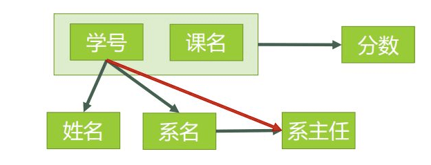
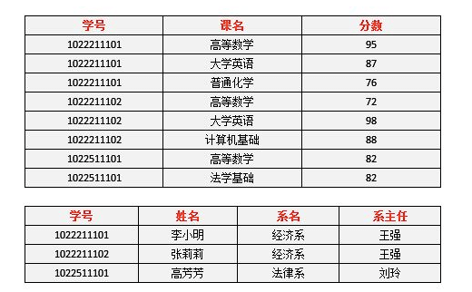

# 1. 函数依赖

## 1.1 函数依赖(有我就能决定你)

设X,Y是关系R的两个属性集合，当任何时刻R中的任意两个元组中的X属性值相同时，则它们的Y属性值也相同，则称X函数决定Y，或Y函数依赖于X。

+ 在一个表中,  X的值确定的情况下，必定能确定属性Y的值,  这就是函数依赖名字的由来，类似于函数关系 y = f(x)
+ 姓名函数依赖于学号，写作 **学号 → 姓名**。
+ 不能说学号函数依赖于姓名。姓名 不能决定学号, 因为有重名.

<!-- more -->

---

## 1.2. 平凡函数依赖(我决定的值还是我自己内部, 走不出自我, 于是平凡的我)

当关系中属性集合Y是属性集合X的子集时(Y⊆X)，存在函数依赖X→Y，即一组属性函数决定它的所有子集，这种函数依赖称为平凡函数依赖。

## 1.3 非平凡函数依赖(我决定的值大千世界)

当关系中属性集合Y不是属性集合X的子集时，存在函数依赖X→Y，则称这种函数依赖为非平凡函数依赖。

---

## 1.4. 完全函数依赖 (我要和别人一起决定你)

设X,Y是关系R的两个属性集合，X’是X的真子集，存在X→Y，但对每一个X’都有X’!→Y，则称Y完全函数依赖于X。

+ （学号，课名）F→ 分数 （因为同一个的学号对应的分数不确定，同一个课名对应的分数也不确定）
+ 自己一个人决定不了, 需要共同决定

## 1.5. 部分函数依赖(我的一部分就能决定你)

设X,Y是关系R的两个属性集合，存在X→Y，若X’是X的真子集，存在X’→Y，则称Y部分函数依赖于X。

+ (学号，课名） P→ 姓名
+ 我自己的一部分就可以决定

## 1.6. 传递函数依赖 (我可以间接决定你)

设X,Y,Z是关系R中互不相同的属性集合，存在X→Y(Y !→X),Y→Z，则称Z传递函数依赖于X。

# 2. 码和主属性

## 2.1 码

设 K 为某表中的一个属性或属性组，若除 K 之外的所有属性都完全函数依赖于 K（这个“完全”不要漏了），那么我们称 K 为**候选码**，简称为**码**。

在实际中我们通常可以理解为：假如当 K 确定的情况下，该表除 K 之外的所有属性的值也就随之确定，那么 K 就是码。一张表中可以有超过一个码。（实际应用中为了方便，通常选择其中的一个码作为主码）

+ 2NF的图 **(学号、课名）**这个属性组就是码。该表中有且仅有这一个码。

  

## 2.2 主属性

包含在任何一个码中的属性成为主属性。

2NF的图主属性就有两个，**学号** 与 **课名**。

# 3. 范式

关系数据库有六种，1NF，2NF，3NF，BCNF，4NF，5NF。

## 3.1 1NF (问题: 同字段内容重复, 要拆表->2NF)

符合1NF的关系中的每个属性都不可再分。下图就不符合1NF的要求.

1NF是关系模式应具备的最起码的条件，如果数据库设计不能满足第一范式，就不能称为关系型数据库。关系数据库自带1NF

## 3.2 2NF (问题: 非主属性不同字段之间关联, 要拆表->3NF)

+ 每一名学生的学号、姓名、系名、系主任这些数据重复多次。每个系与对应的系主任的数据也重复多次——**数据冗余过大** 

+ 假如学校新建了一个系，但是暂时还没有招收任何学生（比如3月份就新建了，但要等到8月份才招生），那么是无法将系名与系主任的数据单独地添加到数据表中去的——**插入异常**

+ 假如将某个系中所有学生相关的记录都删除，那么所有系与系主任的数据也就随之消失了（一个系所有学生都没有了，并不表示这个系就没有了）。——**删除异常**

+ 假如李小明转系到法律系，那么为了保证数据库中数据的一致性，需要修改三条记录中系与系主任的数据。——**修改异常**。

  正因为仅符合1NF的数据库设计存在着这样那样的问题，我们需要提高设计标准，去掉导致上述四种问题的因素，使其符合更高一级的范式（2NF），这就是所谓的“规范化”。

  

  #### 3.2.1  判断是否符合2NF

  根据2NF的定义，判断的依据实际上就是看数据表中**是否存在非主属性对于码的部分函数依赖**。若存在，则数据表最高只符合1NF的要求，若不存在，则符合2NF的要求。判断的方法是：

  

  > 第一步：找出数据表中所有的**码**。
  
  + 查看所有每一单个属性，当它的值确定了，是否剩下的所有属性值都能确定。
  + 查看所有包含有两个属性的属性组，当它的值确定了，是否剩下的所有属性值都能确定。
+ 依次查看3个4个5个.....
  + 看起来很麻烦是吧，但是这里有一个诀窍，就是假如A是码，那么所有包含了A的属性组，如（A，B）、（A，C）、（A，B，C）等等，都不是码了（因为作为码的要求里有一个“**完全**函数依赖”）。

  

  这一步完成以后，可以得到，表3的码只有一个，就是**（学号、课名）**。学号并不能直接决定分数, 所以学号+课名能决定一切

  

  > 第二步：根据第一步所得到的码，找出所有的**主属性**。
  
  主属性有两个：**学号** 与 **课名**
  
  > 第三步：数据表中，除去所有的主属性，剩下的就都是**非主属性**了。
  
  非主属性有四个：**姓名**、**系名**、**系主任**、**分数**
  
  > 第四步：查看是否存在非主属性对码的**部分函数依赖**。
  
  对于**（学号，课名） → 姓名**，有 **学号 → 姓名**，		存在非主属性 姓名 对码**（学号，课名）**的部分函数依赖。
  对于**（学号，课名） → 系名**，有 **学号 → 系名**，		存在非主属性 系名 对码**（学号，课名）**的部分函数依赖。
  对于**（学号，课名） → 系主任**，有 **学号 → 系主任**，存在非主属性 系主任 对码**（学号，课名）**的部分函数依赖。
  
  所以表3存在非主属性对于码的部分函数依赖，最高只符合1NF的要求，不符合2NF的要求。

#### 3.2.2  拆表符合2NF

为了符合2NF的要求，我们必须消除这些部分函数依赖，只有一个办法，就是将大数据表拆分成两个或者更多个更小的数据表，在拆分的过程中，要达到更高一级范式的要求，这个过程叫做”模式分解“。模式分解的方法不是唯一的，以下是其中一种方法：
选课表（学号，课名，分数）
学生表（学号，姓名，系名，系主任）

我们先来判断以下，**选课**表与**学生**表，是否符合了2NF的要求？

对于**选课**表，其码是**（学号，课名）**，主属性是**学号**和**课名**，非主属性是**分数**，**学号**确定，并不能唯一确定**分数**，**课名**确定，也不能唯一确定**分数**，所以不存在非主属性**分数**对于码 **（学号，课名）**的部分函数依赖，所以此表符合2NF的要求。

对于**学生**表，其码是**学号，**主属性是**学号**，非主属性是**姓名、系名**和**系主任**，因为码只有一个属性，所以不可能存在非主属性对于码 的部分函数依赖，所以此表符合2NF的要求。

#### 3.2.3 定义

如果关系模式R是1NF，且每一个非主属性完全依赖于候选建，那么就称R是第二范式。

第二范式要满足的条件：首先要满足第一范式，其次每一个非主属性要**完全函数**依赖于候选键，或者是主键。也就是说，每个非主属性是由整个主键函数决定的，而不能有主键的一部分来决定。

## 3.3 3NF (问题: 主属性不同字段之间关联, 要拆表->BCNF)

+ 李小明转系到法律系
  只需要修改一次李小明对应的系的值即可。——有改进

+ 数据冗余是否减少了？
  学生的姓名、系名与系主任，不再像之前一样重复那么多次了。——有改进

+ 删除某个系中所有的学生记录
  该系的信息仍然全部丢失。——无改进

+ 插入一个尚无学生的新系的信息。
  因为学生表的码是学号，不能为空，所以此操作不被允许。——无改进

  

所以说，仅仅符合2NF的要求，很多情况下还是不够的，而出现问题的原因，在于仍然存在非主属性**系主任**对于码**学号**的传递函数依赖。为了能进一步解决这些问题，我们还需要将符合2NF要求的数据表改进为符合3NF的要求。

**第三范式（3NF）** **3NF在2NF的基础之上，消除了非主属性对于码的传递函数依赖**。也就是说， 如果存在非主属性对于码的传递函数依赖，则不符合3NF的要求。

#### 3.3.1 判断是否符合3NF

接下来我们看看表中的设计，是否符合3NF的要求。

+ 对于**选课**表，主码为（学号，课名），主属性为**学号**和**课名，**非主属性只有一个，为分数，不可能存在传递函数依赖，所以**选课**表的设计，符合3NF的要求。

+ 对于**学生**表，主码为**学号**，主属性为**学号**，非主属性为**姓名**、**系名**和**系主任**。因为 学号 → 系名，同时 系名 → 系主任，所以存在非主属性**系主任**对于码**学号**的传递函数依赖，所以**学生**表的设计，不符合3NF的要求。。

  

#### 3.3.2  拆表符合3NF

为了让数据表设计达到3NF，我们必须进一步进行模式分解为以下形式：
选课（学号，课名，分数）
学生（学号，姓名，系名）
系（系名，系主任）

+ 对于**选课**表，符合3NF的要求，之前已经分析过了。

+ 对于**学生**表，码为**学号**，主属性为**学号**，非主属性为**系名**，不可能存在非主属性对于码的传递函数依赖，所以符合3NF的要求。

+ 对于**系**表，码为**系名**，主属性为**系名**，非主属性为**系主任**，不可能存在非主属性对于码的传递函数依赖（至少要有三个属性才可能存在传递函数依赖关系），所以符合3NF的要求。。

现在我们来看一下，进行同样的操作，是否还存在着之前的那些问题？

1. 删除某个系中所有的学生记录
   该系的信息不会丢失。——有改进
2. 插入一个尚无学生的新系的信息。
   因为系表与学生表目前是独立的两张表，所以不影响。——有改进
3. 数据冗余更加少了。——有改进

由此可见，符合3NF要求的数据库设计，**基本**上解决了数据冗余过大，插入异常，修改异常，删除异常的问题。当然，在实际中，往往为了性能上或者应对扩展的需要，经常 做到2NF或者1NF，但是作为数据库设计人员，至少应该知道，3NF的要求是怎样的。

#### 3.3.3 定义

如果关系模式R是2NF，且关系模式R（U,F）中的所有非主属性对任何候选关键字都不存在传递依赖，则称关系R是属于第三范式。

第三范式（3NF）；符合2NF，并且，消除传递依赖。

## 3.4 BCNF
#### 3.4.1 3NF 也会有一些问题

1. 某公司有若干个仓库；
2. 每个仓库只能有一名管理员，一名管理员只能在一个仓库中工作；
3. 一个仓库中可以存放多种物品，一种物品也可以存放在不同的仓库中。每种物品在每个仓库中都有对应的数量。

那么关系模式 仓库（仓库名，管理员，物品名，数量） 属于哪一级范式？

已知函数依赖集：仓库名 → 管理员，管理员 → 仓库名，（仓库名，物品名）→ 数量
码：（管理员，物品名），（仓库名，物品名）
主属性：仓库名、管理员、物品名
非主属性：数量

∵ 不存在非主属性对码的部分函数依赖和传递函数依赖。∴ 此关系模式属于3NF。

好，既然此关系模式已经属于了 3NF，那么这个关系模式是否存在问题呢？我们来看以下几种操作：

1. 先新增加一个仓库，但尚未存放任何物品，是否可以为该仓库指派管理员？——不可以，因为物品名也是主属性，根据实体完整性的要求，主属性不能为空。
2. 某仓库被清空后，需要删除所有与这个仓库相关的物品存放记录，会带来什么问题？——仓库本身与管理员的信息也被随之删除了。
3. 如果某仓库更换了管理员，会带来什么问题？——这个仓库有几条物品存放记录，就要修改多少次管理员信息。

从这里我们可以得出结论，在某些特殊情况下，即使关系模式符合 3NF 的要求，仍然存在着插入异常，修改异常与删除异常的问题，仍然不是 ”好“ 的设计。

#### 3.3.2  拆表符合BCNF

造成此问题的原因：存在着**主属性**对于码的部分函数依赖与传递函数依赖。

（在此例中就是存在主属性【仓库名】对于码【（管理员，物品名）】的部分函数依赖。

解决办法就是要在 3NF 的基础上消除**主属性**对于码的部分与传递函数依赖。

仓库（仓库名，管理员）
库存（仓库名，物品名，数量）

这样，之前的插入异常，修改异常与删除异常的问题就被解决了。

#### 3.4.3 定义

符合3NF，并且，主属性不依赖于主属性。若关系模式R属于第一范式，且每个属性都不传递依赖于键码，则R属于BC范式。

## 3.5 总结

应用的范式越高，则表越多。表多会带来很多问题：1 查询时要连接多个表，增加了查询的复杂度. 2 查询时需要连接多个表，降低了数据库查询性能

所以有的时候需要应用反范式化

+ 2NF在1NF的基础之上，消除了**非主属性**对于码的部分函数依赖。
+ 3NF在2NF的基础之上，消除了**非主属性**对于码的传递函数依赖。
+ BCNF 在3NF的基础上，消除**主属性**对于码的部分与传递函数依赖。

# 4. 头脑风暴

+ 1NF, 数据库默认就是, 不用考虑
+ 2NF  码可以决定一切, 但是不能一部分就决定.  (AB->CD) 但是 (A->C)    不能这样, 要改
+ 3NF  码可以决定一切, 但是不能间接决定.          (A->B->C)  不能这样, 要改
+ BCNF 码自己的主属性相互依赖,先解决自己的依赖成为 BCNF       (AB->CD)   但是 (A->B) , 要改

# 5. 参考资料

+ https://www.zhihu.com/question/24696366/answer/29189700
+ https://www.cnblogs.com/rosesmall/p/9585655.html