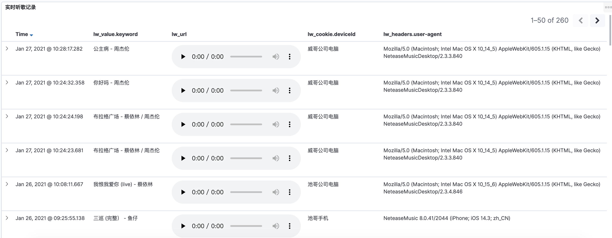
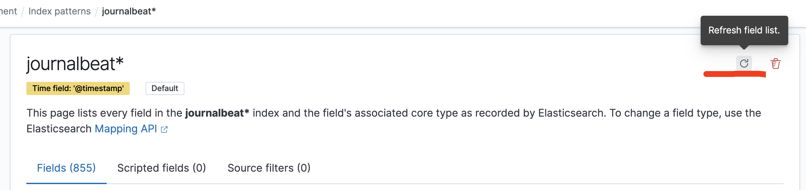
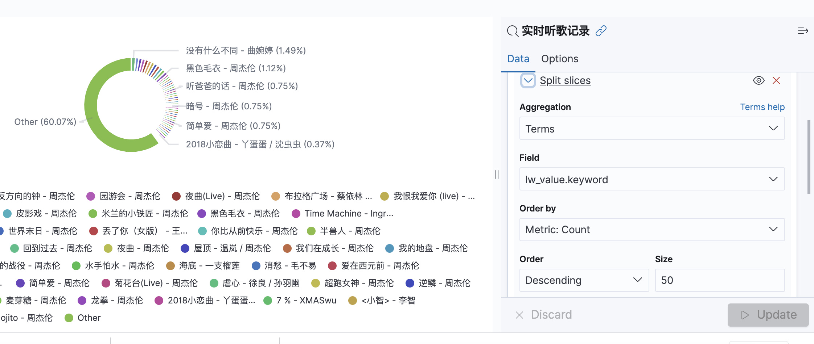
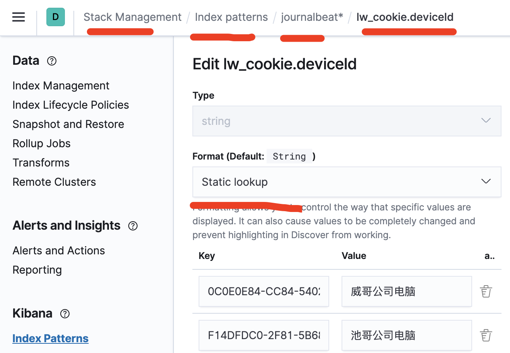
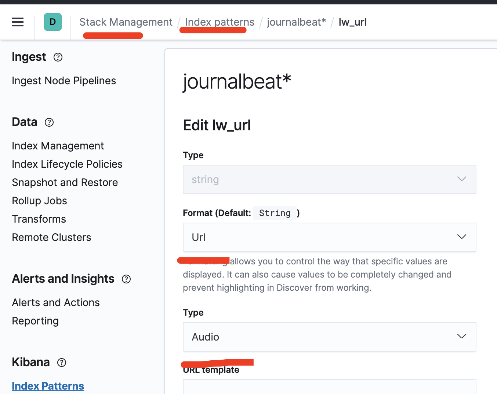

打工人每日网抑云, 所以就用 es简单做个网易云听歌记录. 先上效果图.


<!-- more -->




# 1. 前置条件

### 1.1 代理请求

如果想记录网易云听歌记录,  就要代理网易云请求. 使用了以下服务, 即能代理请求, 也能解锁灰色网抑云歌曲

https://github.com/nondanee/UnblockNeteaseMusic

### 1.2 格式化输出

为了es 方便显示和搜索数据.  需要对统计的数据, 输出 json.

所以需要修改上述服务, 自定义自己的格式化 json 输出.

参考自己的定义结构:

https://github.com/unix2dos/UnblockNeteaseMusic/commit/19232978dec11d260e1da846350101751e276143

### 1.3 安装es

参考: https://www.liuvv.com/p/4986eca1.html

因为服务用的 systemctl 启动的, 为了方便, 没有使用 filebeat, 使用的 journalbeat 收集


# 2. 配置

### 2.1 journalbeat 配置

因为自定义输出了 json, 所以需要beat自动解析 json 字段, 输出到 es 里面.

注意把`decode_json_fields` 放在了`drop_fields`的上面, 因为解析`message` json后, 再放弃原生的`message`信息.

+ journalbeat.yml

```
processors:
  - decode_json_fields:
      fields: ["message"]
      process_array: true
      max_depth: 10
      target: ""
      overwrite_keys: true

  - drop_fields:
      fields: ["message", "journald", "syslog", "log", "host", "event", "ecs", "agent", "process", "systemd"]
```


+ 启动错误1

  Failed to connect to backoff(elasticsearch(http://localhost:9200)): Connection marked as failed because the onConnect callback failed: resource 'journalbeat-7.10.2' exists, but it is not an alias

  

  重新删除索引, 再次启动程序,  在 index 那里出现两个, 一个 index, 一个 alias 即可解决.


+ 启动错误2 

  object mapping for [url] tried to parse field [url] as object, but found a concrete value

  

  因为url 是关键词, 需要在 url 的前面增加了前缀,  例如`lw_url`.


### 2.2 json字段增加索引


去建立索引的地方刷新即可.




# 3. 显示

### 3.1 row分段

Add Sub-Bucket ->Terms, 选择指定字段




### 3.2 歌曲增加 play

去索引管理, 字段编辑, string -> url -> audio



### 3.3 替换字段内容

去索引管理, 字段编辑, string -> string Static lookup




### 3.4 替换字段名字

 7.10.1版本还不支持

参考这个: https://github.com/elastic/kibana/pull/70039


# 4. 获取数据

+ 查看所有索引

```
GET /_cat/indices?v
```

+ 查询指定字段数据

```
GET _search
{
  "query": {
    "match": {
      "lw_value.name": "双截棍"
    }
  }
}
```

+ 查询字段为空的数据

```
GET _search
{
  "query": {
    "bool": {
      "must_not": {
        "exists": {
          "field": "lw_value.name"
        }
      }
    }
  }
}
```

+ 删除查询数据

```
POST /journalbeat-7.10.2-2021.01.24-000001/_delete_by_query
{
  "query": {
    "bool": {
      "must_not": {
        "exists": {
          "field": "lw_value.name"
        }
      }
    }
  }
}
```


# 5. 参考资料

+ https://elasticstack.blog.csdn.net/article/details/108146888