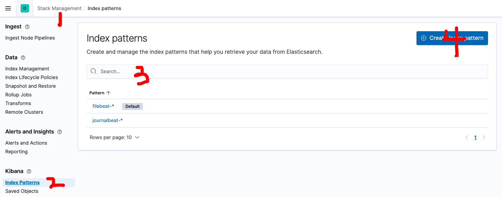
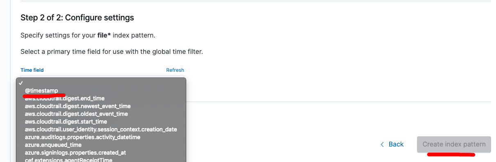
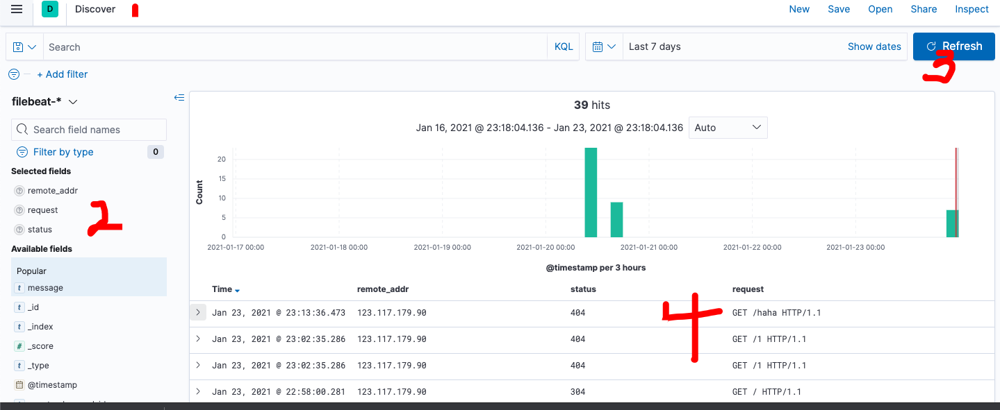

为了便于利用 ELK日志平台收集展示 Nginx 的日志，可以将 Nginx 的日志改成 json 的格式.

<!-- more -->

# 1. 配置

### 1.1 修改 nginx 配置

vim /etc/nginx/nginx.conf 

```nginx
##打开nginx配置文件添加这些信息
    log_format json '{ "time_local": "$time_local", '
                            '"remote_addr": "$remote_addr", '
                            '"referer": "$http_referer", '
                            '"request": "$request", '
                            '"status": $status, '
                            '"bytes": $body_bytes_sent, '
                            '"agent": "$http_user_agent", '
                            '"x_forwarded": "$http_x_forwarded_for", '
                            '"up_addr": "$upstream_addr",'
                            '"up_host": "$upstream_http_host",'
                            '"up_resp_time": "$upstream_response_time",'
                            '"request_time": "$request_time"'
 ' }';
 
##再将日志引用改成json
     access_log  /var/log/nginx/access.log  json;
```


```bash
 > /var/log/nginx/access.log  # 清空日志
 systemctl restart nginx # 重启 nginx
```

通过浏览器访问, 可以看到 json 输出的日志

### 1.2 修改 filebeat 配置

vim /etc/filebeat/filebeat.yml

```nginx
filebeat.inputs:
- type: log
  enabled: true
  paths:
    - /var/log/nginx/access.log
  ##添加这两行信息,使其能解析json格式的日志, 和 path 对齐
  json.keys_under_root: true
  json.overwrite_keys: true

output.elasticsearch:
  hosts: ["localhost:9200"]
```


### 1.3 filebeat 服务

sudo vi /lib/systemd/system/filebeat.service

```
[Unit]
Description=journalbeat
After=network.target

[Service]
Type=simple
User=root
Group=root
Restart=no
WorkingDirectory=/home/elasticsearch/workspace/filebeat-7.10.1-linux-x86_64/
ExecStart=/home/elasticsearch/workspace/filebeat-7.10.1-linux-x86_64/filebeat
PrivateTmp=true

[Install]
WantedBy=multi-user.target
```

systemctl start filebeat


# 2. kinaba查看

### 2.1 创建索引





### 2.2 查询




# 3. 参考资料

+ https://www.jianshu.com/p/b6ba259777e7

