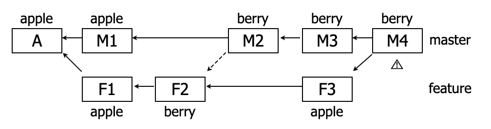

对于多分支的代码库，将代码从一个分支转移到另一个分支是常见需求。

一种情况是，你需要另一个分支的所有代码变动，那么就采用合并（git merge 或 git rebase）。

另一种情况是，你只需要部分代码变动（某几个提交），这时可以采用(git cherry-pick) 。

<!-- more -->

# 1. cherry-pick使用

### 1.1 hash方式

git cherry-pick命令的作用，就是将指定的提交（commit）应用于其他分支。

```bash
$ git cherry-pick <commitHash>
```

上面命令就会将指定的提交commitHash，应用于当前分支。这会在当前分支产生一个新的提交，当然它们的哈希值会不一样。


+ A分支log:

```ini
* cf976d8 - (HEAD -> master, origin/master, origin/HEAD) add 2 (2 minutes ago) <liuwei>
* 07444e6 - add 1 (2 minutes ago) <liuwei>
* 73a2b7f - (cherry) rm citycode (4 minutes ago) <liuwei>
```

+ B分支操作

```bash
git cherry-pick 07444e6
```

+ 然后再看B分支log:

```ini
* d38ece4 - (HEAD -> cherry) add 1 (11 seconds ago) <liuwei>
* 73a2b7f - rm citycode (5 minutes ago) <liuwei>
```


### 1.2 分支方式

git cherry-pick命令的参数，不一定是提交的哈希值，分支名也是可以的，表示转移该分支的最新提交。

```bash
$ git cherry-pick feature
```

上面代码表示将feature分支的最近一次提交，转移到当前分支。!!!注意是一次提交(commit), 不是所有的提交。!!!


### 1.3 多个提交

Cherry pick 支持一次转移多个提交。

```bash
$ git cherry-pick <HashA> <HashB>
```

上面的命令将 A 和 B 两个提交应用到当前分支。这会在当前分支生成两个对应的新提交。


如果想要转移一系列的连续提交，可以使用下面的简便语法。

```bash
$ git cherry-pick A..B 
```

上面的命令可以转移从 A 到 B 的所有提交。它们必须按照正确的顺序放置：提交 A 必须早于提交 B，否则命令将失败，但不会报错。

注意，使用上面的命令，提交 A 将不会包含在 Cherry pick 中。


# 2. 代码冲突

如果操作过程中发生代码冲突，Cherry pick 会停下来，让用户决定如何继续操作。
（1）--continue
用户解决代码冲突后，第一步将修改的文件重新加入暂存区（git add .），第二步使用下面的命令，让 Cherry pick 过程继续执行。

```bash
$ git cherry-pick --continue
```

（2）--abort

发生代码冲突后，放弃合并，回到操作前的样子。

```bash
$ git cherry-pick --abort
```

（3）--quit
发生代码冲突后，退出 Cherry pick，但是不回到操作前的样子。

```bash
$ git cherry-pick --quit
```


# 3. 停止使用cherry-pick

在开发中，不要使用 cherry-pick 来进行不同分支之间代码的同步，这很可能会造成最终合并时出现冲突，而且可能产生比冲突更严重的问题：该有冲突却没有冲突。





如上图，`apple` 代表这个功能是上线状态，`berry` 代表这个功能是下线状态。

然后我们发现了一些 bug，需要将该功能紧急下线，我们：

- 在 feature 分支上下线该功能（F2）：`apple -> berry`
- 然后将该操作 cherry-pick 到 master（M2），现在 master 上该功能也下线了
- 然后我们在 feature 分支上进行了 bug 修复，最终解决了 bug，我们在 feature 分支上将该功能上线（F3）：`berry -> apple`
- 然后我们决定将 bug 修复 merge 到 master
- merge 顺利完成，没有冲突。**但是：这行代码仍然是`berry`，下线状态**

merge 分析：M3(`berry`) 和 F3(`apple`) 的最近公共祖先是 A(`apple`)，因此 git 认为 feature 分支并未修改 `apple` 的值，结果合并后 master 分支上这行代码还是 `berry`，我们的功能在 master 上还是下线状态。


### 3.1 经验

如果你的两个分支是两个单独的分支，永远不会相互 merge，那么才使用 cherry-pick。


# 4. 参考资料


+ https://www.ruanyifeng.com/blog/2020/04/git-cherry-pick.html
+ https://imliyan.com/blogs/article/%E5%81%9C%E6%AD%A2%20cherry-pick%EF%BC%8C%E5%BC%80%E5%A7%8B%20merge/
