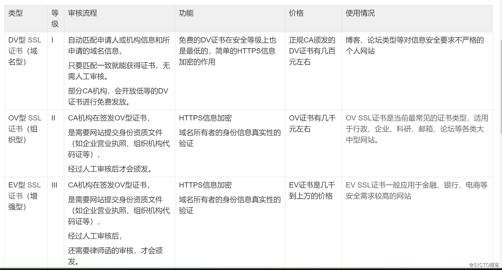
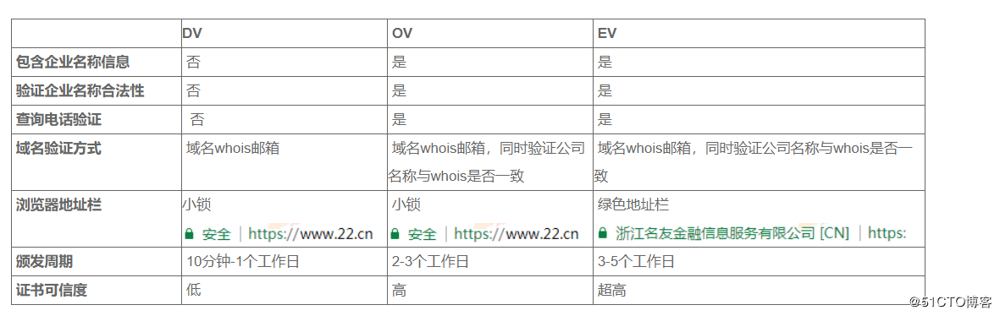

### 1. 证书类型

+ 目前主流的SSL证书主要分为DV SSL(域名型) 、 OV SSL(组织型) 、EV SSL(增强型)。



<!-- more -->

+ DV、OV、EV证书在浏览器中显示的区别

DV类型仅在浏览器显示一个小锁，OV和EV类型证书都包含了企业名称信息，但是，EV证书采用了更加严格的认证标准，浏览器在访问时，会在地址栏显示公司名称，地址栏变成绿色。绿的更加让人信任。




### 2. ACME协议

ACME全称The Automatic Certificate Management Environment，而[acme.sh](https://link.jianshu.com/?t=https%3A%2F%2Fgithub.com%2FNeilpang%2Facme.sh)这个库，则能够在Linux上实现如下功能：

1. 自动向Let's Encrypt申请证书；
2. 自动调用各大云平台的api接口实现TXT解析配置；
3. 证书下发后自动部署到nginx；
4. 利用定时器，每60天自动更新证书，并完成自动部署。


### 3. 配置证书

##### 3.1 安装acme.sh

```bash
curl https://get.acme.sh | sh
```

这个自动安装过程完成了以下几个步骤：

1. 拷贝sh脚本到~/.acme.sh/
2. 创建alias别名acme.sh=~/.acme.sh/acme.sh   (`source ~/.bashrc`一下)
3. 启动定时器 . 可以通过`crontab -l`查看


##### 3.2 dns验证并安装部署

acme.sh 实现了 acme 协议支持的所有验证协议. 一般有两种方式验证: http 和 dns 验证. 接下来我们说下 dns的验证.

+ 去阿里的控制台找到Ali_Key, Ali_Secret, 执行下面命名

  ```bash
  export Ali_Key="xxxxxxxx" 
  export Ali_Secret="xxxxxxxx"
  ```

+ 生成泛域名证书

  ```bash
  acme.sh --issue -d "*.liuvv.com" --dns dns_ali
  ```
  在`~/.acme`文件里生成了`*.liuvv.com` 文件夹

+ 配置nginx

  ```nginx
  server {
          listen 80 default_server;
          listen [::]:80 default_server;
          rewrite ^ https://$http_host$request_uri? permanent; #https跳转到https,永久重定向
  }
  
  server {
          listen 443 ssl default_server;
          listen [::]:443 ssl default_server;
  
          ssl_certificate "/etc/nginx/ssl/fullchain.cer";
          ssl_certificate_key "/etc/nginx/ssl/*.liuvv.com.key";
  
          root /home/levonfly/www;
          index index.html;
  }
  ```

  

+ 安装证书

  ```bash
  sudo ./acme.sh  --installcert  -d  *.liuvv.com   \
          --key-file   /etc/nginx/ssl/*.liuvv.com.key \
          --fullchain-file /etc/nginx/ssl/fullchain.cer \
          --reloadcmd  "service nginx force-reload"
  ```

  + 这里用的是 `service nginx force-reload`, 不是 `service nginx reload`, 据测试, `reload` 并不会重新加载证书, 所以用的 `force-reload`
  + nginx 的配置 `ssl_certificate` 使用 `/etc/nginx/ssl/fullchain.cer` ，而非 `/etc/nginx/ssl/<domain>.cer` ，否则 [SSL Labs](https://www.ssllabs.com/ssltest/) 的测试会报 `Chain issues Incomplete` 错误。

+ 重新生成证书

  ```bash
  sudo ./acme.sh --renew -d *.liuvv.com --force
  ```

  通过这个命令,观看是否自动部署, 并观察证书的到期时间.


### 4. 参考资料

+ [https://github.com/Neilpang/acme.sh/wiki/%E8%AF%B4%E6%98%8E](https://github.com/Neilpang/acme.sh/wiki/说明)

+ https://www.mustu.cn/acme-shhuo-qu-lets-encrypt-wildcardtong-pei-ssl/

+ https://www.jianshu.com/p/a9f2088e099c

+ https://deepzz.com/post/acmesh-letsencrypt-cert-auto-renew.html