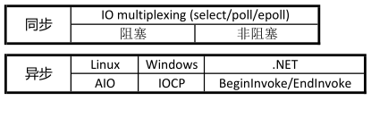
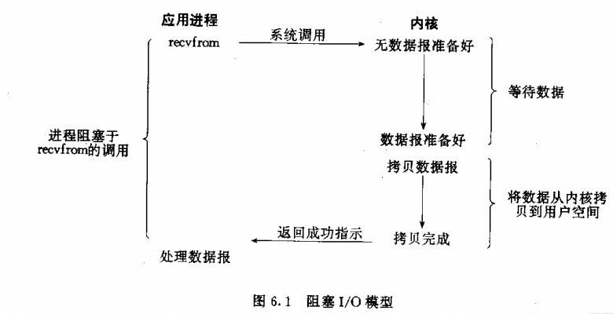
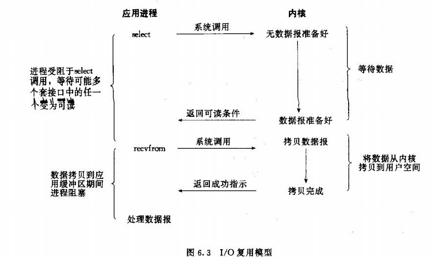
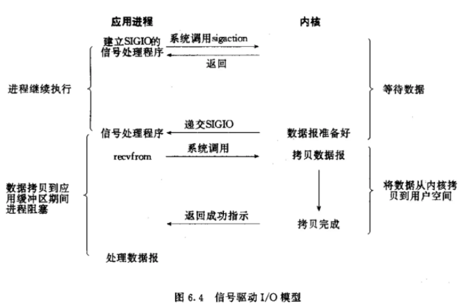
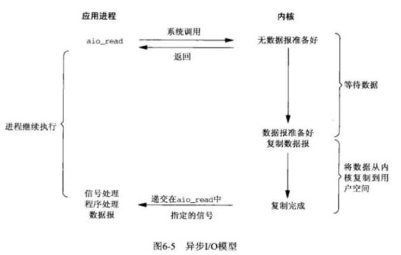
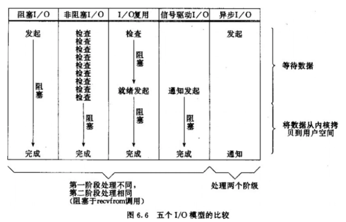

# 1. IO 模型

先抛出来着知乎的一个问题:

epoll技术属于IO复用，IO复用属于同步IO，所以epoll属于同步IO，这应该是没毛病的。

现在我用了一个框架，比如twisted，里面的reactor模式的实现是基于epoll或者poll的，在IO的范畴应该是属于同步IO，但是网上几乎所有的文章都说twisted是异步的。

我的问题是，异步与异步IO是不是一个东西？有没有可能异步可以由同步IO(epoll或poll)实现？

<!-- more -->

### 1.1 同步异步与阻塞非阻塞

阻塞非阻塞与同步异步是不同层次的问题。

一个网络包从应用程序A发到另一台电脑上的应用程序B，需要经历：

1. 从A的业务代码到A的软件框架
2. 从A的软件框架到A的计算机的操作系统内核
3. 从A所在计算机的内核到网卡
4. 从网卡经过网线发到交换机等设备，层层转发，到达B所在计算机的网卡
5. 从B所在计算机的网卡到B所在计算机的内核
6. 从B所在计算机的内核到B的程序的用户空间
7. 从B的软件框架到B的业务代码

这个层级关系就像是过程调用一样，前一级调用后一级的功能，后一级返回一个结果给前一级（比如：成功，或者失败）。

只有在单独一级的调用上，可以说同步还是异步的问题。

所谓同步，是指调用协议中结果在调用完成时返回，这样调用的过程中参与双方都处于一个状态同步的过程。

而异步，是指调用方发出请求就立即返回，请求甚至可能还没到达接收方，比如说放到了某个缓冲区中，等待对方取走或者第三方转交；而结果，则通过接收方主动推送，或调用方轮询来得到。

从这个定义中，我们看，首先1和7，这取决于软件框架的设计，如果软件框架可以beginXXX，然后立即返回，这就是一种异步调用，再比如javascript当中的异步HTTP调用，传入参数时提供一个回调函数，回调函数在完成时调用，再比如协程模型，调用接口后马上切换到其他协程继续执行，在完成时由框架切换回到协程中，这都是典型的异步接口设计。

而2和6，其实都需要调用方自己把数据在内核和用户空间里搬来搬去，其实都是同步接口，除非是IOCP这样的专门的异步传输接口，所以这一级其实是同步的，阻塞与非阻塞的区别其实是影响调用接口的结果（在特定条件下是否提前返回结果），而不是调用方式。

3和5，内核一般通过缓冲区，使用DMA来传输数据，所以这一步又是异步的。

4，以太网是个同步时序逻辑，随信号传输时钟，必须两边设备同时就绪了才能开始传输数据，这又是同步的。

> 总结来说，讨论究竟是异步还是同步，一定要严格说明说的是哪一部分。

说非阻塞是同步而不是异步，这毫无疑问是正确的，然而说某个框架是异步IO的框架，这也是正确的，因为说的其实是框架提供给业务代码的接口是异步的，不管是回调还是协程，比如说我们可以说某个库是异步的HTTPClient，并没有什么问题，因为说的是给业务代码的接口。由于通常异步的框架都需要在2中使用非阻塞的接口，的确会有很多人把非阻塞和异步混为一谈。

### 1.2 linux io阻塞非阻塞

阻塞和非阻塞的主要区别在于：调用端线程在调用函数后是否立刻返回。

+ 阻塞

  服务端返回结果之前，客户端线程会被挂起，此时线程不可被CPU调度，线程暂停运行。

+ 非阻塞

  在服务端返回前，函数不会阻塞调用端线程，而会立刻返回。

### 1.3 linux io同步异步

同步异步的主要区别在于：服务端在拷贝数据时是否阻塞调用端线程。

+ 同步

  调用端会一直等待服务端响应，直到返回结果。

+ 异步

  调用端发起调用之后不会立刻返回，不会等待服务端响应。服务端通过通知机制或者回调函数来通知客户端。

### 1.4 具体分类

阻塞IO和非阻塞IO都是同步IO。

# 2. Linux下的五种I/O模型(apue)

Linux下主要有以下五种I/O模型：

1. 阻塞I/O（blocking IO）
2. 非阻塞I/O (nonblocking I/O)
3. I/O 复用 (I/O multiplexing)（select、poll、linux 2.6种改进的epoll）
4. 信号驱动I/O (signal driven I/O (SIGIO))
5. 异步I/O (asynchronous I/O)

### 2.1 阻塞IO 模型

> 最傻, 不能忍

进程会一直阻塞，直到数据拷贝完成 应用程序调用一个IO函数，导致应用程序阻塞，等待数据准备好。数据准备好后，从内核拷贝到用户空间，IO函数返回成功指示。

### 2.2 非阻塞IO模型

> 循环调用询问, ok了开始拷贝, 拷贝中需要等待。

通过进程反复调用IO函数，在数据从内核拷贝到用户空间过程中，进程是阻塞的。

### 2.3 IO复用模型

> ok了被通知,   拷贝中需要等待

主要是select和epoll。一个线程可以对多个IO端口进行监听，当socket有读写事件时分发到具体的线程进行处理。

### 2.4 信号驱动IO模型

> ok了被通知,   拷贝中需要等待

首先我们允许Socket进行信号驱动IO,并安装一个信号处理函数，进程继续运行并不阻塞。当数据准备好时，进程会收到一个SIGIO信号，可以在信号处理函数中调用I/O操作函数处理数据。

### 2.5 异步IO模型

> ok了被通知, 拷贝完成后被通知

相对于同步IO，异步IO不是顺序执行。用户进程进行aio_read系统调用之后，无论内核数据是否准备好，都会直接返回给用户进程，然后用户态进程可以去做别的事情。等到socket数据准备好了，内核直接复制数据给进程，然后从内核向进程发送通知。IO两个阶段，进程都是非阻塞的。

# 3. Linux五种IO模型比较

### 3.1 同步IO和异步IO的区别

A synchronous I/O operation causes the requesting process to be blocked until that I/O operation completes;
An asynchronous I/O operation does not cause the requesting process to be blocked;

两者的区别就在于同步IO 做 IO操作的时候会将process阻塞。

按照这个定义，之前所述的blocking IO，non-blocking IO，IO multiplexing都属于synchronous IO。注意到non-blocking IO会一直轮询(polling)，这个过程是没有阻塞的，但是recvfrom阶段blocking IO,non-blocking IO和IO multiplexing都是阻塞的。

而asynchronous IO则不一样，当进程发起IO 操作之后，就直接返回再也不理睬了，直到kernel发送一个信号，告诉进程说IO完成。在这整个过程中，进程完全没有被block。

### 3.2 总结

POSIX把I/O操作划分成两类：

- 同步I/O: 同步I/O操作导致请求进程阻塞，直至操作完成

- 异步I/O: 异步I/O操作不导致请求阻塞
  

所以Unix的前四种I/O模型都是同步I/O, 只有最后一种才是异步I/O。

+ 阻塞IO模型，非阻塞IO模型，IO复用模型，信号驱动IO模型都是同步IO。 
+ 非阻塞之所以是同步, 是因为recvfrom会将数据从kernel拷贝到用户内存中，这个时候进程是被block了，在这段时间内，进程是被block的。

# 4. JAVA IO 和 linux IO

### 4.1 JAVA IO

+ BIO(Blocking I/O)

  

+ NIO(Non-blocking I/O)

  在Java领域，也称为New I/O。 
  
  Java NIO ([JSR 51](https://www.jcp.org/en/jsr/detail?id=51))定义了Java new I/O API，提案2000年提出,2002年正式发布。 JDK 1.4起包含了相应的API实现。 
  
  

+ AIO(Asynchronous I/O)

    JAVA NIO2 ([JSR 203](https://www.jcp.org/en/jsr/detail?id=203))定义了更多的 New I/O APIs， 提案2003提出，直到2011年才发布， 最终在JDK 7中才实现。

当前很多的项目还停留在JAVA NIO的实现上， 对JAVA AIO(asynchronous I/O)着墨不多。

### 4.2 对应关系

再次重复linux的前四种I/O模型都是同步I/O, 只有最后一种才是异步I/O。

+ 传统的Java BIO (blocking I/O)是Unix I/O模型中的第一种。
+ Java NIO中如果不使用select模式，而只把channel配置成nonblocking则是第二种模型。
+ Java NIO select实现的是一种多路复用I/O。 底层使用epoll或者相应的poll系统调用。
+ 第四种模型JDK应该是没有实现。
+ Java NIO2增加了对第五种模型的支持，也就是AIO。

#  5. 头脑风暴

### 5.1 epoll 是同步还是异步

IO操作包括：1.等待数据准备好。2.从内核到进程拷贝数据。

同步IO和异步IO的区别：1. 同步IO导致请求进程阻塞，直到IO操作完成。2. 异步IO不导致请求进程阻塞。

得到的结论：

1. 阻塞IO模型，非阻塞IO模型，IO复用模型，信号驱动IO模型都是同步IO。

2. epoll也是IO复用模型，应该是同步IO。

此时又意外了，再看到一个解释：

更为重要的是, epoll 因为采用 mmap的机制, 使得 内核socket buffer和 用户空间的 buffer共享, 从而省去了 socket data copy, 这也意味着, 当epoll 回调上层的 callback函数来处理 socket 数据时, 数据已经从内核层 "自动" 到了用户空间, 虽然和 用poll 一样, 用户层的代码还必须要调用 read/write, 但这个函数内部实现所触发的深度不同了.

用 poll 时, poll通知用户空间的Appliation时, 数据还在内核空间, 所以Appliation调用 read API 时, 内部会做 copy socket data from kenel space to user space.

而用 epoll 时, epoll 通知用户空间的Appliation时?, 数据已经在用户空间, 所以 Appliation调用 read API 时?, 只是读取用户空间的 buffer, 没有 kernal space和 user space的switch了.

于是想了一下：

明显没有IO操作的拷贝数据到内核空间了，stevens应该在99年就挂了，2.6内核的epoll才采用mmap机制，书籍偏旧了吧。

那么epoll是异步IO了吧。

然后再一看，你妹的，这还是不符合异步IO啊，毕竟epoll在告知OK前，是阻塞了，虽然是拷贝数据结束了。

看来好像应该修正的是IO操作定义的第二步才对，而不是那个区别。

好吧，你就暂时属于同步IO了，专心看代码，不纠结概念了。

结论就是epoll属于同步非阻塞模型，这个东西貌似目前还是有争议，在新的2.6内核之后，epoll应该属于异步io的范围了，golang的高并发特性就是底层封装了epoll模型的函数，但也有文章指出epoll属于“伪AIO”，真正的推动力实际在系统内核，另外mmap的应用加快了用户层和内核层的消息交换，对并发效率也有极大的提升。

 

# 6. 参考资料

+ https://www.liuvv.com/p/457c2d1f.html

+ https://www.zhihu.com/question/19732473/answer/117012135
+ https://juejin.im/post/6844903782094995470
+ https://colobu.com/2014/11/13/java-aio-introduction/

+ https://www.cnblogs.com/dolphin0520/p/3916526.html

