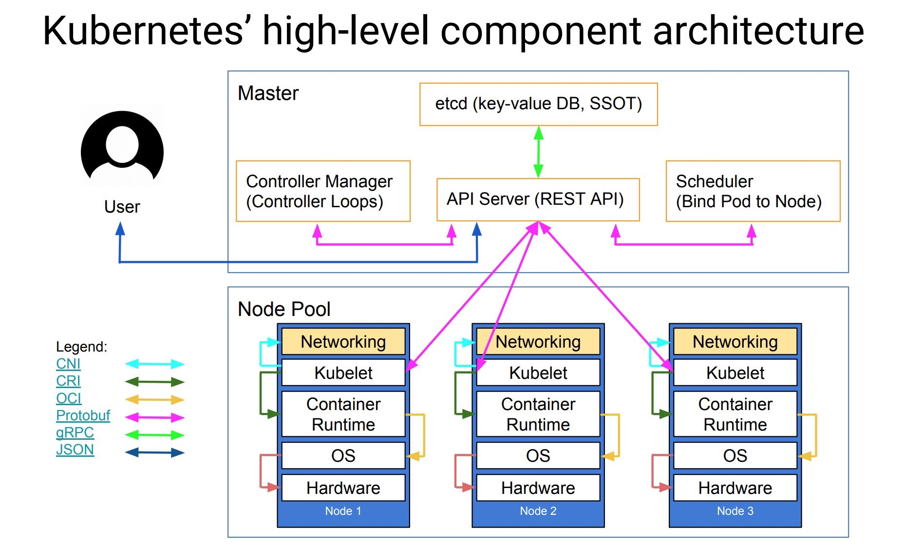
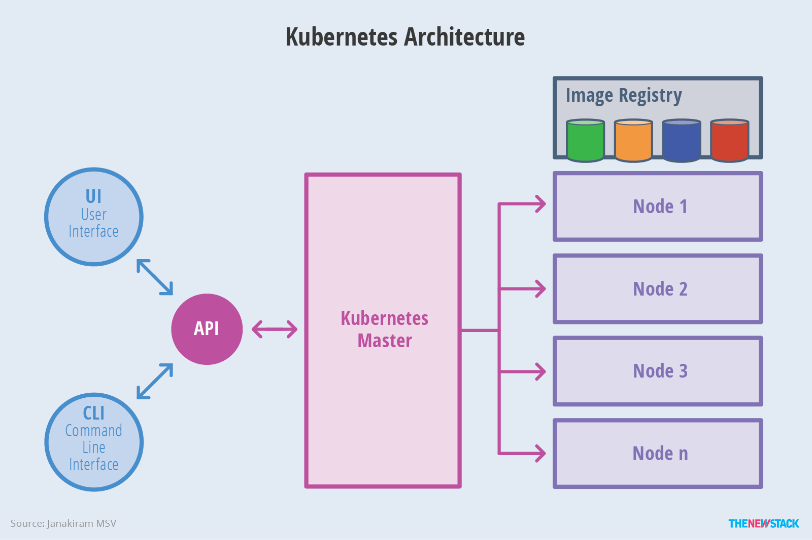
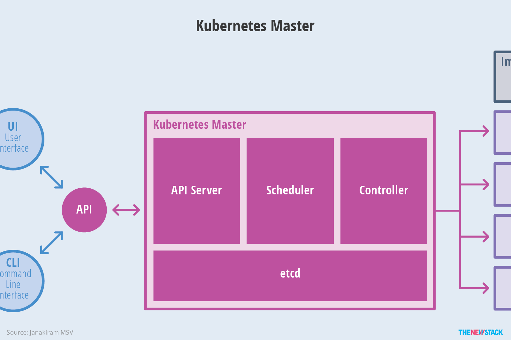
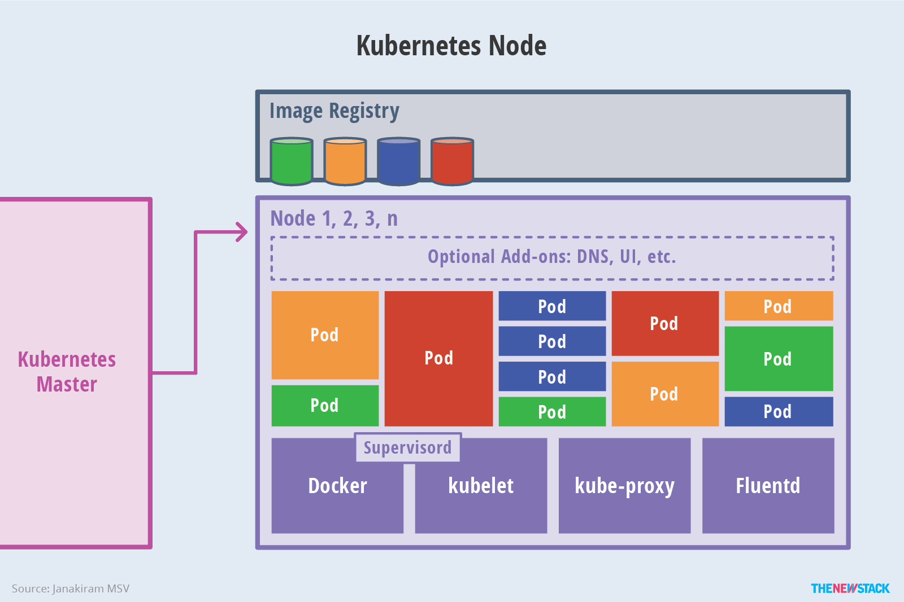

# 0. 前言

先来看一张 k8s 架构设计以及组件之间的通信协议

<!-- more -->

+ Master
  
  Master 负责管理整个集群。Master 协调集群中的所有活动，例如调度应用、维护应用的所需状态、应用扩容以及推出新的更新。
  
  + APISERVER 所有服务统一入口
  + RC 维持副本期望数目
  + Scheduler 负责介绍任务, 选择合适的节点分配任务 
  + Etcd 持久化存储信息
  
+ Node
  
  Node在 Kubernetes 集群中充当工作机器的角色。告诉 Master 启动应用容器， Master 就编排容器在群集的 Node 上运行。 Node 使用 Master 暴露的 Kubernetes API 与 Master 通信。
  
  + kubelet 直接跟容器引擎(docker)交互, 实现容器的生命周期管理
  + kube-proxy 负责写入规则到 IPTABLES, IPVS 实现服务映射访问

### 0.1 抽象视图：

### 0.2 Master架构:

### 0.3 Node架构:

# 1. Pod

### 1.1 自主式 pod

pod 里面的容器, 通过 pause 网络共享和文件共享

### 1.2 控制器管理的 pod

+ ReplicationController

  建议用 RS代替

+ ReplicaSet

  支持集合式的selector

+ Deployment

  自动管理 ReplicatSet

  + HPA

    弹性伸缩, 增加或减少 pod

+ StatefulSet

  解决有状态服务的问题(Deployment和ReplicaSet是无状态服务)

+ DaemonSet

  确保 Node 运行 pod 的副本

+ Job, CronJob

  负责批处理任务

# 3. 网络通信

### 3.1 同一个 pod

共享网络命名空间

### 3.2 pod1, pod2

+ 同一主机, docker0网段
+ 不同主机, podIP 和 nodeIP 关联起来(flannel)

### 3.3 pod, service

+ iptables转发和维护
+ lvs转发和维护

### 3.4 pod, 外网

转发到宿主主机的网卡

### 3.5 外网, pod

service, nodeport 方式

# 4. kubectl 

+ kubectl version 

  client  version 是kubectl的版本

  server version 是 k8s 的版本

  

+ kubectl get nodes

  查看所有的 node 节点

  

+ kubectl get pods 

  查看 pod 节点

  

+ kubectl describe pods 

  查看 pod 状态, 例如 ip , 里面的容器之类的

  

+ kubectl describe services/kubernetes-bootcamp  

  查看services状态

  

+ kubectl get services 

  查看services

+ kubectl expose deployment/kubernetes-bootcamp --type="NodePort" --port 8080  

  新建 service 并暴露端口

  

+ kubectl delete service -l run=kubernetes-bootcamp  

  删除一个 service

+ kubectl create deployment  创建deployment

  kubectl create deployment kubernetes-bootcamp --image=gcr.io/google-samples/kubernetes-bootcamp:v1

  

+ kubectl get deployments

  获取deployments

+ kubectl describe deployment 

  查看deployment

  

+ kubectl label pod $POD_NAME app=v1  

  给 pod 加个 lable

  

+ kubectl get pods -l app=v1  

  加完 lable 就能查看了

  

+ kubectl get rs 

  查看拷贝列表

  

+ kubectl scale deployments/kubernetes-bootcamp --replicas=2  

  直接复制品,牛逼了

  

+ kubectl logs  查看日志

  kubectl logs $POD_NAME

  

+ kubectl exec 执行命令

  kubectl exec $POD_NAME env  查看环境变量

  kubectl exec -ti $POD_NAME bash  进入到 pod 里面

  

+ kubectl set image deployments/kubernetes-bootcamp kubernetes-bootcamp=gcr.io/google-samples/kubernetes-bootcamp:v10

  更换 image

  

+ kubectl rollout status deployments/kubernetes-bootcamp 

  查看状态

  

+ kubectl rollout undo deployments/kubernetes-bootcamp  

  回滚

# 5. 问题记录

+ minikube是干啥的?

   minikube 是一种轻量级的 Kubernetes 实现，可在本地计算机上创建 VM 并部署仅包含一个节点的简单集群。

  简单理解为一个运行在本地Node，我们可以在里面创建Pods来创建对应的服务.

+ deployment和 pods的关系

  pod是单一亦或一组容器的合集, deployment是pod版本管理的工具 用来区分不同版本的pod, 可以回滚版本

  单独创建pod的时候就不会有deployment出现，但是创建deployment的时候一定会创建pod,因为pod是一个基础的单位。

# 6. 参考资料

+ https://kubernetes.io/zh/docs/tutorials/hello-minikube/
+ https://www.bookstack.cn/read/kubernetes-handbook/concepts-index.md
+ https://www.bilibili.com/video/BV1w4411y7Go

