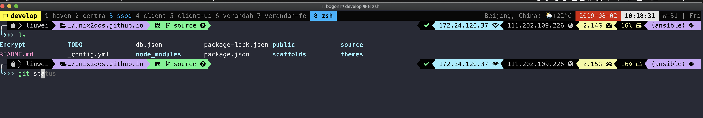

tmux是一款优秀的终端复用软件，它比Screen更加强大。 tmux之所以受人们喜爱，主要得益于以下功能：

- 丝滑分屏（split），虽然iTem2也提供了横向和竖向分屏功能，但这种分屏功能非常拙劣，完全等同于屏幕新开一个窗口，新开的pane不会自动进入到当前目录，也没有记住当前登录状态。这意味着如果我ssh进入到远程服务器时，iTem2新开的pane中，我依然要重新走一遍ssh登录的老路（omg）。tmux就不会这样，tmux窗口中，新开的pane，默认进入到之前的路径，如果是ssh连接，登录状态也依旧保持着，如此一来，我就可以随意的增删pane，这种灵活性，好处不言而喻。

- 保护现场（attach），即使命令行的工作只进行到一半，关闭终端后还可以重新进入到操作现场，继续工作。对于ssh远程连接而言，即使网络不稳定也没有关系，掉线后重新连接，可以直奔现场，之前运行中的任务，依旧在跑，就好像从来没有离开过一样；特别是在远程服务器上运行耗时的任务，tmux可以帮你一直保持住会话。如此一来，你就可以随时随地放心地进行移动办公，只要你附近的计算机装有tmux（没有你也可以花几分钟装一个），你就能继续刚才的工作。

<!-- more -->

+ 先上效果图




# 1. 安装

### 1.1 tmux 安装

```bash
brew install tmux #mac

apt-get install tmux #linux
```


### 1.2 oh my tmux 安装

+ https://github.com/gpakosz/.tmux

```bash
cd
git clone https://github.com/gpakosz/.tmux.git
ln -s -f .tmux/.tmux.conf
cp .tmux/.tmux.conf.local .
```

以后配置修改   ~/.tmux.conf.local 即可. 


# 2. tmux 使用

tmux使用C/S模型构建，主要包括以下单元模块：

- server服务器。输入tmux命令时就开启了一个服务器。
- session会话。一个服务器可以包含多个会话
- window窗口。一个会话可以包含多个窗口。
- pane面板。一个窗口可以包含多个面板。

我习惯一个项目用一个 session, 一个工作区用一个 window, 快捷操作开始一个 panel. 如果刚开始记不住 tmux的操作, 一定多练习, 一定多用, 你会发现离不开它了.


### 2.1 tmux 命令

```bash
tmux ls # 查看当前所有的session

tmux	# 新建一个无名称的会话, 可以用$再改名

tmux new -s demo # 新建一个名称为demo的会话, 

tmux attach -t session_name # 连接之前退出的session

tmux attach-session  # 快速进入 session

tmux kill-server  #关闭服务器，所有的会话都将关闭
```


### 2.2 session操作

+ 新建 <prefix> C-c

+ 删除  :kill-session  或  tmux ls 以后 tmux kill-session -t 名字

+ 选择 s

+ 重命名 $

+ 退出  d


### 2.3 window 操作

+ 新建   c
+ 关闭  ctrl+d 或   &
+ 列表  w   可切到其他 session

+ 重命名  ,

+ 跳跃  0-9
+ 向左 C-h  或   n
+ 向右 C-l  或   p


### 2.4 panel 操作

+ 新建上下   - 或  "

+ 新建左右   _  或 %

+ 关闭  ctrl+d  或 x

+ 切换： 空格键

+ 移动    hjkl 键 或 上下左右键

+ 最大化  z

+ 变窗口  !   如果只是临时变 window, 用+


### 2.5 Oh My Tmux 操作

```bash
#自动把 ctrl + a 当做第二个前缀

<prefix> m #切换鼠标开启状态

<prefix> e #自动打开配置

<prefix> r # 刷新配置

<prefix> C-c  #新建一个 Session

<prefix> - 和 <prefix> _  #水平和垂直分屏

<prefix> + #让当前 panel 成为 window, 注意 再一次还能回到 panel
```


### 2.6 tmux 复制模式

```bash
vi ~/.tmux.conf.local

# 打开下面的配置
set -g mode-keys vi
```

例如我的控制键为：C-a

1、 C-a [ 进入复制模式

2、 参考上表移动鼠标到要复制的区域，移动鼠标时可用vim的搜索功能"/","?"

3、 空格键开始选择复制区域

4、 选择完成后安enter键退出

5、 C-a ] 粘贴

如果用iterm2, 建议直接使用它的复制模式, 但用vi的搜索等操作还是很实用的


# 3. 配置

### 3.1 tmux 配置

```bash
tmux source-file ~/.tmux.conf # 刷新配置

set-option -g prefix2 `  # 设置一个不常用的`键作为指令前缀，按键更快些, 建议用 ctrl+a

set -g mouse on  # 最好关掉, 要不然影响iterm2自带鼠标选中
```


### 3.2 tmux 插件

+ tpm 插件管理

  ```bash
  git clone https://github.com/tmux-plugins/tpm ~/.tmux/plugins/tpm
  ```

  配置参考:

  ```bash
  set -g @tpm_plugins '          \
    tmux-plugins/tpm             \
  '
run '~/.tmux/plugins/tpm/tpm'
  ```
  
  安装:
  
  ```bash
  Installing plugins
  1. Add new plugin to ~/.tmux.conf with set -g @plugin '...'
  ```
2. Press prefix + I (capital i, as in Install) to fetch the plugin.

You're good to go! The plugin was cloned to ~/.tmux/plugins/ dir and sourced.
  ```

+ tmux-resurrect 保存session

  ```bash
  <prefix> ctrl + s #save
  <prefix> ctrl + r #load
  ```


### 3.3 修改Oh My Tmux 配置

  ```bash
  tmux_conf_new_window_retain_current_path=true  #window保持路径
  tmux_conf_new_pane_reconnect_ssh=true  #重新连接 ssh
  tmux_conf_new_session_prompt=true  #新建 session 输入名字

  #左边状态栏精简
  tmux_conf_theme_status_left=' ❐ #S '  
  
  # 右边显示天气, 和week of year
  tmux_conf_theme_status_right='#{prefix}#{pairing}#{synchronized} | #(ipconfig getifaddr en0) | week-#(date +%V)'
  
  # 前缀显示 emoji
  tmux_conf_theme_prefix='🍎 🍐 🍊 🍋 🍌 🍉 '
 
  # 复制模式 vi
  set -g mode-keys vi
  
  # 状态栏放到上面
  set -g status-position top

------------------------------------------------------------------

  # Ctrl+Shift+Left  window向左(不需要prefix), Ctrl+Shift+Left window向右(不需要prefix)
  #bind-key -n C-S-Left swap-window -t -1 
  #bind-key -n C-S-Right swap-window -t +1 
  #链接: https://superuser.com/a/552493
  bind-key -n C-S-Left swap-window -t -1\; select-window -t -1
  bind-key -n C-S-Right swap-window -t +1\; select-window -t +1

  # 插件相关, 参考3.2安装插件步骤
  set -g status-right 'Continuum status: #{continuum_status}'
  set -g @continuum-save-interval '10'
  set -g @continuum-restore 'on'

  set -g @tpm_plugins '    \
  tmux-plugins/tpm            \
  tmux-plugins/tmux-open \
  tmux-plugins/tmux-yank	\
  tmux-plugins/tmux-sensible  \
  tmux-plugins/tmux-resurrect  \
  tmux-plugins/tmux-continuum  \
  '
  run '~/.tmux/plugins/tpm/tpm'
  ```

  

# 4. tmux 遇到的问题

### 4.1 off, 鼠标无法滚动

In iTerm2 all you need to do is to go to 

Preferences > Profile > Terminal and check ‘Save lines to scrollback when an app status bar is present’.

### 4.2 on, 鼠标无法智能选中

快速关闭, prefix+m

### 4.3 无论off, on  鼠标点击文件不是默认 app 打开

https://stackoverflow.com/a/56715244/7062454

自己强答一题: 先退出 tmux seesion, 用鼠标点击通过默认 app 打开, 再进入 tmux session 就可以了

### 4.4 鼠标无法滚动

+ 重置iterm2

  删除app后, 清理一下配置

  ```bash
  rm ~/Library/Application\ Support/iTerm2
  rm ~/Library/Preferences/com.googlecode.iterm2.*
  ```

+ 重置 oh my tmux

  ```bash
  #出问题, 大概率.tmux.conf.local
  ```


# 5. 参考资料

+ http://louiszhai.github.io/2017/09/30/tmux/

