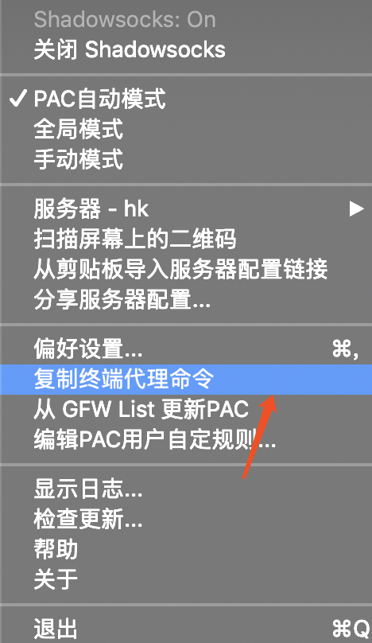
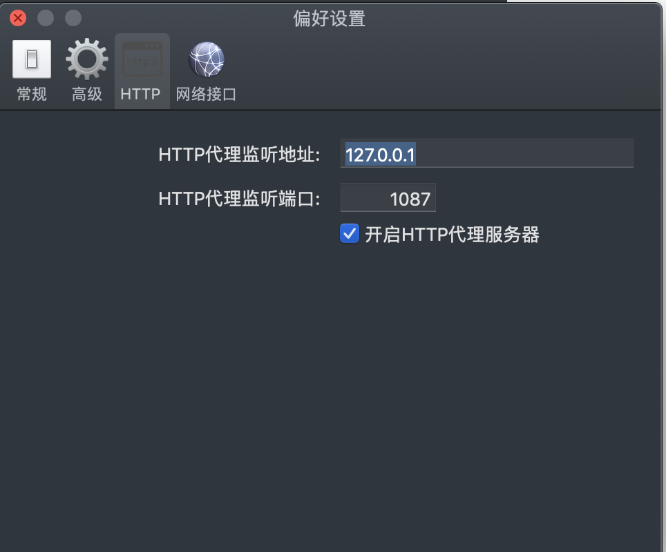
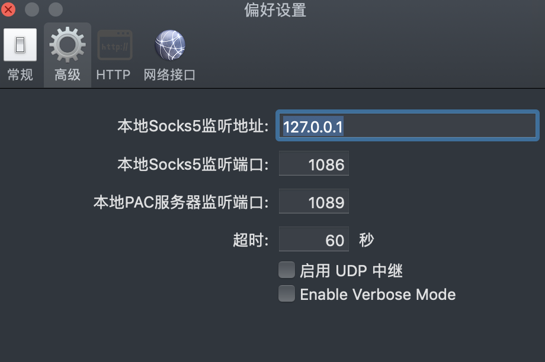

shadowsocks是我们常用的代理工具，它使用socks5协议，而终端很多工具目前只支持http和https等协议，对socks5协议支持不够好，所以我们为终端设置shadowsocks的思路就是将socks协议转换成http协议，然后为终端设置即可。


# 1. 设置终端代理

最新的 [ShadowsocksX-NG](https://github.com/shadowsocks/ShadowsocksX-NG/releases/) 已经支持终端代理, 我们可以如下图复制得出:
```bash
export http_proxy=http://127.0.0.1:1087;export https_proxy=http://127.0.0.1:1087;
```
<!-- more -->




为了方便, 我们可以制作一下别名

```bash
alias setproxy='export http_proxy=http://127.0.0.1:1087;export https_proxy=http://127.0.0.1:1087;' # 设置终端代理

alias disproxy='unset http_proxy https_proxy' # 取消终端代理

alias ip='curl cip.cc' # 测试
```

另外我们可以通过`ShadowsocksX-NG` 的偏好设置看到以下相关配置.


### 1.1 http监听端口




### 1.2 sockes5监听端口




# 2. 参考资料

+ https://droidyue.com/blog/2016/04/04/set-shadowsocks-proxy-for-terminal/
+ https://blog.naaln.com/2019/03/terminal-proxy/
