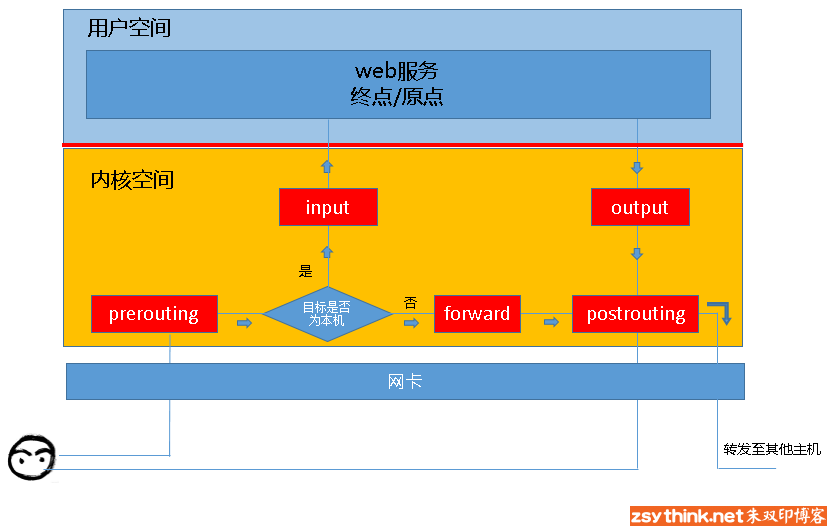
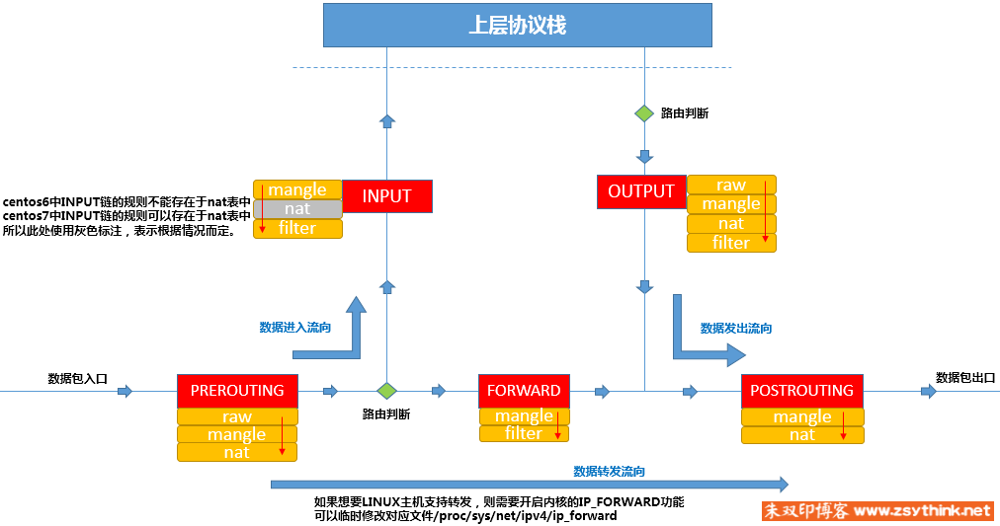
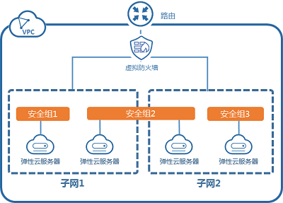

# 0. 前言

### 0.0 防火墙

+ 从逻辑上讲，防火墙可以大体分为主机防火墙和网络防火墙。

  + 主机防火墙：针对于单个主机进行防护。
  
  网络防火墙：往往处于网络入口或边缘，针对于网络入口进行防护，服务于防火墙背后的本地局域网。
  
  网络防火墙和主机防火墙并不冲突，可以理解为，网络防火墙主外（集体）， 主机防火墙主内（个人）。


+ 从物理上讲，防火墙可以分为硬件防火墙和软件防火墙。
+ 硬件防火墙：在硬件级别实现部分防火墙功能，另一部分功能基于软件实现，性能高，成本高。
+ 软件防火墙：应用软件处理逻辑运行于通用硬件平台之上的防火墙，性能低，成本低。

<!-- more -->

### 0.1 iptables

iptables其实不是真正的防火墙，我们可以把它理解成一个客户端代理，用户通过iptables这个代理，将用户的安全设定执行到对应的"安全框架"中，这个"安全框架"才是真正的防火墙，这个框架的名字叫netfilter

netfilter才是防火墙真正的安全框架（framework），netfilter位于内核空间。iptables其实是一个命令行工具，位于用户空间，我们用这个工具操作真正的框架。

netfilter/iptables（下文中简称为iptables）组成Linux平台下的包过滤防火墙，与大多数的Linux软件一样，这个包过滤防火墙是免费的，它可以代替昂贵的商业防火墙解决方案，完成封包过滤、封包重定向和网络地址转换（NAT）等功能。

### 0.2  netfilter

netfilter是Linux操作系统核心层内部的一个数据包处理模块，它具有如下功能：

+ 网络地址转换(Network Address Translate)
+ 数据包内容修改
+ 以及数据包过滤的防火墙功能

所以说，虽然我们使用service iptables start启动iptables"服务"，但是其实准确的来说，iptables并没有一个守护进程，所以并不能算是真正意义上的服务，而应该算是内核提供的功能。


# 1. iptables基础

我们知道iptables是按照规则来办事的，我们就来说说规则（rules），规则其实就是网络管理员预定义的条件，规则一般的定义为"如果数据包头符合这样的条件，就这样处理这个数据包"。

规则存储在内核空间的信息包过滤表中，这些规则分别指定了源地址、目的地址、传输协议（如TCP、UDP、ICMP）和服务类型（如HTTP、FTP和SMTP）等。

当数据包与规则匹配时，iptables就根据规则所定义的方法来处理这些数据包，如放行（accept）、拒绝（reject）和丢弃（drop）等。配置防火墙的主要工作就是添加、修改和删除这些规则。


### 1.1 五链



+ PREROUTING 数据包刚进入网络层 , 路由之前
+ INPUT 路由判断，流入用户空间
+ OUTPUT 用户空间发出，后接路由判断出口的网络接口
+ FORWARD 路由判断不进入用户空间，只进行转发
+ POSTROUTING 数据包通过网络接口出去


##### 1.1.1 举例:

到本机某进程的报文：PREROUTING --> INPUT

由本机转发的报文：PREROUTING --> FORWARD --> POSTROUTING

由本机的某进程发出报文（通常为响应报文）：OUTPUT --> POSTROUTING


## 1.2 四表

我们把具有相同功能的规则的集合叫做"表"，所以说，不同功能的规则，我们可以放置在不同的表中进行管理，而iptables已经为我们定义了4种表，每种表对应了不同的功能，而我们定义的规则也都逃脱不了这4种功能的范围，所以，学习iptables之前，我们必须先搞明白每种表 的作用。

+ filter表：负责过滤功能，防火墙；内核模块：iptables_filter
+ nat表：network address translation，网络地址转换功能；内核模块：iptable_nat
+ mangle表：拆解报文，做出修改，并重新封装 的功能；iptable_mangle
+ raw表：关闭nat表上启用的连接追踪机制；iptable_raw

也就是说，我们自定义的所有规则，都是这四种分类中的规则，或者说，所有规则都存在于这4张"表"中。


### 1.3 表链关系

| 四表/五链 | PREROUTING | INPUT      | FORWARD | OUTPUT | POSTROUTING |
| --------- | ---------- | ---------- | ------- | ------ | ----------- |
| filter    |            | √          | √       | √      |             |
| nat       | √          | √(centos7) |         | √      | √           |
| mangle    | √          | √          | √       | √      | √           |
| raw       | √          |            |         | √      |             |


表的优先级关系:  raw --> mangle --> nat --> filter ,  raw 最高




# 2. 规则

规则是根据指定的匹配条件来尝试匹配每个流经此处的报文，一旦匹配成功，则由规则后面指定的处理动作进行处理；

### 2.1 匹配条件

匹配条件分为基本匹配条件与扩展匹配条件

+ 基本匹配条件：
  源地址Source IP，目标地址 Destination IP
  上述内容都可以作为基本匹配条件。
+ 扩展匹配条件：
  除了上述的条件可以用于匹配，还有很多其他的条件可以用于匹配，这些条件泛称为扩展条件，这些扩展条件其实也是netfilter中的一部分，只是以模块的形式存在，如果想要使用这些条件，则需要依赖对应的扩展模块。
  源端口Source Port, 目标端口Destination Port
  上述内容都可以作为扩展匹配条件

### 2.2 处理动作

处理动作在iptables中被称为target（这样说并不准确，我们暂且这样称呼），动作也可以分为基本动作和扩展动作。
此处列出一些常用的动作，之后的文章会对它们进行详细的示例与总结：

+ ACCEPT：允许数据包通过。
+ DROP：直接丢弃数据包，不给任何回应信息，这时候客户端会感觉自己的请求泥牛入海了，过了超时时间才会有反应。
+ REJECT：拒绝数据包通过，必要时会给数据发送端一个响应的信息，客户端刚请求就会收到拒绝的信息。
+ SNAT：源地址转换，解决内网用户用同一个公网地址上网的问题。
+ MASQUERADE：是SNAT的一种特殊形式，适用于动态的、临时会变的ip上。
+ DNAT：目标地址转换。
+ REDIRECT：在本机做端口映射。
+ LOG：在/var/log/messages文件中记录日志信息，然后将数据包传递给下一条规则，也就是说除了记录以外不对数据包做任何其他操作，仍然让下一条规则去匹配。

补充一下DROP和REJECT的区别。DROP是直接把匹配到的报文丢弃，REJECT除了把报文丢弃还会给该报文中的源IP发一个ICMP报文说明目的不可达(直接回复不可达, 更强硬)。前者报文发送方只能等超时，而后者发送方因为收到了ICMP不可达所以马上就给出了提示。


# 3. filter过滤规则

filter负责过滤功能，比如允许哪些IP地址访问，拒绝哪些IP地址访问，允许访问哪些端口，禁止访问哪些端口，filter表会根据我们定义的规则进行过滤，filter表应该是我们最常用到的表了。

### 3.1 查看规则

怎样查看filter表中的规则呢？使用如下命令即可查看。

```bash
iptables -t filter -L
```

刚才提到，我们可以使用iptables -t filter -L命令列出filter表中的所有规则，那么举一反三，我们也可以查看其它表中的规则，示例如下。

```bash
iptables -t raw -L
iptables -t mangle -L
iptables -t nat -L
```

其实，我们可以省略-t filter，当没有使用-t选项指定表时，默认为操作filter表，即iptables -L表示列出filter表中的所有规则。


### 3.2 详细信息

我们还可以只查看指定表中的指定链的规则，比如，我们只查看filter表中INPUT链的规则，示例如下（注意大小写）。

```bash
# iptables --line-numbers  -nvL INPUT
Chain INPUT (policy ACCEPT 14M packets, 2062M bytes)
num   pkts bytes target     prot opt in     out     source               destination
1    2697K  114M KUBE-SERVICES  all  --  *      *       0.0.0.0/0            0.0.0.0/0            ctstate NEW /* kubernetes service portals */
2    2697K  114M KUBE-EXTERNAL-SERVICES  all  --  *      *       0.0.0.0/0            0.0.0.0/0            ctstate NEW /* kubernetes externally-visible service portals */
3     906M  477G KUBE-FIREWALL  all  --  *      *       0.0.0.0/0            0.0.0.0/0
```

+ 头含义

  上图中INPUT链后面的括号中包含policy ACCEPT ，0 packets，0bytes 三部分。

  ```ini
  policy:表示当前链的默认策略，policy ACCEPT表示上图中INPUT的链的默认动作为ACCEPT
  packets:表示当前链（上例为INPUT链）默认策略匹配到的包的数量，0 packets表示默认策略匹配到0个包。
  bytes:表示当前链默认策略匹配到的所有包的大小总和。
  ```

  其实，我们可以把packets与bytes称作"计数器"，上图中的计数器记录了默认策略匹配到的报文数量与总大小，"计数器"只会在使用-v选项时，才会显示出来。

  

+ 字段含义

  ```ini
  pkts:对应规则匹配到的报文的个数。
  bytes:对应匹配到的报文包的大小总和。
  target:规则对应的target，往往表示规则对应的"动作"，即规则匹配成功后需要采取的措施。
  prot:表示规则对应的协议，是否只针对某些协议应用此规则。
  opt:表示规则对应的选项。
  in:表示数据包由哪个接口(网卡)流入，我们可以设置通过哪块网卡流入的报文需要匹配当前规则。
  out:表示数据包由哪个接口(网卡)流出，我们可以设置通过哪块网卡流出的报文需要匹配当前规则。
  source:表示规则对应的源头地址，可以是一个IP，也可以是一个网段。
  destination:表示规则对应的目标地址。可以是一个IP，也可以是一个网段。
  ```

  

### 3.3 增加规则

为了准备一个从零开始的环境，使用`iptables -F INPUT`命令清空filter表INPUT链中的规则。

```bash
root@tencent:~# iptables -nvL INPUT
Chain INPUT (policy ACCEPT 215 packets, 16538 bytes)
 pkts bytes target     prot opt in     out     source               destination
```

清空INPUT链以后，filter表中的INPUT链已经不存在任何的规则，但是可以看出，INPUT链的默认策略是ACCEPT，也就是说，INPUT链默认"放行"所有发往本机的报文，当没有任何规则时，会接受所有报文，当报文没有被任何规则匹配到时，也会默认放行报文。


+ 增加

```bash
iptables -t filter -I INPUT -s 123.117.179.97 -j DROP
```

在目标服务器增加一条本地的 ip, 发现已经 ping不通了.

上图中，使用 -t选项指定了要操作的表，此处指定了操作filter表，与之前的查看命令一样，不使用-t选项指定表时，默认为操作filter表。
使用-I选项，指明将"规则"插入至哪个链中，-I表示insert，即插入的意思，所以-I INPUT表示将规则插入于INPUT链中，即添加规则之意。

使用-s选项，指明"匹配条件"中的"源地址"，即如果报文的源地址属于-s对应的地址，那么报文则满足匹配条件，-s为source之意，表示源地址。

使用-j选项，指明当"匹配条件"被满足时，所对应的动作，上例中指定的动作为DROP，在上例中，当报文的源地址为223.70.253.1时，报文则被DROP（丢弃）。


+ 查看

再次查看filter表中的INPUT链，发现规则已经被添加了，在iptables中，动作被称之为"target"，所以，上图中taget字段对应的动作为DROP。

```bash
root@tencent:~# iptables -vL INPUT
Chain INPUT (policy ACCEPT 2043 packets, 135K bytes)
 pkts bytes target     prot opt in     out     source               destination         
   66  9796 DROP       all  --  any    any     123.117.179.97       anywhere  
```

注意看, 可以看到 bytes 的字节数, 说明已经匹配上了.


+ 顺序

规则的顺序很重要。

如果报文已经被前面的规则匹配到，iptables则会对报文执行对应的动作，即使后面的规则也能匹配到当前报文，很有可能也没有机会再对报文执行相应的动作。


### 3.4 删除规则

此刻，如果我们想要删除filter表中INPUT中的一条规则，该怎么做呢？有两种办法
方法一：根据规则的编号去删除规则
方法二：根据具体的匹配条件与动作删除规则

```bash
# 添加两种
iptables -t filter -A INPUT -s 1.1.1.1 -j DROP
iptables -t filter -A INPUT -s 1.1.1.2 -j DROP


iptables --line -nvL INPUT
3        0     0 DROP       all  --  *      *       1.1.1.1              0.0.0.0/0           
4        0     0 DROP       all  --  *      *       1.1.1.2              0.0.0.0/0  


# 两种删除方式
iptables -D INPUT 3
iptables -D INPUT -s 1.1.1.2 -j DROP
```


+ 删除所有

  而删除指定表中某条链中的所有规则的命令，我们在一开始就使用到了，就是"iptables -t 表名 -F 链名"
  -F选项为flush之意，即冲刷指定的链，即删除指定链中的所有规则，但是注意，此操作相当于删除操作，在没有保存iptables规则的情况下，请慎用。


### 3.5 修改规则

建议删除后再新增

+ 修改默认策略
  使用-t指定要操作的表，使用-P选项指定要修改的链，下例中，`-P FORWARD ACCEPT`表示将表中FORWRD链的默认策略改为ACCEPT。

  ```bash
  iptables --line -nvL FORWARD
  Chain FORWARD (policy DROP 0 packets, 0 bytes)
  
  # 执行修改默认
  iptables -P FORWARD ACCEPT
  
  iptables --line -nvL FORWARD
  Chain FORWARD (policy ACCEPT 0 packets, 0 bytes)
  ```

  

### 3.6 保存规则

在默认的情况下，我们对"防火墙"所做出的修改都是"临时的"，换句话说就是，当重启iptables服务或者重启服务器以后，我们平常添加的规则或者对规则所做出的修改都将消失，为了防止这种情况的发生，我们需要将规则"保存"。

+ centos

  centos6中，使用"service iptables save"命令即可保存规则，规则默认保存在/etc/sysconfig/iptables文件中

  ```bash
  service iptables save
  ```

  centos7中，使用firewall替代了原来的iptables service

  ```bash
  firewall-cmd --zone=public --add-port=3000/tcp --permanent
  firewall-cmd --reload
  
  # 也可以安装 iptables-service
  yum install -y iptables-services
  systemctl disable firewalld
  systemctl enable iptables
  service iptables save
  ```

  还可以使用另一种方法保存iptables规则，就是使用iptables-save命令
  使用iptables-save并不能保存当前的iptables规则，但是可以将当前的iptables规则以"保存后的格式"输出到屏幕上。可以使用iptables-save命令，再配合重定向

  ```bash
  iptables-save > /etc/sysconfig/iptables
  iptables-restore < /etc/sysconfig/iptables
  ```

+ ubuntu

  ```bash
  sudo apt-get install iptables-persistent
  
  sudo /etc/init.d/iptables-persistent save 
  sudo /etc/init.d/iptables-persistent reload
  
  # Ubuntu 16.04 Server
  sudo netfilter-persistent save
  sudo netfilter-persistent reload
  ```


# 4. 匹配条件

### 4.1 匹配方式

```bash
# 单个匹配
iptables -I INPUT -s 1.1.1.2 -j DROP

# 多个匹配
iptables -I INPUT -s 1.1.1.3,1.1.1.4 -j DROP

# 网段匹配
iptables -I INPUT -s 1.1.1.5/23 -j DROP

# 取反匹配
iptables -I INPUT ! -s 1.1.1.6 -j ACCEPT
```


+ 取反注意点

使用 "!" 取反后则表示，报文源地址IP只要不为1.1.1.6即满足条件，那么，上例中规则表达的意思就是，只要发往本机的报文的源地址不是1.1.1.6，就接受报文。

只要报文的源IP不是1.1.1.6，那么就接受此报文，但是，某些小伙伴可能会误会，把上例中的规则理解成如下含义，

只要报文的源IP是1.1.1.6，那么就不接受此报文，这种理解与上述理解看似差别不大，其实完全不一样，这样理解是错误的，上述理解才是正确的。

换句话说就是，报文的源IP不是1.1.1.6时，会被接收，并不能代表，报文的源IP是1.1.1.6时，会被拒绝。


### 4.2 目标地址

```bash
# 只丢弃从 1.1.1.7 发往 1.1.1.8 这个IP的报文
iptables -I INPUT -s 1.1.1.7 -d 1.1.1.8 -j DROP
```

如果我们不指定任何目标地址，则目标地址默认为0.0.0.0/0，同理，如果我们不指定源地址，源地址默认为0.0.0.0/0，0.0.0.0/0表示所有IP，示例如下。

与-s选项一样，-d选项也可以使用"叹号"进行取反，也能够同时指定多个IP地址，使用"逗号"隔开即可。

但是请注意，不管是-s选项还是-d选项，取反操作与同时指定多个IP的操作不能同时使用。


### 4.3


# 8. 命令总结

### 8.1 过滤查看

```bash
#查看对应表的所有规则，-t选项指定要操作的表，省略"-t 表名"时，默认表示操作filter表，-L表示列出规则，即查看规则
iptables -t 表名 -L


#查看指定表的指定链中的规则
iptables -t 表名 -L 链名


# 查看指定表的所有规则，并且显示更详细的信息（更多字段），-v表示verbose，表示详细的，冗长的，当使用-v选项时，会显示出"计数器"的信息，由于上例中使用的选项都是短选项，所以一般简写为iptables -t 表名 -vL
iptables -t 表名 -v -L


#表示查看表的所有规则，并且在显示规则时，不对规则中的IP或者端口进行名称反解，-n选项表示不解析IP地址。
iptables -t 表名 -n -L


#表示查看表的所有规则，并且显示规则的序号，--line-numbers选项表示显示规则的序号，注意，此选项为长选项，不能与其他短选项合并，不过此选项可以简写为--line，注意，简写后仍然是两条横杠，仍然是长选项。
iptables --line-numbers -t 表名 -L


#表示查看表中的所有规则，并且显示更详细的信息(-v选项)，不过，计数器中的信息显示为精确的计数值，而不是显示为经过可读优化的计数值，-x选项表示显示计数器的精确值。
iptables -t 表名 -v -x -L


# 实际使用中，为了方便，往往会将短选项进行合并，所以，如果将上述选项都糅合在一起，可以写成如下命令，此处以filter表为例。
iptables --line -t filter -nvxL INPUT
```


### 8.2 过滤增删存

+ 增加

```bash
#在指定表的指定链的尾部添加一条规则，-A选项表示在对应链的末尾添加规则，省略-t选项时，表示默认操作filter表中的规则
命令语法：iptables -t 表名 -A 链名 匹配条件 -j 动作
示例：iptables -t filter -A INPUT -s 192.168.1.146 -j DROP


#在指定表的指定链的首部添加一条规则，-I选型表示在对应链的开头添加规则
命令语法：iptables -t 表名 -I 链名 匹配条件 -j 动作
示例：iptables -t filter -I INPUT -s 192.168.1.146 -j ACCEPT


#在指定表的指定链的指定位置添加一条规则
命令语法：iptables -t 表名 -I 链名 规则序号 匹配条件 -j 动作
示例：iptables -t filter -I INPUT 5 -s 192.168.1.146 -j REJECT


#设置指定表的指定链的默认策略（默认动作），并非添加规则。
命令语法：iptables -t 表名 -P 链名 动作
示例：iptables -t filter -P FORWARD ACCEPT
```

+ 删除

```bash
#按照规则序号删除规则，删除指定表的指定链的指定规则，-D选项表示删除对应链中的规则。
命令语法：iptables -t 表名 -D 链名 规则序号
示例：iptables -t filter -D INPUT 3


#按照具体的匹配条件与动作删除规则，删除指定表的指定链的指定规则。
命令语法：iptables -t 表名 -D 链名 匹配条件 -j 动作
示例：iptables -t filter -D INPUT -s 192.168.1.146 -j DROP


#删除指定表的指定链中的所有规则，-F选项表示清空对应链中的规则，执行时需三思。
命令语法：iptables -t 表名 -F 链名
示例：iptables -t filter -F INPUT

#删除指定表中的所有规则，执行时需三思。
命令语法：iptables -t 表名 -F
示例：iptables -t filter -F
```

+ 修改

```bash
#修改指定表中指定链的指定规则，-R选项表示修改对应链中的规则，使用-R选项时要同时指定对应的链以及规则对应的序号，并且规则中原本的匹配条件不可省略。
命令语法：iptables -t 表名 -R 链名 规则序号 规则原本的匹配条件 -j 动作
示例：iptables -t filter -R INPUT 3 -s 192.168.1.146 -j ACCEPT


#其他修改规则的方法：先通过编号删除规则，再在原编号位置添加一条规则。


#修改指定表的指定链的默认策略（默认动作），并非修改规则，可以使用如下命令。
命令语法：iptables -t 表名 -P 链名 动作
示例：iptables -t filter -P FORWARD ACCEPT
```
+ 保存

```bash
# centos
yum install -y iptables-services
systemctl disable firewalld
systemctl enable iptables
service iptables save

# ubtuntu
sudo apt-get install iptables-persistent
sudo netfilter-persistent save
sudo netfilter-persistent reload
```


# 9. 问题总结

### 9.1 firewalld 和 iptables 关系(Centos)

ConterOS7.0以上使用的是firewall，ConterOS7.0以下使用的是iptables

在RHEL7里有几种防火墙共存：firewalld、iptables、ebtables，默认是使用firewalld来管理netfilter子系统，不过底层调用的命令仍然是iptables等。

firewalld跟iptables比起来至少有两大好处：

1、firewalld可以动态修改单条规则，而不需要像iptables那样，在修改了规则后必须得全部刷新才可以生效；

2、firewalld在使用上要比iptables人性化很多，即使不明白“五张表五条链”而且对TCP/IP协议也不理解也可以实现大部分功能。

firewalld跟iptables比起来，不好的地方是每个服务都需要去设置才能放行，因为默认是拒绝。而iptables里默认是每个服务是允许，需要拒绝的才去限制。

### 9.2 ufw 和 iptables 关系(Ubuntu)

Uncomplicated Firewall，简称 UFW，是Ubuntu系统上默认的防火墙组件。UFW是为轻量化配置iptables而开发的一款工具。UFW 提供一个非常友好的界面用于创建基于IPV4，IPV6的防火墙规则。UFW 在 Ubuntu 8.04 LTS 后的所有发行版中默认可用。

当使用了 ufw 这类前端时，就最好不要再碰 iptables 了，尤其要慎重使用 iptables – 来清空所有链的规则。在不了解 iptables 的表、链、规则之前，盲目的清空 iptables”规则” 就是耍流氓！

试想，假如你在服务器上ufw enable，那么 INPUT 和 FORWARD 就是 DROP，那么当你iptables -F时，不仅仅是 SSH 的例外规则没了，所有出网的包也都出不去了！此时唯一能做的事情就是去 VNC、或者去机房插鼠标键盘显示器。


### 9.3 虚拟防火墙和安全组有什么差异

+ 云虚拟防火墙是互联网边界防火墙、VPC边界防火墙、主机边界防火墙的统称，为您提供互联网边界、VPC网络边界、ECS实例间的三重防护。

+ 安全组是ECS提供的虚拟主机防火墙，对ECS实例间的流量进行访问控制。

结论: 

1. 防火墙是在安全组之前生效的。

2. 防火墙主要是做南北向的访问控制，作用范围是整个VPC，安全组主要是做东西向的访问控制，作用范围是虚拟机网卡，和防火墙形成互补的关系。




# 10. 参考资料

+ http://www.zsythink.net/archives/tag/iptables/page/2/
+ https://support-it.huawei.com/docs/zh-cn/hcs-6.5.0/vfw-type1/vfw_ug_000031.html
+ https://zhuanlan.zhihu.com/p/86734727
