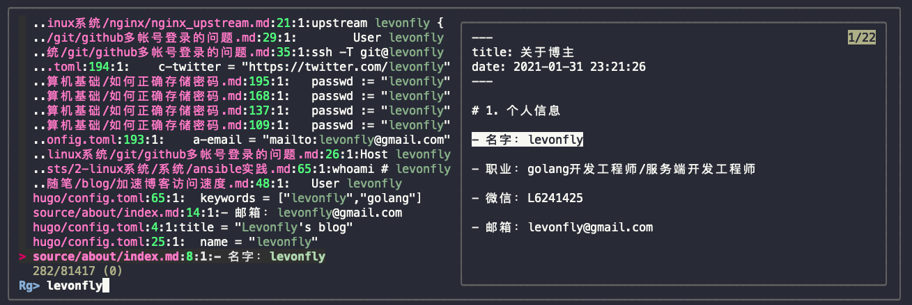

说到文本搜索工具，大家一定会知道 grep, 它是 linux 最有用并最常用的工具之一。但如果在一个大的工程项目中搜索某个关键词，它会有些耗时。

如果有更好的替代工具, 最出名的应该是 Ack，Ag ,  而现在一个新的替代者 Ripgrep,  简称`rg`,  比它们更快, 更省电.

<!-- more -->

# 1. 介绍

RipGrep 与 The Silver Searcher(ag)、Ack 和 GNU Grep 的功能类似。

RipGrep 是一个以行为单位的搜索工具， 它根据提供的 pattern 递归地在指定的目录里搜索。它是由 Rust 语言写成，相较与同类工具，它的特点就是无与伦比地快。

+ 自动递归搜索 （grep 需要-R）
+ 自动忽略.gitignore 中的文件以及二进制文件
+ 可以搜索指定文件类型（rg -t py foo限定 python 文件， rg -T js foo排除 js 文件)
+ 支持大部分 grep 的 feature(常用的都有)
+ 支持各种文件编码（UTF-8， UTF-16， latin-1, GBK, EUC-JP, Shift_JIS 等等）
+ 支持搜索常见压缩文件(gzip, xz, lzma, bzip2, lz4)
+ 自动高亮匹配的结果

### 1.1 扩展阅读

强中更有强中手, 现在还有rga: ripgrep, 并且还能搜索 PDFs, E-Books, Office documents, zip, tar.gz, 等等.

参考: https://github.com/phiresky/ripgrep-all


# 2. 使用

### 2.1 安装

```bash
brew install ripgrep
alias grep="rg"  # 强制转向 rg
```


### 2.2 基础搜索

cat a.txt, 我们以下面的文件为测试文件, 可以发现rg 和 grep 的选项大部分一样

```txt
test
a
b
c
d
e
f
g
test1
TEST2
```

1. 我们先来一个最基础的搜索:

```bash
rg 'test'  a.txt
1:test
9:test1
```


2. `-w`有word之意，表示搜索的字符串作为一个独立的单词时才会被匹配到。

```bash
rg -w 'test'  a.txt
1:test
```


3. 使用`-i`选项，即可在搜索时不区分大小写

```bash
rg -i 'test'  a.txt
1:test
9:test1
10:TEST2
```


4. `-l`只打印有匹配的文件名

```bash
rg -l 'test'  a.txt
a.txt
```


5. `-C` 输出匹配上下几行的内容

```bash
rg -C 2 'c'  a.txt

2-a
3-b
4:c
5-d
6-e
```


### 2.3 高级搜索

1. 使用 `-e REGEX` 来指定正则表达式

```bash
rg -e "*sql" -C2
```


2.  默认 rg 会忽略 `.gitignore` 和隐藏文件，可以使用 `-uu` 来查询所有内容

```bash
rg -uu "word" .
```


3. 可以使用 `-t type` 来指定文件类型：

```bash
rg -t markdown "mysql" .  # 在 md 文件中查找 “mysql” 关键字
```

支持的文件类型可以通过 `rg --type-list` 查看


### 2.4 搜索文件

 列出当前文件夹会进行查询的所有文件, 该选项其实可相当于：find . -type f，查找当前目录所有文件

```bash
rg --files . 
alias rgf='rg --files | rg' # 可来个别名
```

 搜索以 md 为后缀的文件

```bash
rg --files . | rg -e ".md$" # 正则匹配
```


# 3. vim里使用

### 3.1 配合 fzf

```bash
Plug 'junegunn/fzf', { 'do': { -> fzf#install() } } "极限搜索文件
Plug 'junegunn/fzf.vim'
nnoremap <leader>fo :Files<CR>"映射
nnoremap <leader>fif :Rg<CR> "映射
```

`:Rg`




# 4. 参考资料

+ https://github.com/BurntSushi/ripgrep
+ https://einverne.github.io/post/2019/09/ripgrep-recursively-searches-directories-using-regex-pattern.html
+ https://juejin.cn/post/6844903680446038029
+ https://github.com/phiresky/ripgrep-all