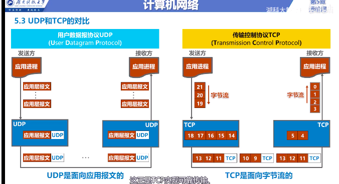
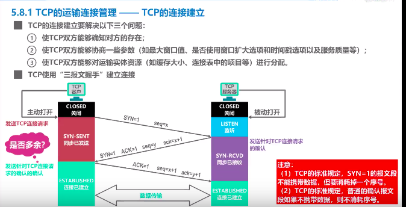
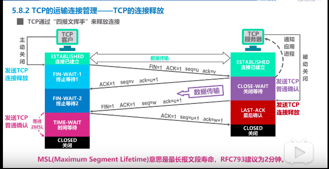
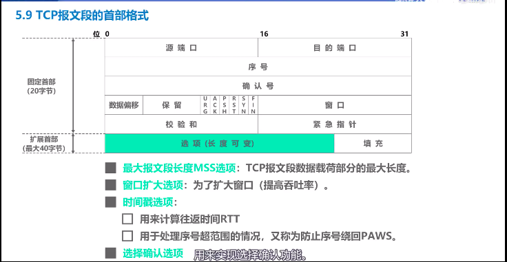

# 1. udp 和 tcp 的区别

### 1.1 数据传输

UDP 

+ 数据传输

TCP 

+ 3报文握手+数据传输+4报文挥手

<!-- more -->

### 1.2  连接方式

UDP 

+  单播(一对一), 多播(一对多), 广播 (一对全)

TCP 

+  单播(一对一)

### 1.3 应用报文

UDP

+ 每个报文添加个UDP首部

TCP

+ 一系列字节流放到缓存中, 通过滑动窗口策略发送
+ 发送方加个 TCP 头部
+ 接收方取出字节流,组合送给接收方进程

### 1.4 首部

UDP

+ 8字节

TCP

+ 最小20字节, 最大60字节

# 2. tcp连接

### 2.1 tcp客户端

##### 建立

+ closed 关闭
+ 创建传输控制快
+ 握手①SYN=1 seq=x  进入**SYN-SENT**(同步已发送状态)
+ 握手③ACK=1 seq=x+1 ack=y+1 进入 **ESTABLISHED**(连接已建立状态)
+ 数据传输

##### 释放

+ 挥手① FIN=1 ACK=1 seq=u  ack=v 进入 **FIN_WAIT_1**(终止等待1状态)
+ 收到挥手②进入 **FIN_WAIT_2**(终止等待2状态)
+ 接受数据
+ 挥手④ ACK=1 seq=u+1 ack=w+1 进入 **TIME_WAIT**(时间等待状态)
+ 经过2MSL后, 进入 **CLOSED**(关闭状态)

### 2.2 TCP服务器

##### 建立

+ closed 关闭
+ 创建传输控制快
  + tcp 连接表
  + 指向发送和接收缓存的指针
  + 指向重传队列的指针
  + 当前的发送和接收序号
+ listen 监听
+ 握手② SYN=1 ACK=1 seq=y ack=x+1  进入**SYN-REVD**(同步已接收状态)
+ 进入**ESTABLISHED**(连接已建立状态)
+ 数据传输

##### 释放

+ 挥手② ACK=1 seq=v ack=u+1 并进入**CLOSE_WAIT**(关闭等待状态)
+ 通知应用进程断开连接, 客户端到服务器方向连接关闭, 属于半关闭状态
+ 发送数据
+ 挥手③ FIN=1 ACK=1 seq=w ack=u+1 进入 **LAST-ACK**(最后确认状态)
+ 收到挥手④后进入 **CLOSED**(关闭状态)

# 3. tcp 连接问题

### 3.1 为什么不用两次握手

+ 假如第一个连接发送失败, 重传了以后, 过了好久失败的正确到达了, 就会产生问题

### 3.2 CLOSE_WAIT 和 TIME_WAIT

+ CLOSE_WAIT 
  + 服务器状态(关闭等待状态 )
  + 发送确认挥手②以后
+ TIME_WAIT 
  + 客户端状态(时间等待状态)
  + 发送确认挥手④以后, 再等待2个2MSL

### 3.3 为什么进入 TIME_WAIT 而不是直接关闭

因为发送挥手④的时候, 有可能失败

如果客户端直接关闭, 服务器重发挥手③, 客户端处于关闭不响应, 服务器无法释放资源

### 3.4 保活计时器的作用

假如建立连接后, 客户端出现了故障

+ 服务器每次收到请求后, 重新启动定时器(2小时)
+ 服务器2小时后没收到客户端请求, 发送探测报文段
+ 服务器75秒间隔发送一个, 达到10个无响应,关闭连接

# 4. tcp 头部字段

### 4.1 头部格式

20字节固定  + 最大40字节扩展

### 4.2 固定20字节详情

- [x] 源端口 2字节,  目的端口 2字节

- [x] 序号 4字节 , 我发送的是以 n 开始的序号

- [x] 确认号 4字节, 之前的都已经接收,下次希望给我传递 n,  ACK位置必须=1

- [x] 数据偏移(说明头部字节是20还是到60) + 保留 + URG(紧急指针有效) + ACK + PSH(推送,尽快交给应用层) + RST(复位,重新建立连接) + SYN(tcp建立标志) + FIN(tcp释放标志) 一共2字节,     窗口2字节, 我的接收窗口大小 (例如rwnd=20)

- [x] 检验和2字节(检错算法),  紧急指针2字节(帮忙取出紧急数据)

### 4.3 扩展字段

