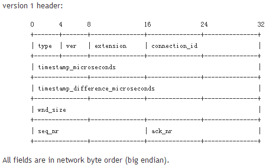

# 4. uTP协议 

uTP协议是一个基于UDP的开放的BT点对点文件共享协议。在uTP协议出现之前，BT下载会占用网络中大量的链接，直接导致其它网络应用服务质量下载和网络的拥堵，因此有很多ISP都开始限制BT的下载。uTP减轻了网络延迟并解决了传统的基于TCP的BT协议所遇到的拥塞控制问题，提供可靠的有序的传送。

<!-- more -->

一个有效的uTP数据包包含下面格式的报头




1. type(包类型):

	```
    1) ST_DATA = 0: 最重要的数据包，uTP就是使用该类型的包传送数据
    2) ST_FIN = 1: 关闭连接，这是uTP连接的最后一个包，类似于TCP中的FIN
    3) ST_STATE = 2: 简单的应答包，表明已从对方收到了数据包，该包不包含任何数据，seq_nr值不变
    4) ST_RESET = 3: 终止连接，类似于TCP中的RST
    5) ST_SYN = 4: 初始化连接，类似于TCP中的SYN，这是uTP连接的第一个包
	```
2. ver: This is the protocol version. The current version is 1.
3. extension: The type of the first extension in a linked list of extension headers. 
  
    ```
    1) 0 means no extension.
    2) Selective acks: There is currently one extension:
	```

4. `connection_id`: This is a random, unique, number identifying all the packets that belong to the same connection. Each socket has one connection ID for sending packets and a different connection ID for receiving packets. The endpoint initiating the connection decides which ID to use, and the return path has the same ID + 1.    

	uTP的一个很重要的特点是使用connection id来标识一次连接，而不是每个包算一次连接。所以在分析ST_DATA时，需要注意找所有connection id相同的数据包，然后按seq_nr排序，seq_nr应该是依次递增的(注意ST_STATE包不会增加seq_nr值)，如果发现两个ST_DATA的seq_nr值相同则说明后面那个报文是重复报文需要忽略掉，如果发现两个ST_DATA的seq_nr值不是连续的，中间差了一个或多个，则可能是由于网络原因发生了丢包现象，数据包将不可用

5. `timestamp_microseconds`: This is the 'microseconds' parts of the timestamp of when this packet was sent. This is set using gettimeofday() on posix and QueryPerformanceTimer() on windows. The higher resolution this timestamp has, the better. The closer to the actual transmit time it is set, the better.

6. `timestamp_difference_microseconds`: This is the difference between the local time and the timestamp in the last received packet, at the time the last packet was received. This is the latest one-way delay measurement of the link from the remote peer to the local machine. 
When a socket is newly opened and doesn't have any delay samples yet, this must be set to 0.

7. wnd_size: Advertised receive window. This is 32 bits wide and specified in bytes. The window size is the number of bytes currently in-flight, i.e. sent but not acked. The advertised receive window lets the other end cap the window size if it cannot receive any faster, if its receive buffer is filling up. When sending packets, this should be set to the number of bytes left in the socket's receive buffer.

8. seq_nr
9. ack_nr

在uTP连接建立之后，就开始传送需要的数据了。peer和peer之间传送数据也是遵循着一定的规范，就是Peer Wire协议。


# 5. Peer Wire协议 

在BitTorrent中，节点的寻址是通过DHT实现的，而实际的资源共享和传输则需要通过uTP以及Peer Wire协议来配合完成

### 0x1: 握手

Peer Wire协议是Peer之间的通信协议，通常由一个握手消息开始。握手消息的格式是这样的

```
<pstrlen><pstr><reserved><info_hash><peer_id> 
```

在BitTorrent协议的v1.0版本, pstrlen = 19, pstr = "BitTorrent protocol"，info_hash是上文中提到的磁力链接中的btih，peer_id每个客户端都不一样，但是有着一定的规则，根据前面几个字符可以推断出客户端的类型

```
'AG' - Ares
'A~' - Ares
'AR' - Arctic
'AV' - Avicora
'AX' - BitPump
'AZ' - Azureus
'BB' - BitBuddy
'BC' - BitComet
'BF' - Bitflu
'BG' - BTG (uses Rasterbar libtorrent)
'BR' - BitRocket
'BS' - BTSlave
'BX' - ~Bittorrent X
'CD' - Enhanced CTorrent
'CT' - CTorrent
'DE' - DelugeTorrent
'DP' - Propagate Data Client
'EB' - EBit
'ES' - electric sheep
'FT' - FoxTorrent
'FX' - Freebox BitTorrent
'GS' - GSTorrent
'HL' - Halite
'HN' - Hydranode
'KG' - KGet
'KT' - KTorrent
'LH' - LH-ABC
'LP' - Lphant
'LT' - libtorrent
'lt' - libTorrent
'LW' - LimeWire
'MO' - MonoTorrent
'MP' - MooPolice
'MR' - Miro
'MT' - MoonlightTorrent
'NX' - Net Transport
'PD' - Pando
'qB' - qBittorrent
'QD' - QQDownload
'QT' - Qt 4 Torrent example
'RT' - Retriever
'S~' - Shareaza alpha/beta
'SB' - ~Swiftbit
'SS' - SwarmScope
'ST' - SymTorrent
'st' - sharktorrent
'SZ' - Shareaza
'TN' - TorrentDotNET
'TR' - Transmission
'TS' - Torrentstorm
'TT' - TuoTu
'UL' - uLeecher!
'UT' - µTorrent
'VG' - Vagaa
'WD' - WebTorrent Desktop
'WT' - BitLet
'WW' - WebTorrent
'WY' - FireTorrent
'XL' - Xunlei
'XT' - XanTorrent
'XX' - Xtorrent
'ZT' - ZipTorrent
```

Peer Wire协议是在uTP协议基础上里层应用态协议。收到握手消息后，对方也会回复一个握手消息，并且开始协商一些基本的信息。


# 6. BitTorrent协议扩展ut_metadata和ut_pex(Extension for Peers to Send Metadata Files) (磁力链接核心)

```
BEP:9 		Title:	Extension for Peers to Send Metadata Files
BEP:10 		Title:	Extension Protocol
```


借助于DHT/KRPC完成了的Node节点寻址，资源对应的Peer获取，以及uTP以及Peer Wire完成握手之后，接下要就要"动真格"了，我们需要获取到目标资源的"种子信息(infohash/filename/pieces分块sha1)"了，<font color="red">这个扩展的目的是为了在最初没有.torrent文件的情况仍然能够加入swarm并能够完成下载。这个扩展能让客户端从peer哪里下载metadata。这让支持magnet link成为了可能，magnet link是一个web页上的链接，仅仅包含了足够加入swarm的足够信息(info hash)</font>


### 0x1: Metadata

这个扩展仅仅传输.torrent文件的info-字典字段，这个部分可以由infohash来验证。在这篇文档中，.torrent的这个部分被称为metadata。

Metadata被分块，每个块有16KB(16384字节)，Metadata块从0开始索引，所有快的大小都是16KB，除了最后一个块可能比16KB小


### 0x2: Extension头部

Metadata扩展使用extension协议(<font color="green">__BEP0010__</font>)来声称它的存在。它在extension握手消息的头部m字典加入ut_metadata项。它标识了这个消息可以使用这个消息码，同时也可以在握手消息中加入metadata_size这个整型字段(不是在m字典中)来指定metadata的字节数

```
{'m': {'ut_metadata', 3}, 'metadata_size': 31235}
```

### 0x3: Extension消息

Extension消息都是bencode编码，这里有3类不同的消息


+ request 0: 

请求消息并不在字典中附加任何关键字，这个消息的回复应当来自支持这个扩展的peer，是一个reject或者data消息，回复必须和请求所指出的片相同
Peer必须保证它所发送的每个片都通过了infohash的检测。即直到peer获得了整个metadata并通过了infohash的验证，才能够发送片(即一个peer应该保证自己已经完整从其他peer中拷贝了一份相同的资源文件后，才能继续响应其他节点的拷贝请求)。Peers没有获得整个metadata时，对收到的所有metadata请求都必须直接回复reject消息

```
{'msg_type': 0, 'piece': 0}
d8:msg_typei0e5:piecei0ee
# 这代表请求消息在请求metadata的第一片
```

+ data 1

这个data消息需要在字典中添加一个新的字段，"total_size".这个关键字段和extension头的"metadata_size"有相同的含义，这是一个整型

Metadata片被添加到bencode字典后面，他不是字典的一部分，但是是消息的一部分(必须包括长度前缀)。
如果这个片是metadata的最后一个片，他可能小于16KB。如果它不是metadata的最后一片，那大小必须是16KB

```
{'msg_type': 1, 'piece': 0, 'total_size': 3425}
d8:msg_typei1e5:piecei0e10:total_sizei34256eexxxxxxxx...
# x表示二进制数据(metadata) 
```

+ reject 2

Reject消息没有附件的关键字。它的意思是peer没有请求的这个metadata片信息 

在客户端收到收到一定数目的消息后，可以通过拒绝请求消息来进行洪泛攻击保护。尤其在metadata的数目乘上一个因子时 

```
{'msg_type': 2, 'piece': 0}
d8:msg_typei1e5:piecei0ee
```

### 0x4: request消息: Metadat信息获取过程

+ 扩展支持交互(互相询问对方支持哪些扩展)

根据BEP-010我们知道，扩展消息一般在Peer Wire握手之后立即发出，是一个B编码的字典

```
{
    e: 0,
    ipv4: xxx,
    ipv6: xxx,
    complete_ago: 1,
    m:
    {
        upload_only: 3,
        lt_donthave: 7,
        ut_holepunch: 4,
        ut_metadata: 2,
        ut_pex: 1,
        ut_comment: 6
    },
    matadata_size: 45377,
    p: 33733,
    reqq: 255,
    v: BitTorrent 7.9.3
    yp: 19616,
    yourip: xxx
}

1. m: 是一个字典，表示客户端支持的所有扩展以及每个扩展的编号
    1) ut_pex: 表示该客户端支持PEX(Peer Exchange)
    2) ut_metadata表示支持BEP-009(也就是交换种子文件的metadata)
```

+ 握手handshake


我们在完成双方握手之后，并且得到了对方支持的扩展信息。资源请求方也通知被请求方本机支持的扩展情况，然后后面接着一个扩展消息(从上面的m字典可以看到可能会有多种不同的扩展消息)，具体是哪个类型的扩展消息由message ID后面那个数字决定，这个数字对应着m字典中的编号。譬如我们这里的消息是

```
00 00 00 1b 14 02 ... 00 00 00 1b 
1. 消息长度为 0x1b (27 bytes) 
2. 14 表示是 扩展消息(0x14 = 20)
3. 02 对应上面m字典中的 ut_metadata，所以我们这个消息是ut_metadata消息
```


再次看上图的截图，我们这里的图显示的是[msg_type: 0, piece: 2]正是request消息，意思是向对象请求第二个piece的数据，piece的意思是分块的意思，根据BEP-009我们知道，种子文件的metadata（也就是info部分）会按16KB分成若干块，除最后一块每一块的大小都是16KB，每一块从0开始按顺序进行编号。所以这个请求的意思就是向对象请求第三块的metadata


+ 回复data信息


从图中形象的表示可以看到torrent文件整个info的长度为45377，这个值正是上面握手报文后的扩展消息中的metadata_size的值。在发送request消息之后，接下来对方应该回复data消息（如果对方有数据）或reject消息（如果对方没有数据）。


msg_type为1表示是回复就是我所需要的数据，但是注意这里的数据并没完，由于uTP协议的缘故，我们可以根据connection id找到这个连接后续的所有数据。 这里其实一共收到了三个消息，我们分别来看一下

```
00 00 00 03 09 83 c5 --> message ID为9，port消息，表示端口号为0x83c5 = 33733
00 00 00 03 14 03 01 --> message ID为20(0x14)，extend消息，编号03为upload_only，表示设置upload_only = 1
00 00 31 70 14 02 xx --> message ID为20(0x14)，extend消息，编号02为ut_metadata，后面的xx表示[msg_type: 1, piece: 2, total_size: 45377]和相应块的metadata数据
```


看第三个消息可以知道消息长度为0x3170，这个长度包括了[msg_type...]这一串字符串的长度，共0x2f个字节，我们将其减去就得到了piece2的长度：0x3170 - 0x2f = 0x3141 我们上面说过每个块的大小应该是16KB，也就是0x4000，这里的大小为0x3141，只可能是最后一块。我们稍微计算验证下，将整个info的长度45377(0xb141)按16KB分块

```
piece 0: 0x0001 ~ 0x4000 长度0x4000
piece 1: 0x4001 ~ 0x8000 长度0x4000
piece 2: 0x8001 ~ 0xb141 长度0x3141
```


可以看到piece2正是最后一块，大小为0x3141。至此我们得到了第二块的metadata，然后通过request消息获取piece0和piece1获取第一和第二块的metadata，将三块的消息合并成torrent文件info字段，然后再加上create date、create by或comment等信息，种子文件就算完成下载了。<font color="red">可见要在BT网络中完成实际的资源下载，就必须完整获取到种子文件，因为种子文件中不单有infohash值，还有piece sha1校验码，分块下载时需要进行校验，而磁力连接magnet只是一个最小化入口，最终还是需要通过磁力连接在DHT网络中获取种子文件的完整信息</font>


### 0x5: 校验info_hash

我们将从DHT网络中下载的种子文件和原始的种子文件进行比较，可以看到annouce和annouce-list字段都丢掉了(引入了DHT网络后，BT可以实现Trackerless)，create date发生了变化，info字段不变

磁力链是为了简化BT种子文件的分发，封装了一个简化版的magnet url，客户端解析这个magnet磁力链之后，需要在DHT网络中寻找infohash对应的peer节点，获取节点成功后，向目标peer节点获取真正的BitTorrent种子(.torrent文件)信息(包含了完整的pieces SHA1杂凑信息)，另一个渠道就是传统的Bt种子论坛会分发.BT种子文件


# 6. 参考资料

+ https://www.cnblogs.com/LittleHann/p/6180296.html