# 1. https 协议

HTTPS 协议（HyperText Transfer Protocol over Secure Socket Layer）：可以理解为HTTP+SSL/TLS， 即 HTTP 下加入 SSL 层，HTTPS 的安全基础是 SSL，因此加密的详细内容就需要 SSL，用于安全的 HTTP 数据传输。

<!-- more -->

> SSL历史和版本

1994年，NetScape公司设计了SSL协议（Secure Sockets Layer）的1.0版，但是未发布。

1995年，NetScape公司发布SSL 2.0版，很快发现有严重漏洞。

1996年，SSL 3.0版问世，得到大规模应用。

1999年，互联网标准化组织ISOC接替NetScape公司，发布了SSL的升级版TLS 1.0版。

2006年和2008年，TLS进行了两次升级，分别为TLS 1.1版和TLS 1.2版。最新的变动是2011年TLS 1.2的修订版。

目前，应用最广泛的是TLS 1.0，接下来是SSL 3.0。但是，主流浏览器都已经实现了TLS 1.2的支持。

---
TLS 1.0通常被标示为SSL 3.1

TLS 1.1为SSL 3.2，

TLS 1.2为SSL 3.3。

# 2. 数字证书

数字证书，又称互联网上的"身份证"，用于唯一标识一个组织或一个服务器的，这就好比我们日常生活中使用的"居民身份证"，用于唯一标识一个人。

网站的证书也是同样的道理。一般来说数字证书从受信的权威证书授权机构 (Certification Authority，证书授权机构)买来的。一般浏览器在出厂时就内置了诸多知名CA。

实际应用中，HTTPS并非直接传输公钥信息，而是使用携带公钥信息的数字证书来保证公钥的安全性和完整性。用来保障HTTPS服务端发送给客户端的公钥信息不被篡改。

### 2.1 数字证书和 CA 机构

一个数字证书通常包含了：

- 公钥；
- 持有者信息；
- 证书认证机构（CA）的信息；
- CA 对这份文件的数字签名及使用的算法；
- 证书有效期；
- 还有一些其他额外信息；

那数字证书的作用，是用来认证公钥持有者的身份，以防止第三方进行冒充。说简单些，证书就是用来告诉客户端，该服务端是否是合法的，因为只有证书合法，才代表服务端身份是可信的。

我们用证书来认证公钥持有者的身份（服务端的身份），那证书又是怎么来的？又该怎么认证证书呢？

为了让服务端的公钥被大家信任，服务端的证书都是由 CA （*Certificate Authority*，证书认证机构）签名的，CA 就是网络世界里的公安局、公证中心，具有极高的可信度，所以由它来给各个公钥签名，信任的一方签发的证书，那必然证书也是被信任的。

之所以要签名，是因为签名的作用可以避免中间人在获取证书时对证书内容的篡改。

### 2.2 数字证书签发和验证流程

如下图图所示，为数字证书签发和验证流程：

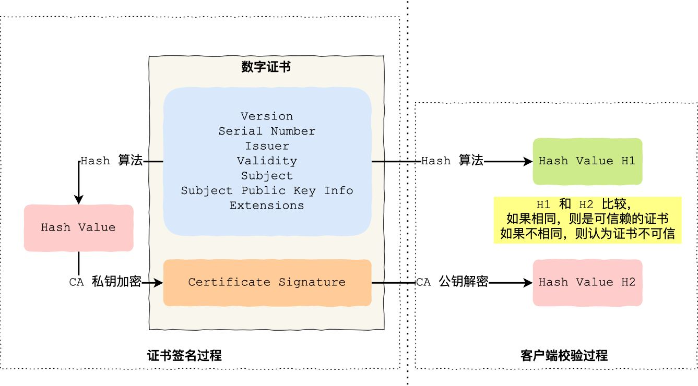

1. CA 签发证书的过程，如上图左边部分：

- 首先 CA 会把持有者的公钥、用途、颁发者、有效时间等信息打成一个包，然后对这些信息进行 Hash 计算，得到一个 Hash 值；
- 然后 CA 会使用自己的私钥将该 Hash 值加密，生成 Certificate Signature，也就是 CA 对证书做了签名；
- 最后将 Certificate Signature 添加在文件证书上，形成数字证书；

2. 客户端校验服务端的数字证书的过程，如上图右边部分：

- 首先客户端会使用同样的 Hash 算法获取该证书的 Hash 值 H1；
- 通常浏览器和操作系统中集成了 CA 的公钥信息，浏览器收到服务器的证书后可以使用 CA 的公钥解密 Certificate Signature 内容，得到一个 Hash 值 H2 ；
- 最后比较 H1 和 H2，如果值相同，则为可信赖的证书，否则则认为服务器证书不可信。

### 2.3 证书链

但事实上，证书的验证过程中还存在一个证书信任链的问题，因为我们向 CA 申请的证书一般不是根证书签发的，而是由中间证书签发的，比如百度的证书，从下图你可以看到，证书的层级有三级：
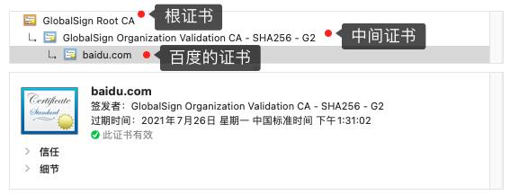

对于这种三级层级关系的证书的验证过程如下：

- 客户端收到 [baidu.com](https://link.zhihu.com/?target=http%3A//baidu.com/) 的证书后，发现这个证书的签发者不是根证书，就无法根据本地已有的根证书中的公钥去验证 [baidu.com](https://link.zhihu.com/?target=http%3A//baidu.com/) 证书是否可信。于是，客户端根据 [baidu.com](https://link.zhihu.com/?target=http%3A//baidu.com/) 证书中的签发者，找到该证书的颁发机构是 “GlobalSign Organization Validation CA - SHA256 - G2”，然后向 CA 请求该中间证书。
- 请求到证书后发现 “GlobalSign Organization Validation CA - SHA256 - G2” 证书是由 “GlobalSign Root CA” 签发的，由于 “GlobalSign Root CA” 没有再上级签发机构，说明它是根证书，也就是自签证书。应用软件会检查此证书有否已预载于根证书清单上，如果有，则可以利用根证书中的公钥去验证 “GlobalSign Organization Validation CA - SHA256 - G2” 证书，如果发现验证通过，就认为该中间证书是可信的。
- “GlobalSign Organization Validation CA - SHA256 - G2” 证书被信任后，可以使用 “GlobalSign Organization Validation CA - SHA256 - G2” 证书中的公钥去验证 [baidu.com](https://link.zhihu.com/?target=http%3A//baidu.com/) 证书的可信性，如果验证通过，就可以信任 [baidu.com](https://link.zhihu.com/?target=http%3A//baidu.com/) 证书。

在这些步骤中，最开始客户端只信任根证书 GlobalSign Root CA 证书的，然后 “GlobalSign Root CA” 证书信任 “GlobalSign Organization Validation CA - SHA256 - G2” 证书，而 “GlobalSign Organization Validation CA - SHA256 - G2” 证书又信任 [baidu.com](https://link.zhihu.com/?target=http%3A//baidu.com/) 证书，于是客户端也信任 [baidu.com](https://link.zhihu.com/?target=http%3A//baidu.com/)证书。

总括来说，由于用户信任 GlobalSign，所以由 GlobalSign 所担保的 [baidu.com](https://link.zhihu.com/?target=http%3A//baidu.com/) 可以被信任，另外由于用户信任操作系统或浏览器的软件商，所以由软件商预载了根证书的 GlobalSign 都可被信任。

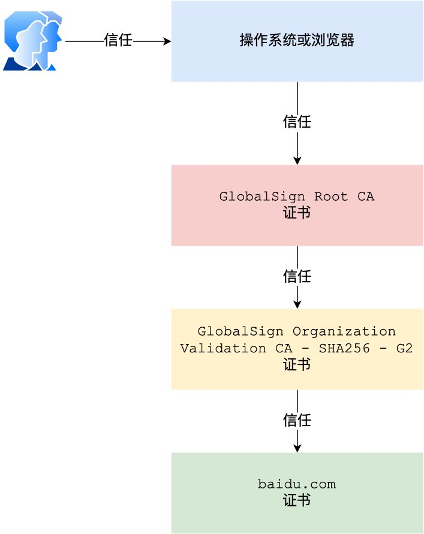

操作系统里一般都会内置一些根证书，比如我的 MAC 电脑里内置的根证书有这么多：

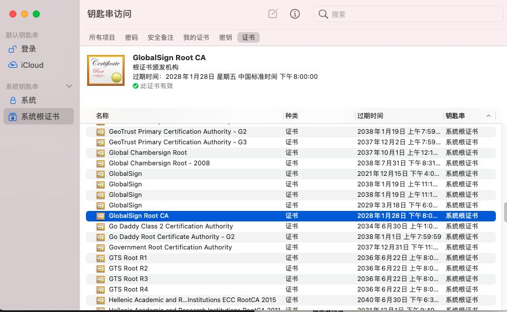

这样的一层层地验证就构成了一条信任链路，整个证书信任链验证流程如下图所示：

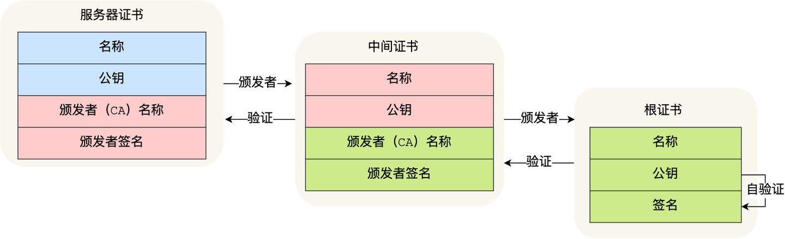

最后一个问题，为什么需要证书链这么麻烦的流程？Root CA 为什么不直接颁发证书，而是要搞那么多中间层级呢？

这是为了确保根证书的绝对安全性，将根证书隔离地越严格越好，不然根证书如果失守了，那么整个信任链都会有问题。

# 3. tls 四次握手

用 Wireshark 工具抓了用 RSA 密钥交换的 TLS 握手过程，你可以从下面看到，一共经历来四次握手

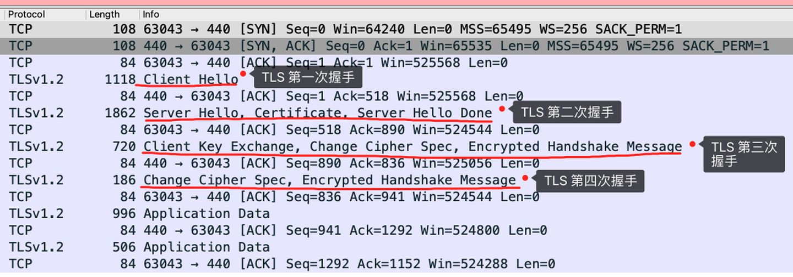

### 3.1 客户端向服务端发送 **Client Hello** 消息

客户端首先会发一个「**Client Hello**」消息，字面意思我们也能理解到，这是跟服务器「打招呼」。

消息里面有客户端使用的 TLS 版本号、支持的密码套件列表，以及生成的随机数（Client Random），这个随机数会被服务端保留，它是生成对称加密密钥的材料之一。

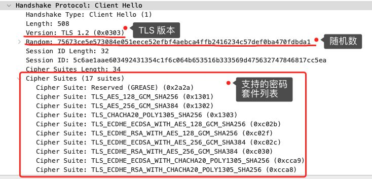

### 3.2 服务端向客户端发送 **Server Hello** 消息

当服务端收到客户端的「Client Hello」消息后，会确认 TLS 版本号是否支持，和从密码套件列表中选择一个密码套件，以及生成随机数（Server Random）。

接着，返回「Server Hello」消息，消息里面有服务器确认的 TLS 版本号，也给出了随机数（Server Random），然后从客户端的密码套件列表选择了一个合适的密码套件。

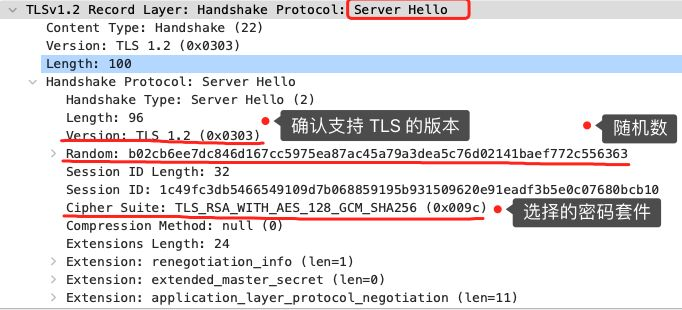

可以看到，服务端选择的密码套件是 “Cipher Suite: TLS_RSA_WITH_AES_128_GCM_SHA256”。

这个密码套件看起来真让人头晕，好一大串，但是其实它是有固定格式和规范的。基本的形式是「**密钥交换算法 + 签名算法 + 对称加密算法 + 摘要算法**」， 一般 WITH 单词前面有两个单词，第一个单词是约定密钥交换的算法，第二个单词是约定证书的验证算法。比如刚才的密码套件的意思就是：

- 由于 WITH 单词只有一个 RSA，则说明握手时密钥交换算法和签名算法都是使用 RSA；

- 握手后的通信使用 AES 对称算法，密钥长度 128 位，分组模式是 GCM；

- 摘要算法 SHA256 用于消息认证和产生随机数；

  

 就前面这两个客户端和服务端相互「打招呼」的过程，客户端和服务端就已确认了 TLS 版本和使用的密码套件，而且你可能发现客户端和服务端都会各自生成一个随机数，并且还会把随机数传递给对方。那这个随机数有啥用呢？其实这两个随机数是后续作为生成「会话密钥」的条件，所谓的会话密钥就是数据传输时，所使用的对称加密密钥。

然后，服务端为了证明自己的身份，会发送「**Server Certificate**」给客户端，这个消息里含有数字证书。

随后，服务端发了「**Server Hello Done**」消息，目的是告诉客户端，我已经把该给你的东西都给你了，本次打招呼完毕。

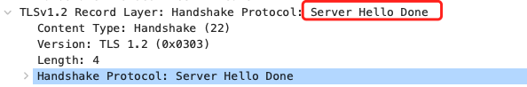

### 3.3 客户端验证 服务器证书 和 协商密钥

客户端去验证完证书后，认为可信则继续往下走。接着，客户端就会生成一个新的随机数 (pre-master)，用服务器的 RSA 公钥加密该随机数，通过「Change Cipher Key Exchange」消息传给服务端。

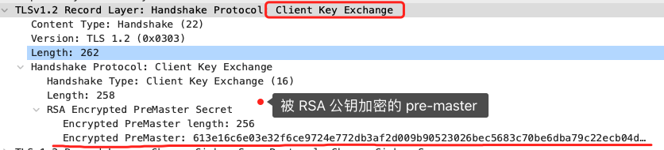

服务端收到后，用 RSA 私钥解密，得到客户端发来的随机数 (pre-master)。

至此，**客户端和服务端双方都共享了三个随机数，分别是 Client Random、Server Random、pre-master**。

于是，双方根据已经得到的三个随机数，生成**会话密钥（Master Secret）**，它是对称密钥，用于对后续的 HTTP 请求/响应的数据加解密。

生成完会话密钥后，然后客户端发一个「**Change Cipher Spec**」，告诉服务端开始使用加密方式发送消息。

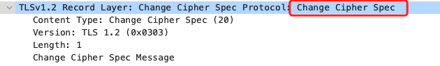

然后，客户端再发一个「**Encrypted Handshake Message（Finishd）**」消息，把之前所有发送的数据做个摘要，再用会话密钥（master secret）加密一下，让服务器做个验证，验证加密通信是否可用和之前握手信息是否有被中途篡改过。

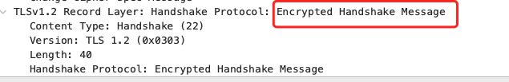

可以发现，「Change Cipher Spec」之前传输的 TLS 握手数据都是明文，之后都是对称密钥加密的密文。

### 3.4 服务端向客户端发送 Finished 消息

服务器也是同样的操作，发「**Change Cipher Spec**」和「**Encrypted Handshake Message**」消息，如果双方都验证加密和解密没问题，那么握手正式完成。

最后，就用「会话密钥」加解密 HTTP 请求和响应了。

# 4. 优化https

### 4.1 密钥交换算法优化

尽量**选用 ECDHE 密钥交换**算法替换 RSA 算法，因为该算法由于支持「False Start」，它是“抢跑”的意思，客户端可以在 TLS 协议的第 3 次握手后，第 4 次握手前，发送加密的应用数据，以此将 **TLS 握手的消息往返由 2 RTT 减少到 1 RTT，而且安全性也高，具备前向安全性**。

ECDHE 算法是基于椭圆曲线实现的，不同的椭圆曲线性能也不同，应该尽量**选择 x25519 曲线**，该曲线是目前最快的椭圆曲线。比如在 Nginx 上，可以使用 ssl_ecdh_curve 指令配置想使用的椭圆曲线，把优先使用的放在前面：

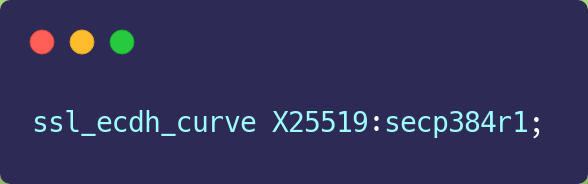

对于对称加密算法方面，如果对安全性不是特别高的要求，可以**选用 AES_128_GCM**，它比 AES_256_GCM 快一些，因为密钥的长度短一些。比如在 Nginx 上，可以使用 ssl_ciphers 指令配置想使用的非对称加密算法和对称加密算法，也就是密钥套件，而且把性能最快最安全的算法放在最前面：

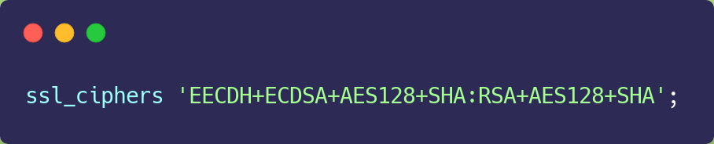

### 4.2 TLS 升级

当然，如果可以，直接把 TLS 1.2 升级成 TLS 1.3，TLS 1.3 大幅度简化了握手的步骤，**完成 TLS 握手只要 1 RTT**，而且安全性更高。

在 TLS 1.2 的握手中，一般是需要 4 次握手，先要通过 Client Hello （第 1 次握手）和 Server Hello（第 2 次握手） 消息协商出后续使用的加密算法，再互相交换公钥（第 3 和 第 4 次握手），然后计算出最终的会话密钥，下图的左边部分就是 TLS 1.2 的握手过程：

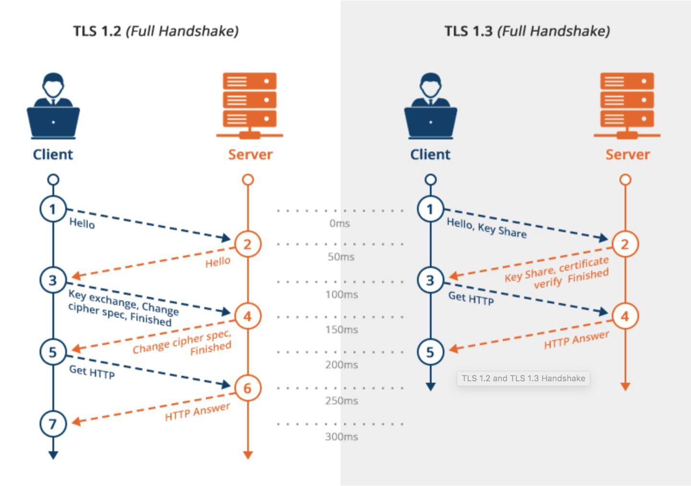

上图的右边部分就是 TLS 1.3 的握手过程，可以发现 **TLS 1.3 把 Hello 和公钥交换这两个消息合并成了一个消息，于是这样就减少到只需 1 RTT 就能完成 TLS 握手**。

怎么合并的呢？具体的做法是，客户端在 Client Hello 消息里带上了支持的椭圆曲线，以及这些椭圆曲线对应的公钥。

服务端收到后，选定一个椭圆曲线等参数，然后返回消息时，带上服务端这边的公钥。经过这 1 个 RTT，双方手上已经有生成会话密钥的材料了，于是客户端计算出会话密钥，就可以进行应用数据的加密传输了。

而且，TLS1.3 对密码套件进行“减肥”了， **对于密钥交换算法，废除了不支持前向安全性的 RSA 和 DH 算法，只支持 ECDHE 算法**。

# 5. 参考资料

+ https://www.ruanyifeng.com/blog/2014/02/ssl_tls.html
+ https://draveness.me/whys-the-design-https-latency/
+ https://zhuanlan.zhihu.com/p/344086342
+ https://zhuanlan.zhihu.com/p/348215533
+ https://zhuanlan.zhihu.com/p/346489295