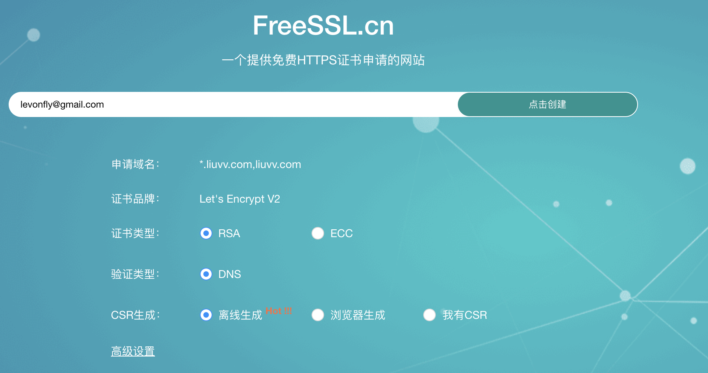
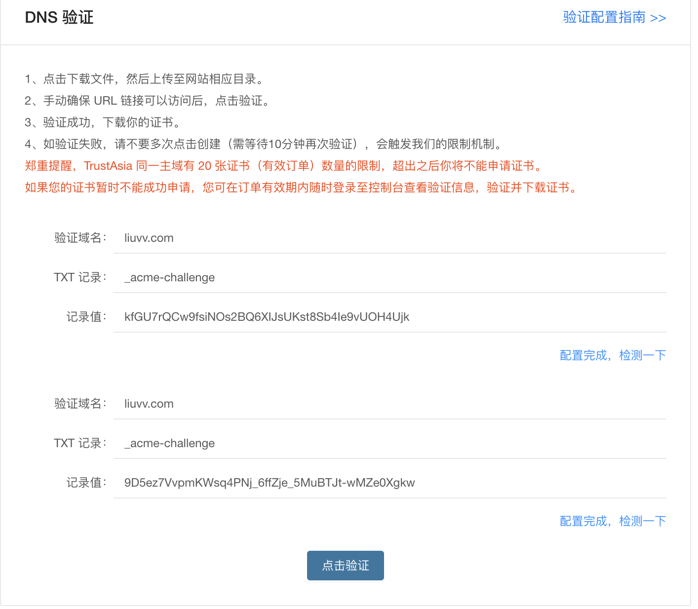
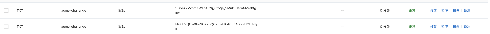
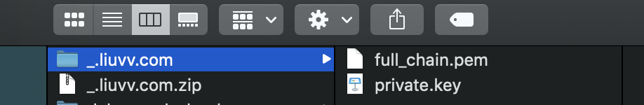
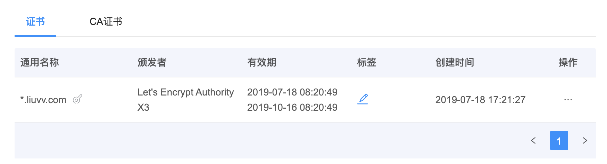

# 1. certbot

+ 使用 Let’s Encrypt 提供的免费证书, 放到自己的服务器中, 并且在nginx配置好证书路径, 这样使用浏览器访问的时候就会见到熟悉的绿色小锁头了. 需要注意证书必须颁发给`某个域名`, 所以`ip地址`无效.

+ 安装工具certbot

```
git clone https://github.com/certbot/certbot
cd certbot
chmod +x certbot-auto
	
# certbot-auto 即为自动化脚本工具, 他会判断你的服务是nginx还是apache, 然后执行对应逻辑
./certbot-auto --help
```
<!-- more -->

+ 生成证书

```bash
# webroot代表webroot根目录模式, certonly代表只生成证书 邮箱亲测没啥大用, 域名一定要和自己要申请证书的域名一致
./certbot-auto certonly --webroot --agree-tos -v -t --email 你的邮箱 -w 服务器根目录 -d 你要申请的域名
	
	
# 实际如下
./certbot-auto certonly --webroot --agree-tos -v -t --email levonfly@gmail.com -w /var/www/html/ -d a.xuanyueting.com
```

然后会在/etc/letsencrypt/目录下生成相关文件, 你所需要的证书其实在`/etc/letsencrypt/live/a.xuanyueting.com/`目录中.

`fullchain.pem`可以看作是证书公钥, `privkey.pem`是证书私钥, 是我们下面需要使用到的两个文件


+ nginx 配置支持 https

```nginx
server {
    listen 80 default_server;
    listen [::]:80 default_server;
    rewrite ^ https://$http_host$request_uri? permanent;
}


server {
	  listen 443 ssl default_server;
    listen [::]:443 ssl default_server;
    ssl_certificate "/etc/letsencrypt/live/a.xuanyueting.com/fullchain.pem";
    ssl_certificate_key "/etc/letsencrypt/live/a.xuanyueting.com/privkey.pem";
    
    root /var/www/html;
    ....
}
```

+ 重启 nginx 验证
```bash
sudo service nginx restart
```
访问 a.xuanyueting.com, 会发现出现了小绿锁


# 2. acme自动生成并更新证书

+ https://www.liuvv.com/p/ee822cec.html


# 3. freesn网站免费申请

+ https://freessl.cn/ 注册账号

+ 选择Let's Encrypt V2 支持通配符

  

+ 启动keymanager(需要下载), 设置一个密码

+ 浏览器拉起keymanager, 会自动生成一个csr

+ DNS 验证

  

  CA 将通过查询 DNS 的 TXT 记录来确定您对该域名的所有权。您只需要在域名管理平台将生成的 TXT 记录名与记录值添加到该域名下，等待大约 1 分钟即可验证成功。

  

  需要你到你的域名托管服务商那里添加一条 TXT 记录，其中记录名称为第二行的内容,记录值为第三行的内容。

  

+ 生成证书并且下载, 建议保存到key manager里
	

+ 保存到key manager里, 有效期3个月, 选择导出证书, nginx, 2个文件crt 和 key
  
  
+ Nginx 配置

  ```nginx
  server {
          listen 80 default_server;#一定要加上default_server,否则多个server会找第一个为默认
          listen [::]:80 default_server;#监听所有的ipv6的地址
          rewrite ^ https://$http_host$request_uri? permanent; #https 跳转到 https,永久重定向向
  }
  server {
          listen 443 ssl default_server;
          listen [::]:443 ssl default_server;
          ssl_certificate "/etc/nginx/ssl/*.liuvv.com_chain.crt";
          ssl_certificate_key "/etc/nginx/ssl/*.liuvv.com_key.key";
          root /home/levonfly/www;
          index index.html;
  }
  ```

