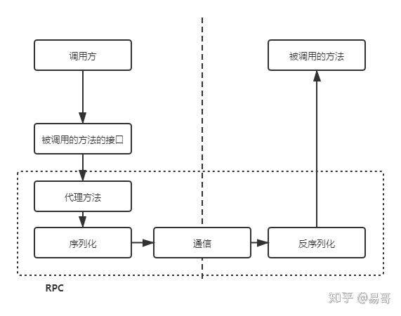
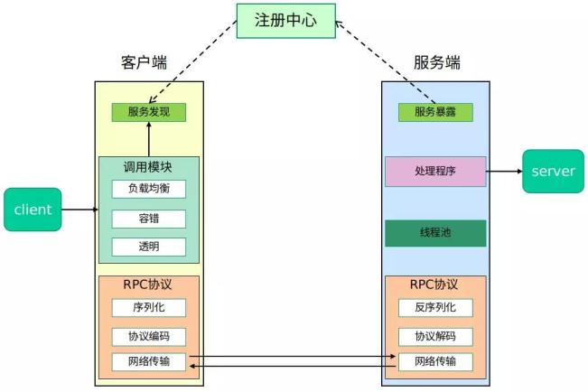
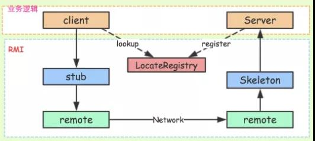
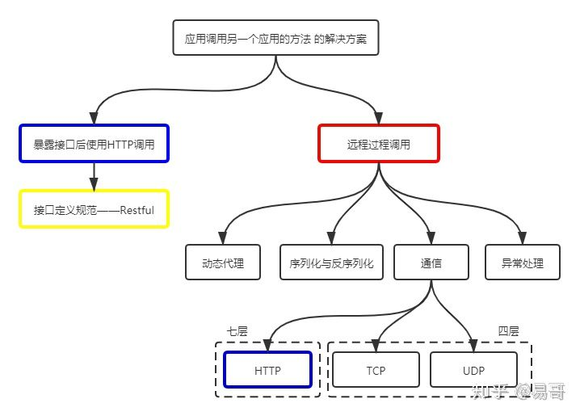

# 1. RPC（Remote Procedure Call）远程过程调用

在分布式计算，远程过程调用（英语：Remote Procedure Call，缩写为 RPC）是一个计算机通信协议。该协议允许运行于一台计算机的程序调用另一个地址空间（通常为一个开放网络的一台计算机）的子程序，而程序员就像调用本地程序一样，无需额外地为这个交互作用编程（无需关注细节）。RPC是一种服务器-客户端（Client/Server）模式，经典实现是一个通过发送请求-接受回应进行信息交互的系统。

<!-- more -->

### 1.1 常见的 RPC框架

RPC 是一种技术思想而非一种规范或协议，常见 RPC框架有：

[Dubbo](http://dubbo.io/) 是阿里巴巴公司开源的一个Java高性能优秀的服务框架，使得应用可通过高性能的 RPC 实现服务的输出和输入功能，可以和 Spring框架无缝集成。

[Motan](https://github.com/weibocom/motan)是新浪微博开源的一个Java 框架。它诞生的比较晚，起于2013年，2016年5月开源。Motan 在微博平台中已经广泛应用，每天为数百个服务完成近千亿次的调用。

[rpcx](https://github.com/smallnest/rpcx)是Go语言生态圈的Dubbo， 比Dubbo更轻量，实现了Dubbo的许多特性，借助于Go语言优秀的并发特性和简洁语法，可以使用较少的代码实现分布式的RPC服务。

[gRPC](http://www.grpc.io/)是Google开发的高性能、通用的开源RPC框架，其由Google主要面向移动应用开发并基于HTTP/2协议标准而设计，基于ProtoBuf(Protocol Buffers)序列化协议开发，且支持众多开发语言。本身它不是分布式的，所以要实现上面的框架的功能需要进一步的开发。

[thrift](https://thrift.apache.org/)是Apache的一个跨语言的高性能的服务框架，也得到了广泛的应用。

|框架| Dubbo            | Montan | rpcx                              | gRPC |
| :--------------- | :----- | :-------------------------------- | :--- | :----------------- |
| 开发语言         | Java   | Java                              | Go   | 跨语言             |
| 分布式(服务治理) | √      | √                                 | √    | ×                  |
| 多序列化框架支持 | √      | √ (当前支持Hessian2、Json,可扩展) | √    | × (只支持protobuf) |
| 多种注册中心     | √      | √                                 | √    | ×                  |
| 管理中心         | √      | √                                 | √    | ×                  |
| 跨编程语言       | ×      | × (支持php client和C server)      | ×    | √                  |

### 1.2 完整的 RPC 框架

在一个典型 RPC 的使用场景中，包含了服务发现、负载、容错、网络传输、序列化等组件，其中“RPC 协议”就指明了程序如何进行网络传输和序列化。

### 1.3 RPC 核心之功能实现

所以，要实现一个 RPC 框架，只需要把以下三点实现了就基本完成了：

- 服务寻址Call ID 映射：可以直接使用函数字符串，也可以使用整数 ID。映射表一般就是一个哈希表。

- 数据流的序列化和反序列化：可以自己写，也可以使用 Protobuf 或者 FlatBuffers 之类的。

- 网络传输：尽管大部分 RPC 框架都使用 TCP 协议，但其实 UDP 也可以，而 gRPC 干脆就用了 HTTP2。也可以自己写 Socket，或者用 Asio，ZeroMQ，Netty 之类。

  

##### 1.3.1 服务寻址

服务寻址可以使用 Call ID 映射。在本地调用中，函数体是直接通过函数指针来指定的，但是在远程调用中，函数指针是不行的，因为两个进程的地址空间是完全不一样的。

所以在 RPC 中，所有的函数都必须有自己的一个 ID。这个 ID 在所有进程中都是唯一确定的。客户端在做远程过程调用时，必须附上这个 ID。然后我们还需要在客户端和服务端分别维护一个函数和Call ID的对应表。

当客户端需要进行远程调用时，它就查一下这个表，找出相应的 Call ID，然后把它传给服务端，服务端也通过查表，来确定客户端需要调用的函数，然后执行相应函数的代码。

> 实现方式：服务注册中心。

要调用服务，首先你需要一个服务注册中心去查询对方服务都有哪些实例。Dubbo 的服务注册中心是可以配置的，官方推荐使用 Zookeeper。

实现案例：RMI(Remote Method Invocation，远程方法调用)也就是 RPC 本身的实现方式。

Registry(服务发现)：借助 JNDI 发布并调用了 RMI 服务。实际上，JNDI 就是一个注册表，服务端将服务对象放入到注册表中，客户端从注册表中获取服务对象。

RMI 服务在服务端实现之后需要注册到 RMI Server 上，然后客户端从指定的 RMI 地址上 Lookup 服务，调用该服务对应的方法即可完成远程方法调用。

Registry 是个很重要的功能，当服务端开发完服务之后，要对外暴露，如果没有服务注册，则客户端是无从调用的，即使服务端的服务就在那里。

##### 1.3.2 序列化和反序列化

客户端怎么把参数值传给远程的函数呢?在本地调用中，我们只需要把参数压到栈里，然后让函数自己去栈里读就行。

但是在远程过程调用时，客户端跟服务端是不同的进程，不能通过内存来传递参数。这时候就需要客户端把参数先转成一个字节流，传给服务端后，再把字节流转成自己能读取的格式。

只有二进制数据才能在网络中传输，序列化和反序列化的定义是：

- 将对象转换成二进制流的过程叫做序列化
- 将二进制流转换成对象的过程叫做反序列化

这个过程叫序列化和反序列化。同理，从服务端返回的值也需要序列化反序列化的过程。

##### 1.3.3 网络传输

网络传输：远程调用往往用在网络上，客户端和服务端是通过网络连接的。

所有的数据都需要通过网络传输，因此就需要有一个网络传输层。网络传输层需要把 Call ID 和序列化后的参数字节流传给服务端，然后再把序列化后的调用结果传回客户端。

只要能完成这两者的，都可以作为传输层使用。因此，它所使用的协议其实是不限的，能完成传输就行。

尽管大部分 RPC 框架都使用 TCP 协议，但其实 UDP 也可以，而 gRPC 干脆就用了 HTTP2。

TCP 的连接是最常见的，简要分析基于 TCP 的连接：通常 TCP 连接可以是按需连接(需要调用的时候就先建立连接，调用结束后就立马断掉)，也可以是长连接(客户端和服务器建立起连接之后保持长期持有，不管此时有无数据包的发送，可以配合心跳检测机制定期检测建立的连接是否存活有效)，多个远程过程调用共享同一个连接。

# 2. 问题总结

### 2.1 RPC 和 HTTP 区别

+ HTTP和RPC同一级别，还是被RPC包含？

  

  

  上图是一个比较完整的关系图，这时我们发现HTTP（图中蓝色框）出现了两次。其中一个是和RPC并列的，都是跨应用调用方法的解决方案；另一个则是被RPC包含的，是RPC通信过程的可选协议之一。

  因此，**问题的答案是都对。看指的是哪一个蓝色框。**

+ Restful也属于RPC么？

  第二个问题是在问远程过程调用（红色框）是不是包含了Restful（黄色框），这种理解的关键在于对RPC的理解。

  RPC字面理解是远程过程调用，即在一个应用中调用另一个应用的方法。那Restful是满足的，通过它可以实现在一个应用中调用另一个应用的方法。

  但是，上述理解使得RPC的定义过于宽泛。RPC通常特指在一个应用中调用另一个应用的接口而实现的远程调用，即红色框所指的范围。这样，RPC是不包含Restful的。

  

# 3. 参考资料

+ [花了一个星期，我终于把RPC框架整明白了！](https://developer.51cto.com/art/201906/597963.htm)

