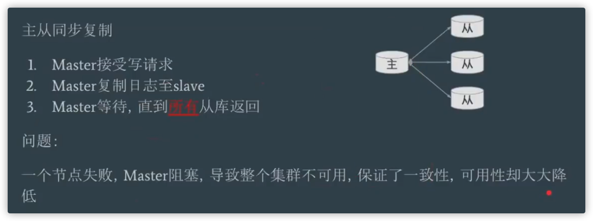
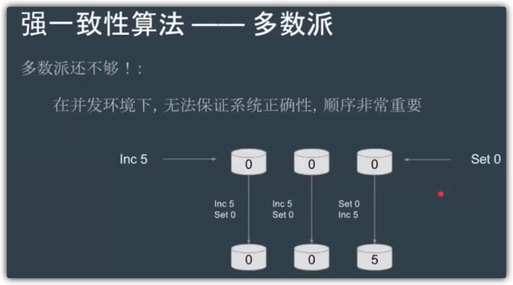
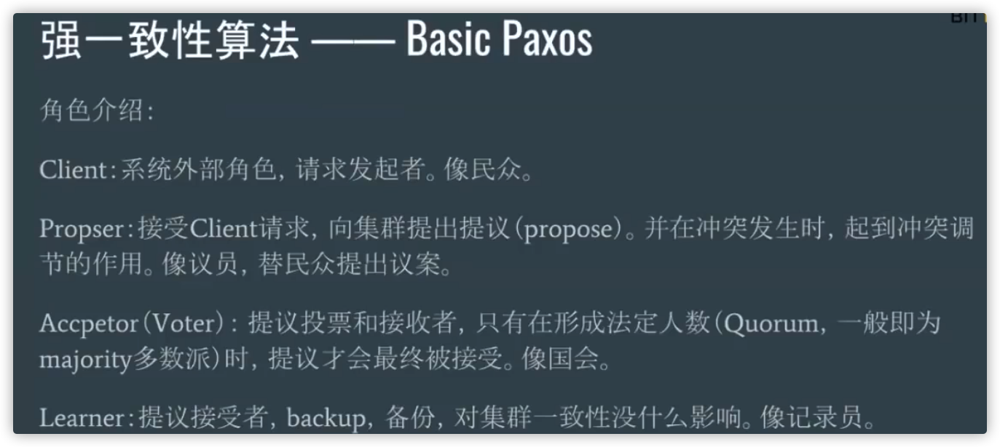
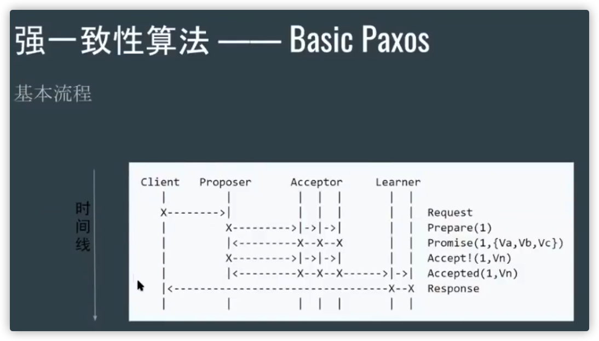
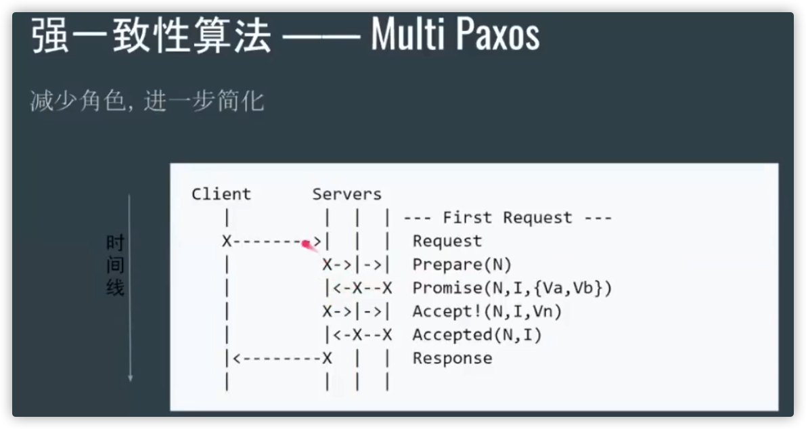
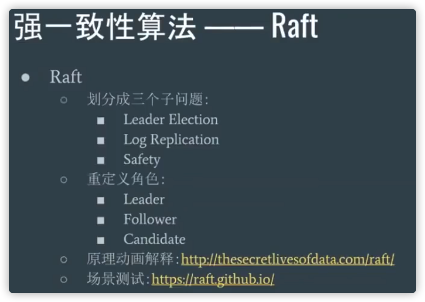
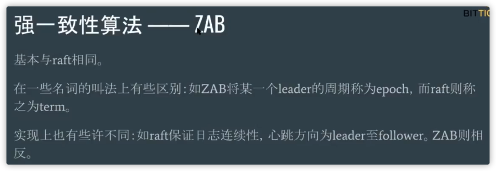

# 1. CAP 理论

+ 一致性（C：Consistency）
+ 可用性（A：Availability）
+ 分区容忍性（P：Partition Tolerance）

CAP 理论中分区容错性 P 是一定要满足的，理论上不可能选择 CA 架构，只能选择 CP 或者 AP 架构。

<!-- more -->

# 2. BASE 理论

BASE 是 Basically Available（基本可用） 、Soft-state（软状态） 和 Eventually Consistent（最终一致性） 三个短语的缩写。

CAP 是分布式系统设计理论，BASE 是 CAP 理论中 AP 方案的延伸。

核心思想:
即使无法做到强一致性，但每个应用都可以根据自身业务特点，采用适当的方式来使系统达到最终一致性。

1. 基本可用
基本可用是指分布式系统在出现不可预知故障的时候，允许损失部分可用性。但是，这绝不等价于系统不可用。

2. 软状态
软状态指允许系统中的数据存在中间状态（CAP 理论中的数据不一致），并认为该中间状态的存在不会影响系统的整体可用性，即允许系统在不同节点的数据副本之间进行数据同步的过程存在延时。

3. 最终一致性
最终一致性强调的是系统中所有的数据副本，在经过一段时间的同步后，最终能够达到一个一致的状态。因此，最终一致性的本质是需要系统保证最终数据能够达到一致，而不需要实时保证系统数据的强一致性。

# 3. 一致性

### 3.1 弱一致性

+ 最终一致性
例如 DNS(Domain Name System)

### 3.2 强一致性

+ 主从同步
  
  

  

+ Basic Paxos
  
  

+ Multi Paxos
    Basic Paxos的问题:  难实现、效率低(2轮RPC)、活锁
    Multi Paxos新概念, Leader:唯一的 propser,所有请求都需经过此 Leader
    

+ Raft (multi-paxos)

+ ZAB (multi-paxos)

# 4. 参考资料

+ https://www.cnblogs.com/savorboard/p/distributed-system-transaction-consistency.html
+ https://github.com/Snailclimb/JavaGuide/blob/master/docs/system-design/distributed-system/CAP%E7%90%86%E8%AE%BA.md
+ https://www.bilibili.com/video/BV1TW411M7Fx
+ http://thesecretlivesofdata.com/raft/
