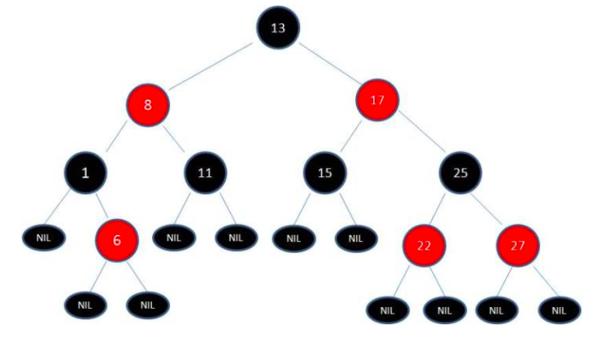

# 1. 树

在自然界和日常生活中，可以见到很多情形可以归结为树结构。如：家族谱系、行政管理机构、Windows磁盘文件管理系统等。

自然界的树是树根朝下，枝干和叶子向上生长，而我们讨论的树在生长方向上正好与其相反，它是倒长的树，即根朝上，枝干和叶子朝下。

<!-- more -->

### 1.1 定义

树（Tree）是n（n≥0）个结点的有限集合。它满足：
（1）仅有一个特定的结点，称为根（root）结点;
（2）其余结点分为m(m≥0)个互不相交的非空有限集合   其中每个集合自身又是一棵树，称为根的子树（subtree）。

本条即是说，树结点之间的路径不能形成回路，否则称为图

+ 为了表述方便，把没有结点的树称为空树。
+ 树的定义具有递归性：即一棵树是由根及若干棵子树构成的，而子树又是由根及若干棵子树构成的。

### 1.2 树的基本术语

+ 结点的度（degree）(就是直接的孩子有几个)

  结点所拥有的子树的个数称为该结点的度，而树中各结点的度的最大值称为该树的度。

  

+ 叶子（leaf）结点和分支结点  (没有孩子的节点就是叶子节点)
  + 度为0的结点称为叶子（终端）结点；度不为0的结点称为分支（非终端）结点。
  
  + 一棵树除了叶子结点就是分支节点。
  
    
  
+ 孩子结点、双亲结点、兄弟及堂兄弟结点 

  + 树中一个结点的子树的根（或说后继）称为该结点的孩子，该结点称为其孩子结点的双亲结点。
  + 同一个双亲的孩子结点互称为兄弟。双亲在同一层的结点互为堂兄弟。


+ 祖先和子孙
  + 祖先是从根到该所经分支上的所有结点。反之，以某结点为根的子树中的任一结点称为该结点的子孙。
  + 显然祖先和子孙关系是父子关系的延伸。


+ 结点的层数（level）和树的深度(depth，或称高度height）
  + 结点的层次从根结点开始算起，根结点的层数为1，其余结点的层数等于其双亲结点的层数加1。比如，如果某个结点的层数为h，则其子树就在第h+1层。
  + 树中各个结点层数的最大值称为树的深度（高度）。


+ 有序树（ordered tree）和无序树（unordered tree）

  若一棵树中结点的各子树从左到右是有次序的，即若交换了某结点各子树的相对位置就构成不同的树，则称这棵树为有序树，否则称为无序树。


+ 路径（path）

  从树中的一个结点到另一个结点的路途（路径只能由上向下，不能横向或由下向上）


+ 森林（forest）

  m（m≥0）棵互不相交的树的集合

  


# 2. 二叉树

一般的树规律性差，二叉树结构简单，存储和处理相对容易，而且一般的树可以转化为二叉树处理。

### 2.1 二叉树的定义

+ 二叉树是n（n≥0）个结点的有限集合，除了空树（n=0）之外，由一个根结点及两棵不相交的左子树和右子树组成；

+ 二叉树每个结点的度数≤2；

+ 二叉树的定义是递归的。

二叉树有五种基本形态：

(1)空树

(2)只有根结点

(3)只有左子树

(4)只有右子树

(5)完整二叉树

注意：二叉树的子树一定要分出左右，否则不能称作二叉树。

### 2.2 二叉树的性质

+ 二叉树的第i层的结点数量最多为 2<sup>i-1 </sup> (i >= 1)

  + 1层 最多1

  + 2层 最多2

  + 3层 最多4

    

+ 深度为k的二叉树结点数目最多为 2<sup>k</sup> -1 (k >= 1)

  + 深1层 最多1

  + 深2层 最多3

  + 深3层 最多7

    

+ 在任意二叉树中，若叶子结点数为n0，度数为2的结点数为n2，则有n0=n2+1

  本性质是说，任意一颗二叉树，叶子结点比度数为2的结点的个数多一个。

  ​     1

    1     1

  11    11 

  叶子节点4个, 度数为2的是3个


### 2.3 二叉树存储(先变成完全二叉树)

二叉树的形状可能繁多且不固定，不好掌握规律，而进行顺序存储恰恰相反，要求规律性强。所以这种存储一定是规律性较强的二叉树才适合。完全二叉树符合这一点，这也是它被定义的原因之一。

对于完全二叉树进行结点编号（自上而下，自左至右）后，编号可以反映结点的分支和从属关系，将这些结点存入一维数组时，编号和数组下标可以对应起来。

对于一般的二叉树，不易直接采用顺序存储，可以虚补成完全二叉树后再用顺序存储的方法存储。


然后数组的每个节点结构可以如下:

```c
typedef struct node
{
 DataType data;
 struct node *lchild,*parents,*rchild;
}ThTree;
```


### 2.4 二叉树遍历

+ 先序遍历：**根**，左子树，右子树   

+ 中序遍历：左子树，**根**，右子树  

+ 后序遍历：左子树，右子树，**根**

  

中序更重要, 只有中序和其他一个序组合,就能还原二叉树


# 3. 二叉树的种类

### 3.1 满二叉树(就是节点全满了)

满二叉树的定义：深度为k（k≥1）且结点数为 2<sup>k</sup> -1的二叉树。

满二叉树的结点数达到最大值。


### 3.2 完全二叉树(除最后一层都是满的,因为数量不可能正好满二叉树,常用)

对于满二叉树的结点，按下列规则编号：
(1)从根结点开始，自上而下；
(2)同一层自左至右。

+ 满二叉树的结点编号后，任意取满二叉树的前若干个连续的结点所对应的二叉树，称为完全二叉树。

+ 完全二叉树的特点：除最后一层外，其余各层均是满的，最后一层，结点连续出现在左边。

请注意：满二叉树要求太特殊且严格，一般不容易满足，而完全二叉树条件低一些，容易满足，今后会经常用到它，所以要注意它。


### 3.3 二叉查找树（英语：Binary Search Tree，简写为BST）

也称 **二叉搜索树**、**有序二叉树**（英语：ordered binary tree），**排序二叉树**（英语：sorted binary tree）不一定是完全二叉树

是指一棵空树或者具有下列性质的二叉树：

+ 若任意节点的左子树不空，则左子树上所有结点的值均小于它的根结点的值；

+ 若任意节点的右子树不空，则右子树上所有结点的值均大于它的根结点的值；

+ 任意节点的左、右子树也分别为二叉查找树；

+ 没有键值相等的节点。

简单的说就是：各节点值不同，并且对于任意一个子树：左<根<右。


##### 3.3.1 算法复杂度

+ 算法查找时间依赖于树的拓扑结构。最佳情况是 O(log­2n)，而最坏情况是 O(n)。

+ 插入算法的复杂度与查找算法的复杂度是一样的：最佳情况是 O(log­2n)，而最坏情况是 O(n)。

  如何插入值相等直接丢弃或抛出异常

+ 删除算法的运行时间也与 BST 的拓扑结构有关，最佳情况是 O(log­2n)，而最坏情况是 O(n)。

  删除一个非叶子节点，就必须选择其他节点来填补因删除节点所造成的树的断裂。


### 3.4 平衡二叉树

平衡二叉树的提出就是为了保证树不至于太倾斜，尽量保证两边平衡。因此它的定义如下：

1. 平衡二叉树要么是一棵空树
2. 要么保证左右子树的高度之差不大于 1
3. 子树也必须是一颗平衡二叉树

这种形态就是平衡，会使查找速度更快。为什么能够保持这种好身材呢？通过在新增/删除时的旋转（`左旋和右旋`）。


##### 3.4.1 平衡调整

1. 找平衡因子 = 2

2. 找插入新节点后失去平衡的最小子树

   + 距离插入点最近
   + 平衡因子绝对值大于1的结点作为根
   + 确认调整的点:     先确定根 -> 对插入的新节点, 路上的3个点

3. 平衡调整, 有四种类型

   + LL-> R 	

     中为支点, 高右旋

   + RR -> L

     中为支点, 高左旋
   
   + LR -> LR
   
     下二整体先左转, 变成 LL 再右转
   
   + RL -> RL
   
     下二整体先右转, 变成 RR 再左转


##### 3.4.2 常见的平衡树：

[AVL树](https://link.jianshu.com/?t=https://zh.wikipedia.org/wiki/AVL树)、[Treap](https://link.jianshu.com/?t=https://zh.wikipedia.org/wiki/Treap)、[伸展树](https://link.jianshu.com/?t=https://zh.wikipedia.org/wiki/伸展树)、[红黑树](https://link.jianshu.com/?t=https://zh.wikipedia.org/wiki/红黑树)、[加权平衡树](https://link.jianshu.com/?t=https://zh.wikipedia.org/wiki/加权平衡树)、[2-3树](https://link.jianshu.com/?t=https://zh.wikipedia.org/wiki/2-3树)、[AA树](https://link.jianshu.com/?t=https://zh.wikipedia.org/wiki/AA树)、[替罪羊树](https://link.jianshu.com/?t=https://zh.wikipedia.org/wiki/替罪羊树)、节点大小平衡树


### 3.5 红黑树（Red–black tree)

红黑树是一种含有红黑结点并能自平衡的二叉查找树。它必须满足下面性质：

+ 性质1：每个节点要么是黑色，要么是红色。
+ 性质2：根节点是黑色。每个叶子节点（NIL）是黑色。
+ 性质3：树中不存在两个相邻的红色结点（即红色结点的父结点和孩子结点均不能是红色）
+ 性质4：从任意一个结点（包括根结点）到其任何后代 NULL 结点（默认是黑色的）的每条路径都具有相同数量的黑色结点。





##### 为什么要有红黑树？

大多数二叉排序树BST的操作（查找、最大值、最小值、插入、删除等等）都是 的时间复杂度，h 为树的高度。但是对于斜树而言（BST极端情况下出现），BST的这些操作的时间复杂度将达到 。为了保证BST的所有操作的时间复杂度的上限为 ，就要想办法把一颗BST树的高度一直维持在 ，而红黑树就做到了这一点，红黑树的高度始终都维持在 ，n 为树中的顶点数目.

##### 红黑树RBT与平衡二叉树AVL比较：

AVL 树比红黑树更加平衡，但AVL树在插入和删除的时候也会存在大量的旋转操作。所以当你的应用涉及到频繁的插入和删除操作，切记放弃AVL树，选择性能更好的红黑树；当然，如果你的应用中涉及的插入和删除操作并不频繁，而是查找操作相对更频繁，那么就优先选择 AVL 树进行实现。

##### 红黑树的优势

。。。。

### 3.6 B树(B-树)

N叉的排序树

+ 结点最多含有m 颗子树，m-1个关键字（数据）（m>=2）
+ 若根节点不是叶子节点，则至少有两颗子树。

不满足，就分裂，从中间分开，分成两颗子树

+ 除根节点和叶子节点外，其他每个节点至少有ceil(m/2)个子节点（子树）。2.1=>3, 2.7=>3

### 3.7 B+树 

##### 3.7.1 数据库为什么不用红黑树

+ 树太高，读取次数过多
+ 读取浪费太多，不连续

##### 3.7.2 和 B 树的区别

+ 叶子节点连起来了 双向链表（方便范围查找）

+ 非叶子节点不存数据，数据都存在叶子节点

  

# 4. 其他种类的树

### 4.1 哈夫曼树(霍夫曼树)

带权的树,  加起来 WPL 最小, 可用来压缩


# 5. 头脑风暴

### 5.1 左旋右旋

+ 左旋

  父亲掉下去，右儿子上去，为了上去，儿子割左腿补偿给父亲右腿

+ 右旋

  父亲掉下去，左儿子上去，为了上去，儿子割右腿补偿给父亲左腿

  

# 6. 参考资料

+ https://www.jianshu.com/p/a826ab614e4a

+ [二叉查找树](https://www.cnblogs.com/gaochundong/p/binary_search_tree.html)

+ [为什么mysql索引要使用B+树，而不是B树，红黑树](https://segmentfault.com/a/1190000021488885)

  

