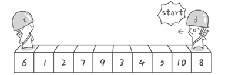
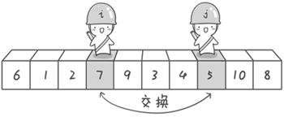
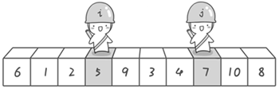
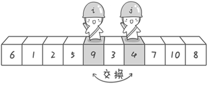
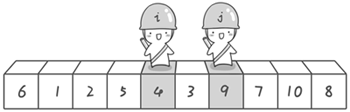
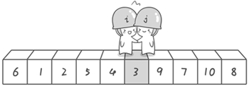
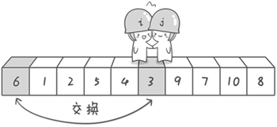
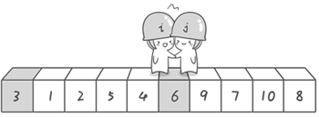

每次写快速排序，写过一次搞明白了，过一段时间写又忘记了。这次采用牛郎织女的故事，加深记忆。

+ 牛郎织女从两边往中间走见面，但是他们身上是有任务的，他们选取路上的 一个数字作为交流信号。

+ 牛郎先向左走，大于等于就走，**小于** 就停。织女向右走，小于等于就走，**大于** 就停，然后两人打电话交换脚下的数据。
+ 接着走，接着打电话交换数据，直到两人相遇。相遇后，把两人脚下的数据和心中的数字做交换。

+ 至此，相遇点左边都是比心中数字小，相遇点右边都是比心中数字大。

<!-- more -->


# 1. 快速排序

### 1.1 原始数据 “**6 1 2 7 9 3 4 5 10 8**”，目标：左边小于参考值，右边大于参考值




把第一个值 **6** 作为参考值，分别从初始序列“**6 1 2 7 9 3 4 5 10 8**”两端开始“探测”。先从**右**往**左**找一个小于 **6** 的数，再从**左**往**右**找一个大于 **6** 的数，然后交换他们。

这里可以用两个变量 **i** 和 **j**，分别指向序列最左边和最右边。我们为这两个变量起个好听的名字“哨兵 i”和“哨兵 j”。刚开始的时候让哨兵 i 指向序列的最左边（即 **i=1**），指向数字 **6**。让哨兵 **j** 指向序列的最右边（即 **j=10**），指向数字 **8**。

---



首先哨兵 **j** 开始出动。因为此处设置的基准数是最左边的数，所以需要让哨兵 **j** 先出动，这一点非常重要（后面会解释）。哨兵 **j** 一步一步地向左挪动（即 **j--**），直到找到一个小于 **6** 的数停下来。接下来哨兵 **i** 再一步一步向右挪动（即 **i++**），直到找到一个数大于 **6** 的数停下来。最后哨兵 **j** 停在了数字 **5** 面前，哨兵 **i** 停在了数字 **7** 面前。

现在交换哨兵 **i** 和哨兵 **j** 所指向的元素的值。交换之后的序列如下：6 1 2 **5** 9 3 4 **7** 10 8，到此，第一次交换结束。



---


接下来开始哨兵 **j** 继续向左挪动（再友情提醒，每次必须是哨兵 **j** 先出发）。他发现了 **4**（比基准数 **6** 要小，满足要求）之后停了下来。哨兵 **i** 也继续向右挪动的，他发现了 **9**（比基准数 **6** 要大，满足要求）之后停了下来。



此时再次进行交换，交换之后的序列如下：6 1 2 5 **4** 3 **9** 7 10 8，第二次交换结束。




---


“探测”继续。哨兵 **j** 继续向左挪动，他发现了 **3**（比基准数 **6** 要小，满足要求）之后又停了下来。哨兵 **i** 继续向右移动，糟啦！此时哨兵 **i** 和哨兵 **j** 相遇了，哨兵 **i** 和哨兵 **j** 都走到 **3** 面前。说明此时“探测”结束。




我们将基准数 **6** 和 **3** 进行交换。



交换之后的序列如下：**3** 1 2 5 4 **6** 9 7 10 8。




到此第一轮“探测”真正结束。此时以基准数 **6** 为分界点，**6** 左边的数都小于等于 **6**，**6** 右边的数都大于等于 **6**。回顾一下刚才的过程，其实哨兵 **j** 的使命就是要找小于基准数的数，而哨兵 **i** 的使命就是要找大于基准数的数，直到 **i** 和 **j** 碰头为止。

---

OK，解释完毕。现在基准数 **6** 已经归位，它正好处在序列的第 **6** 位。此时我们已经将原来的序列，以 **6** 为分界点拆分成了两个序列，左边的序列是“**3 1 2 5 4**”，右边的序列是“ **9 7 10 8** ”。

接下来开始递归把。


### 1.2 代码实现

```go
package main

import "fmt"

func main() {
	arr := []int{21, 2, 1, 60, 32}
	Print(arr)//21      2       1       60      32
	QuickSort(arr, 0, len(arr)-1)
	Print(arr)//1       2       21      32      60
}

func QuickSort(arr []int, left, right int) {
	if left < right {
		mid := partition(arr, left, right)
		QuickSort(arr, left, mid-1)
		QuickSort(arr, mid+1, right)
	}
}

func partition(arr []int, left, right int) int {

	value := arr[left] // 两人心中所想的数字
	start := left      // 记录所想数字的位置，相遇了要交换

	for left != right { // 两人不相遇，就循环

		for left < right && arr[right] >= value { //牛郎先走，大于等于就走，小于就停
			right--
		}
		for left < right && arr[left] <= value { //织女后走，小于等于就走，大于就停
			left++
		}

		if left < right { //双方停止后打电话交换脚下的数据
			arr[left], arr[right] = arr[right], arr[left]
		}
		//接着循环，直到两人相遇
	}

	// 相遇了，把两人脚下数据和心中数字交换，下面 left 和 right 是相等的
	arr[start], arr[left] = arr[left], arr[start]

	return left
}

func Print(arr []int) {
	for _, v := range arr {
		fmt.Printf("%d\t", v)
	}
	fmt.Print("\n")
}

```


# 2. 实现的问题

### 2.1 为什么从右往左开始找

如果哨兵 i 先走，相遇的地点有可能大于基准的值，跟基准一交换，大的值跑到前面去了，肯定是不对的。

哨兵 j 的寻找条件是小于基准数的数，所以最终定位到的序列中间的数总是会小于基准数，交换后顺序是对的，这样就能保证快速排序正确执行。


### 2.2 为什么大于等于，小于等于开始走，不是大于，小于

如果就两个数，正确的结果是相遇交换，而不是打电话交换。

+ 2，1
  +  right 大于等于2不动，left 小于等于2走一步相遇
+ 2，2
  + right 大于等于2走一步，直接相遇

+ 1，2
  + right 大于等于1走一步，直接相遇


### 2.3  另外一种方案

只要有一个人停下，就打电话交换，这样交换的次数会多一些。

```go
func partition(arr []int, left, right int) int {

	value := arr[left]

	for left != right {
		for left < right && arr[right] >= value {
			right--
		}
		arr[left], arr[right] = arr[right], arr[left]		
    
    
    for left < right && arr[left] <= value {
			left++
		}
		arr[left], arr[right] = arr[right], arr[left]
	}

	return left
}
```


# 3. 参考资料

+ https://wiki.jikexueyuan.com/project/easy-learn-algorithm/fast-sort.html

+ https://blog.csdn.net/qq_43990023/article/details/102297065

