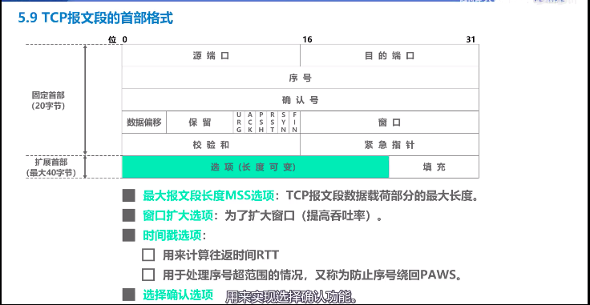

# 1. tcp 介绍和 udp 区别

|          | TCP                                                          | UDP                                       |
| -------- | ------------------------------------------------------------ | ----------------------------------------- |
| 数据传输 | 3报文握手+数据传输+4报文挥手                                 | 数据传输                                  |
| 连接方式 | 单播(一对一)                                                 | 单播(一对一), 多播(一对多), 广播 (一对全) |
| 应用报文 | 一系列字节流放到缓存中, 通过滑动窗口策略发送 发送方加个 TCP 头部 接收方取出字节流,组合送给接收方进程 | 每个报文添加个UDP首部                     |
| 首部     | 最小20字节, 最大60字节                                       | 8字节                                     |

<!-- more -->

# 2. tcp连接

### 2.1 建立连接

##### 客户端

+ 首先处于 closed 状态
+ 创建传输控制快
+ 
+ 发送握手①SYN=1 seq=x  进入**SYN-SENT**(同步已发送状态)
+ 发送握手③ACK=1 seq=x+1 ack=y+1 进入 **ESTABLISHED**(连接已建立状态)
+ 开始数据传输

##### 服务端

+ 首先处于 closed 状态
+ 创建传输控制快
  + tcp 连接表
  + 指向发送和接收缓存的指针
  + 指向重传队列的指针
  + 当前的发送和接收序号
+ listen 监听

+ 

+ 发送握手② SYN=1 ACK=1 seq=y ack=x+1  进入**SYN-REVD**(同步已接收状态)
+ 进入**ESTABLISHED**(连接已建立状态)
+ 开始数据传输

### 2.2 释放连接

##### 客户端

+ 发送挥手① FIN=1 ACK=1 seq=u  ack=v 进入 **FIN_WAIT_1**(终止等待1状态)
+ 收到挥手②进入 **FIN_WAIT_2**(终止等待2状态)
+ 接受数据
+ 发送挥手④ ACK=1 seq=u+1 ack=w+1 进入 **TIME_WAIT**(时间等待状态)
+ 经过2MSL后, 进入 **CLOSED**(关闭状态)

##### 服务端

+ 发送挥手② ACK=1 seq=v ack=u+1 并进入**CLOSE_WAIT**(关闭等待状态)
+ 通知应用进程断开连接, 客户端到服务器方向连接关闭, 属于半关闭状态
+ 发送未发完的数据
+ 发送挥手③ FIN=1 ACK=1 seq=w ack=u+1 进入 **LAST-ACK**(最后确认状态)
+ 收到挥手④后进入 **CLOSED**(关闭状态)

# 3. tcp 连接问题

### 3.1 为什么不用两次握手

假如第一个连接发送失败, 重传后过了好久好久, 到达了。 

服务器对失败后的连接又建立了一次请求, 但客户端可能处于关闭了都无法理会, 服务器就无法释放这个连接。

### 3.2 为什么进入 TIME_WAIT 而不是直接关闭

因为客户端发送挥手④的时候，有可能失败。

如果客户端直接关闭, 服务器重发挥手③, 客户端处于关闭不响应, 服务器无法释放资源。

### 3.3 CLOSE_WAIT 和 TIME_WAIT

+ CLOSE_WAIT  服务器状态(关闭等待状态 )

  服务器发送确认挥手②以后

+ TIME_WAIT 客户端状态(时间等待状态)

  客户端发送确认挥手④以后, 再等待2个2MSL

  

### 3.4 保活计时器的作用

假如建立连接后, 客户端出现了故障

+ 服务器每次收到请求后, 重新启动定时器(2小时)
+ 服务器2小时后没收到客户端请求, 发送探测报文段
+ 服务器75秒间隔发送一个, 达到10个无响应,关闭连接

# 4. tcp 头部字段

### 4.1 头部格式

20字节固定  + 最大40字节扩展

### 4.2 固定20字节详情

- [x] 源端口 2字节,  目的端口 2字节

- [x] 序号 4字节 , 我发送的是以 n 开始的序号

- [x] 确认号 4字节, 之前的都已经接收,下次希望给我传递 n,  ACK位置必须=1

- [x] 数据偏移(说明头部字节是20还是到60) + 保留 + URG(紧急指针有效) + ACK + PSH(推送,尽快交给应用层) + RST(复位,重新建立连接) + SYN(tcp建立标志) + FIN(tcp释放标志) 一共2字节,     窗口2字节, 我的接收窗口大小 (例如rwnd=20)

- [x] 检验和2字节(检错算法),  紧急指针2字节(帮忙取出紧急数据)

### 4.3 扩展字段

# 5. tcp 其他

### 5.1 Nagle(內勾)算法

（1）如果包长度达到MSS，则允许发送；

（2）如果该包含有FIN，则允许发送；

（3）设置了TCP_NODELAY选项，则允许发送；

（4）未设置TCP_CORK选项时，***若所有发出去的小数据包（包长度小于MSS）均被确认，则允许发送；***

（5）上述条件都未满足，但发生了超时（一般为200ms），则立即发送。

+ 优点：避免网络中充斥着许多小数据块，降低网络负载，减少网络拥塞，提高网络吞吐

+ 缺点：客户端的延迟会增加，实时性降低，不适合延时要求尽量小的场景；且对于大文件传输这种场景，会降低传输速度。

用TCP_NODELAY选项可以禁止Negale 算法。此时，应用程序向内核递交的每个数据包都会立即发送出去。需要注意的是，虽然禁止了Negale 算法，但网络的传输仍然受到TCP确认延迟机制的影响。

### 5.2 延迟确认

接收方在收到数据后，并不会立即回复ACK, 而是延迟一定时间 或者 达到2x最大段数据长度为止 (不同操作系统实现并不一样)

1. 这样做的目的是ACK是可以合并的，也就是指如果连续收到两个TCP包，并不一定需要ACK两次，只要回复最终的ACK就可以了，可以降低网络流量。
2. 如果接收方有数据要发送，那么就会在发送数据的TCP数据包里，带上ACK信息。这样做，可以避免大量的ACK以一个单独的TCP包发送，减少了网络流量。

### 5.3 Nagle和延迟确认一起使用产生的问题

两种算法优点都有减小网络数据包的优点，但是都增加了网络通信的延时. 结合在一起就会有问题

例如客户端发送一个数据报, 由于延时确认，服务端不是马上确认；

若客户端启用nagle算法，要等到收到上一个数据报的确认在发送下一个数据报；

如此以来，客户端和服务端相互等待，直到超时或者其他情况.

# 6. 参考资料

+ https://my.oschina.net/xinxingegeya/blog/485643