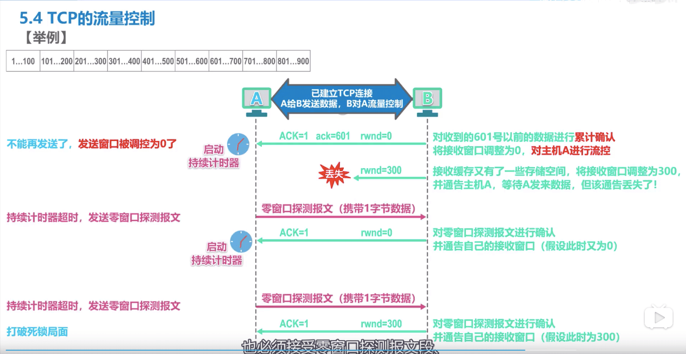
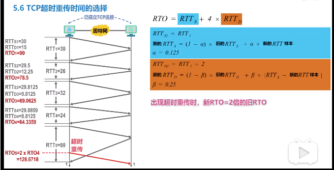

# 1. 流量控制-滑动窗口

<!-- more -->

### 1.0 前提

A->B     A 是发送方, B 是接收方,  各自有自己的滑动窗口

### 1.1  B告诉A的窗口大小

+ rwnd=20  我的窗口20个

+ ack=31  下一次给老子发31

### 1.2  A的窗口移动

+  尾部
  + 往前移动
  + 不动, 因为在等待 ACK 

+ 头部
  + 往前移动
  + 不动, 等待
  + 向后收缩, B 端的窗口变小了(不建议这么做)

### 1.3 A窗口内三个指针

+ P1 已经发送的位置, 未收取到 ACK
+ P2 准备发送的位置
+ P3 尾部

### 1.4  B的窗口状态

+ B 窗口内,  数据未按序到达, 只能现在缓存中,  因为B 只能按正确顺序发送ACK
+ 如果 A 一只没有收到 ACK,还有超时重传机制

### 1.5 总结

+ A的窗口大小不一定和 B 说的一样
  + 传说窗口值有时间滞后
  + 网络拥塞情况

+ B 的不按时序达到的数据如何处理, tcp 没有规定
  + 直接丢弃, 简单, 效率差
  + 缓存在窗口内, 等到收到连续了后, 再 ACK

+ 为了增加效率,  tcp 要求接收方 B 
  + 累计确认, 多个一起确认
  + 捎带确认. 发数据顺便确认, 不经常发生
  + 不能太晚确认, 要不然 A 就超时重传

+ 全双工通信
  + 其实A和B都有发送窗口和接收窗口

##### 1.6. 0窗口检测报文

+ 没有缓存了, 也必须要接收检测或紧急报文

# 2. 拥塞机制(通过算法调整拥塞窗口)

出现拥塞不控制，吞吐量下降，类似堵车。

### 2.0 前提

数据发送 A->B,  B 有足够大的窗口, A 的拥塞窗口根据拥塞调节 

+ > TCP 发送方A的发送窗口 = min(A的自身拥塞窗口, TCP接收方B的接收窗口)

+ 接收窗口 rwnd (receive window)

+ 发送窗口 swnd (send window)

+ 拥塞窗口 cwnd (congestion window)

>  判断拥塞依据, 是 A没有收到 B 的 ACK, A自己发生了超时重传。

### 2.1 A的拥塞窗口大小(cwnd)和慢开始变量 ssthresh

+ cwnd < ssthresh 慢开始算法

+ cwnd >  ssthresh 拥塞避免算法
+ cwnd =  ssthresh  两个算法都可以

### 2.2 窗口变量的变化

cwnd=1

swnd=cwnd，因为取拥塞和接收最小值

ssthresh=16

+ 慢开始算法开始  每次收到 ack, 就+1,  然后 +2,  + 4,  + 8 , 有种指数增长概念

+ 到了16, 变成拥塞避免算法, 每次+1, 收到后再+1
+ 出现了丢包情况,认为拥塞
  + 将cwnd=1，直接到底。
  + 将ssthresh=cwnd/2, 这个时候你开始拥塞了, 取我的一半好了
+ 慢开始算法继续开始

---

### 2.3 快重传，快恢复，避免拥塞窗口直接变1

> 有时候丢包, 是网络问题,并不是拥塞,但是你认为拥塞,  直接让窗口变1了怎么办?

+ 启用快重传机制
+ B 直接给 A 发送3个重复确认
+ 发送方 A 收到了3个重复确认, 说明不是拥塞, 不用慢开始算法, 执行快恢复算法。

+ 
+ 快恢复算法，直接将拥塞窗口和ssthresh等于当前的拥塞窗口的一半
+ 因为相等，继续执行拥塞避免方法

### 2.4 拥塞控制四个算法

+ 慢开始, 指数增加

  + 发送的报文少, 不点都不慢，反而指数增长

+ 拥塞避免, 每次+1

  + 不是避免拥塞, 是线性增长, 试试啥时候拥塞

+ 快重传

  B 数据未按序到达, 就一直发送想要的序号, 一直提醒 A, 让提早重传

  + B要求 A 你快重传, 不要等计时器到了
  + B立即发送确认, 如果不是正确顺序到达, 就发送之前正确顺序的重复确认(为了提醒 A)
  + A 收到了3个连续的重复确认, 就应该立即重传

+ 快恢复

  + 将ssthresh和 cwnd都调整为当前窗口的一半,  他俩相等了再执行拥塞避免算法

# 3. 超时重传时间的选择

+ RTT往返时间 = 开始发送时间 -  收到时间

+ RTO超时时间, 要略大于 RTT 时间

随着环境的不一样, RTT样本差别大, 要计算加权平均

但是如果重传了,由于分不清是对那个的回应, 就不计算了, 还是用以前的RTO*2

