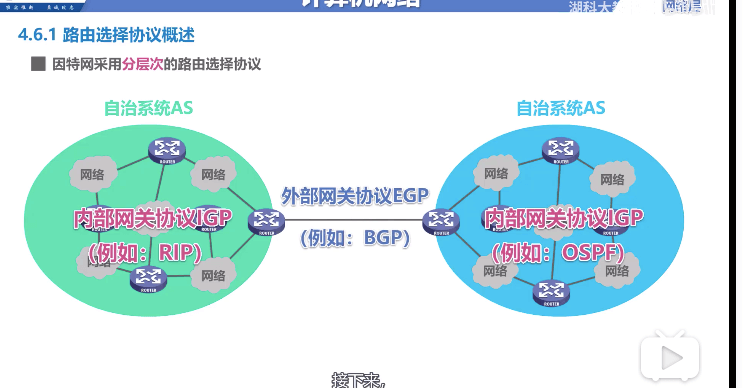
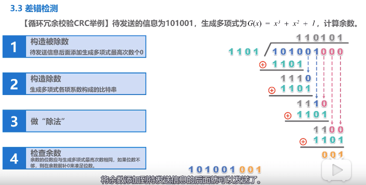

# 1. MAC地址

是对网络上各接口的唯一标识, 注意而不是设备的唯一标识

因为普通电脑就有线网卡和无线网卡, 交换机和路由器更是有多个 mac 地址
<!-- more -->

+ 单播 mac 地址  就是查看自己是否匹配, 匹配接受

+ 广播 mac 地址  FF-FF-FF-FF-FF-FF, 接受

+ 多播 mac 地址 看自己的是否在这个多播租, 在的话接受

# 2. IP 地址

在数据包的转发过程中, 源 ip地址和目的 ip 地址不变, 源 mac 地址和目的 mac 地址一直变

# 3. ARP协议

每个主机有自己的 arp 缓存表,  不知道别人的就需要发送 arp 报文

arp 缓存表有类型, 静态和动态,  一般是动态, 两分钟失效, 因为有可能你换 ip

arp 只能在同一个网络中使用, 不能跨网络询问

# 4. 集线器和交换机

集线器给以太网每个设备发送(物理层)

交换机给目的主机发送(数据链路层,也包括物理层)

集线器和交换机组成的网络属于同一个广播域,就是广播的都能收到

交换机通过自学习的方法, 记录主机 mac 地址所对应的接口号

为了以太网稳定, 一般冗余交换机线路连接, 但是有可能发生广播风暴(环), 可以通过生成树协议STP ,避免环路(最小生成树)

# 5. VALN

一个或多个交换机,不同的接口划分成多个 VLAN

通过 VLAN缩小广播域, 还可以用路由器隔离广播域

交换机接口类型: Access, Trunk, Hybrid(华为)

VLAN 设置, 和主机连接的交换机用 ACCESS端口, 交换机互联的端口用 Trunk 端口

# 6. IPV4

### 6.1 分类编址

网络号+主机号 4个字节32位

A 类 0-127    网络号1个字节

B 类 128-191  网络号2个字节

C 类 192-223 网络号3个字节

D 类  多播地址

E 类  保留使用

### 6.2 划分子网

从主机号借用一部分给子网号,  有种从B类降级到C类的感觉

子网掩码, 前面1代表网络号, 0代表主机号, 然后逻辑与运算, 得到子网的网络地址(网络起始的地址,xxx.xxx.xxx.0)

C 类地址默认子网掩码就是255.255.255.0

### 6.3 无分类编址

忘记前两种方法

128.14.35.7/20 表明20个是主机号

根据无分类, 路由选择最长前缀匹配, 认为越长,路由更具体

# 7. IP数据报

给别人发数据报, 先看自己和别人的网络地址是否一样, 不一样就不在一个网络, 要发给默认网关

默认网关: 指定的转发路由器的 IP 地址

到达路由器时, 检查路由条目, 匹配到正确的网络地址后转发

路由器不转发广播地址

### 7.1 路由表

默认路由 0.0.0.0/0, 				 网络前缀最短,最模糊, 选择优先级最低

特定路由 198.168.1.2/32        网络前缀最长,最具体, 选择优先级最高

因为有默认路由的存在(少了路由条目发给默认路由, 不存在的网络也给默认路由), 容易发生路由环路的问题, 所以 IP 数据报有 TTL , 变成0了就丢弃

### 7.2 路由选择协议

一个网络,组成自治系统 AS

两个AS 之间用外部网关协议 EGP

AS内部用内部网关协议 IGP

##### 7.2.1 RIP 内部网关,UDP

经过一个路由+1, 认为越短的路由就是好的路由, 跳数大于15,表明不可达

如果距离一样, 可以负载均衡

路由器仅和相邻路由器周期交换路由信息

##### 7.2.2 OSPF 内部网关,IP

克服 RIP 缺点,1989年开发出

路由器之间有代价, 采用最短路径算法(迪杰斯特拉)

##### 7.2.3 BGP 外部网关,tcp

只是能找到到达的比较好路由, 不是最佳路由

不同的 AS自治系统发言人建立 tcp 连接,交流信息

# 8. ipv4首部格式

固定20字节+ 40字节可变部分

### 8.1 固定20字节

+ 版本4bit + 首部长度(4字节的整数倍) 4bit +区分服务 8bit + 总长度(首部+数据) 16bit 
+  标识 标志 片偏移   三个用于 ip数据报分片
+ 生存时间TTL(以跳数对单位)协议8bit +   协议8bit(1 icmp 2 igmp 6tcp 17udp 41ipv6 89 ospf) + 首部检验和16bit(检测首部是否出错, ipv6不再检验)
+ 源 IP地址  32bit
+ 目的 IP地址 32bit

### 8.2 IP数据报分片

以太网数据载荷部分最大1500字节的限制(MTU), IP数据报太大的话, 需要分片发送

# 9. ICMP网际控制报文协议

封装在 IP 数据报中发送, 向源点报错  和 向其他主机询问

+ 差错报告报文
  + 终点不可打
  + 源点抑制
  + 时间超过
  + 参数问题
  + 改变路由

+ 询问报文
  + 回送请求和回答 
    + ping 命令, 不通过 tcp 和 udp  
    +  tracert 命令, 用来看经过哪些路由器
  + 时间戳请求和回答

# 10. 虚拟专用网vpn和 网络地址转换NAT

### 10.1 私有地址

+ 10.0.0.0/8
+ 172.16.0.0/12
+ 192.168.0.0/16

### 10.2 不同局域网间的发送

+ 路由器不转发私有地址

+ 所以对内部 IP数据报, 进行加密, 再次套一个首部, 写上公网地址
+ 又叫 IP 隧道技术

### 10.3 NAT

+ 路由器上安装 NAT 软件
+ 到路由器的时候,转换全球地址, 记录在路由器的 NAT转换表里
+ NAPT路由器, 将端口号和 IP 地址一起转换
+ NAT, 外网不能主动发起到内网的主机, 内网主机不能充当服务器, 如果可以,就要特殊穿透技术

> # 运输层

# 11. 运输层

### 11.1 端口号  0-65535

+ 熟知端口号 0-1023 个人不能用
+ 登记端口号 1024-49151 也得IANA登记
+ 短暂端口号 49152-65535 

### 11.2 发送复用和接收分用

> # 数据链路层

# 12. 数据链路层

#### 12.1 封装成帧

添加帧头, 添加帧尾来标志

如果数据里面有帧的定界标志, 就对数据进行一个转义, 否则会认为错误的结束位置

帧的最大数据长度有限制, 叫做 MTU

#### 12.2 差错检测

+ 奇偶校验
  + 在数据后面添加1位奇偶校验位, 使1的个数为奇数或偶数
  + 不靠谱, 一半的失误率

+ CRC 校验

  

  

#### 12.3 可靠传输

+ 一般链路层在有线以太网不实现可靠传输, 无线局域网信号差, 实现可靠传输

+ 停止等待协议SW

  + 信道利用率特别低

    

+ 回退 N 帧协议GBN 

  + 通过发送窗口发送, 累计确认增大效率
  + 但是发送5个, 第1个出错, 会连累剩下的4个, 造成5个都需要重传, 差的情况下效率也不高
  + 接收窗口只能是1

+ 选择重传协议SR

  + 接收窗口大于1, 有了缓存
  + 不能累计确认,只能逐一确认

# 13 数据链路层协议

#### 13.1 点对点协议 PPP

不提供可靠传输服务

> # 应用层

# 20. DHCP 

dhcp 服务端口udp 68,  客户端 udp 67

dhcp 服务器, 一般集成在路由器里

客户通过 dhcp 客户端向 dhcp 服务器请求, 得到 IP租用, 时间过了一半后,重新发送租用请求

在使用的时候需要用 arp 请求确定 ip 未被占用