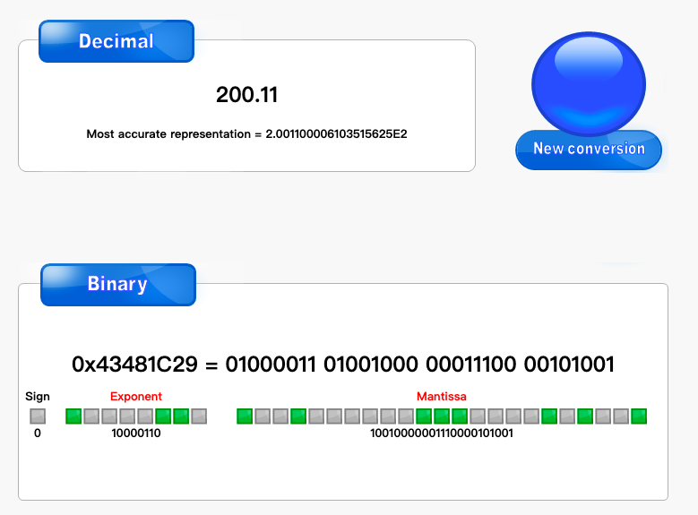

# 1. 计算200.11D的 IEEE754单精度浮点数

### 1.1 整数部分200求二进制

|       | 结果 | 余数 |
| ----- | ---- | ---- |
| 200/2 | 100  | 0    |
| 100/2 | 50   | 0    |
| 50/2  | 25   | 0    |
| 25/2  | 12   | 1    |
| 12/2  | 6    | 0    |
| 6/2   | 3    | 0    |
| 3/2   | 1    | 1    |
| 1/2   | 0    | 1    |

二进制为: 1100 1000 (倒序)

<!-- more -->

### 1.2 小数部分0.11求二进制

|        | 结果 | 整数部分 |
| ------ | ---- | -------- |
| 0.11*2 | 0.22 | 0        |
| 0.22*2 | 0.44 | 0        |
| 0.44*2 | 0.88 | 0        |
| 0.88*2 | 1.76 | 1        |
| 0.76*2 | 1.52 | 1        |
| 0.52*2 | 1.04 | 1        |
| 0.04*2 | 0.08 | 0        |
| 0.08*2 | 0.16 | 0        |

二进制为 0001 1100(正序)

整个二进制为: 200.11D = 11001000.00011100

### 1.3 求IEEE754

+ 计算

  ```bash
  +200.11 = +11001000.00011100
  
  = +1.1001000 00011100 * 2^7    e=7=134-127
  
  S = 0(符号位)
  E = 134D =10000110B (134的二进制)
  M = 1001 0000 0011 1000 0000 000 (小数点1后面的,补齐23位)
  ```

+ 所以二进制存储格式为

  | 符号位 | E(8位)    | M(23位)                      |
  | ------ | --------- | ---------------------------- |
  | 0      | 1000 0110 | 1001 0000 0011 1000 0000 000 |

  

### 1.4 总结

+ 单精度浮点数字长32位，尾数长度23，指数长度8, 指数偏移量127；

+ https://www.binaryconvert.com/convert_float.html


# 2. 计算10001101的奇校验码和偶校验码(校验位放在首位)

P=D1⊕D2⊕D3⊕D4⊕D5⊕D6⊕D7⊕D8

P* =P⊕D1⊕D2⊕D3⊕D4⊕D5⊕D6⊕D7⊕D8

数据: 10001101 

+ 奇校验码(1的个数为奇数)

  1 10001101

+ 偶校验码(1的个数为偶数)

  0 10001101


# 3. 计算数据 D=D4D3D2D1=1110的海明码(奇校验)

### 3.1 计算

2^r >= 4+1+r,   r = 3

数据位为 D4D3D2D1

校验位为 P3P2P1

| 索引       | 7     | 6    | 5    | 4    | 3    | 2    | 1    |
| ---------- | ----- | ---- | ---- | ---- | ---- | ---- | ---- |
| 信息位     | D4    | D3   | D2   | P3   | D1   | P2   | P1   |
| 信息位值 | 1     | 1    | 1    | P3   | 0    | P2   | P1   |
| 二进制 | 111 | 110 | 101 | (100) | 011 | (010) | (001) |


P1 = D1⊕ D2 ⊕ D4 =  0 ⊕ 1 ⊕ 1 = 1(奇检验)

P2 = D1⊕ D3 ⊕ D4 = 0 ⊕ 1 ⊕ 1 = 1(奇检验)

P3 = D2⊕ D3 ⊕ D4 = 1 ⊕ 1 ⊕ 1 = 0(奇检验)

所以奇校验的海明码为:  111 P3 0 P2 P1 =  1110 011

### 3.2 总结

+ 2^r ≥ k+r+1,  r 是校验位


# 4. 计算信息多项式:101010110,生成多项式1100的CRC校验码

1110 = x^3 + x^2 + x^ 1 + 0

+ 先补充最高位次数,   101010 110 000
+ 除数1100

| 商:     |       |       |         | 1       | 1    | 0    | 0    | 1    | 1 | 0 | 1 | 1 | | |
| ------- | ----- | ----- | ------- | ------- | ---- | ---- | ---- | ---- | ---- | ---- | ---- | ---- | ------- | ------- |
| 被除数: | 1     | 0     | 1       | 0       | 1    | 0    | 1    | 1    | 0    | 0    | 0    | 0    | | |
|     | **1** | **1** | **0** | **0** |      |      |      |      |      |      |      |      | | |
|     |       | 1     | 1       | 0       | 1    |      |      |      |      |      |      |      | | |
|     |       | **1** | **1**   | **0**   | **0** |      |      |      |      |      |      |      | | |
|     |       |       |         |         | 1    | 0    | 1    | 1    |      |      |      |      | | |
|     |       |       |         |         | **1** | **1** | **0** | **0** |      |      |      |      | | |
|     |       |       |         |         |      | 1 | 1 | 1 | 0 |      |      |      | | |
|     |       |       |         |      |   | **1** | **1** | **0** | **0** |      |      |      | | |
|     |       |       |         |         |      |      |      | 1 | 0 | 0 | 0 |      | | |
|     |       |       |         |         |      |      |   | **1** | **1** | **0** | **0** |      | | |
|     |       |       |         |         |      |      |      |      | 1 | 0 | 0 | 0 | | |
|  | | | | | | | | | **1** | **1** | **0** | **0** | | |
|  | | | | | | | | |  | 1 | 0 | 0 | | |
|  | | | | | | | | |  |  |  |  | | |

余数为100

所以CRC校验码为: 101010110 100

### 4.2 计算步骤

1. 用最高位补齐被除数
2. 拿出除数, 进行异或运算
3. 商: 够除是1, 不够除是0
4. 如果余数不足最高次数,  需要补齐0
5. 把余数放在多项式后面即可


# 5. 寻址方式

+ 指令寻址方式

+ 操作数寻址方式

  + 立即寻址

    指令中直接给出操作数，指令中的形式地址字段即为操作数，又称为立即数寻址。

  + 隐含寻址

    隐含寻址是指令字中不明确给出操作数的地址，其操作数隐含在操作码或某个寄存器中。

  + 直接寻址

      指令中地址码字段中给出的地址，即为操作数在主存中的地址，操作数在主存中。

  + 间接寻址

    指令中地址码字段中给出的地址，是操作数在主存中地址的地址，操作数在主存中。

  + 寄存器直接寻址

      指令中地址码给出的是寄存器的编号，操作数在指定的寄存器中。

      由于操作数不在主存中,故这种寻址方式无需访存，减少了指令执行时间。由于地址字段只需指明寄存器编号,故位数较少，节省了存储空间。  因此，寄存器直接寻址方式得到广泛应用。

  + 寄存器间接寻址

    指令中地址码给出的是寄存器的编号，该寄存器中的内容为操作数地址，操作数在主存中。

     这也是一种访内的寻址方式，与存储器间接寻址相比较，只需一次访内即可获得操作数，提高了执行速度，同样得到广泛应用。

  + 相对寻址

    相对寻址是把程序计数器PC的内容加上指令格式中的形式地址D(相对量)而形成操作数的有效地址。

    相对寻址的最大特点是操作数地址与指令地址之间总是相差一个固定值，操作数地址随PC的变化而变化。因此，支持程序在主存中任意浮动。

  + 变址寻址

    变址寻址方式：是把变址寄存器BX的内容与偏移量D之和作为操作数有效地址。(有时通用寄存器也可作为变址器使用)

    变址寄存器的内容是由程序员设定的，在程序执行过程中其内容可变，而指令字中的偏移量D是不可变的。 变址寻址主要用于数组处理。

  + 基址寻址

    基址寻址方式：是把变址寄存器BR的内容与偏移量D之和作为操作数有效地址。(有时通用寄存器也可作为变址器使用)

    基址寻址可以扩大指令对主存的寻址范围。在多道程序和浮动程序编制时十分有用。

  + 段寻址

     段寻址是一种为了扩大寻址范围而采用的技术。

    如采用将16位的段寄存器左移4位、加上16位的偏移量形成20位的物理地址，扩大了寻址空间。
    
  + 复合寻址方式：

     是将两种基本寻址方式结合形成。


# 6. 参考资料

+ https://blog.csdn.net/crjmail/article/details/79723051
+ https://zhuanlan.zhihu.com/p/26509678
+ https://www.bilibili.com/video/BV1SJ41157pR
+ https://www.bilibili.com/video/BV1xJ411K7Wx