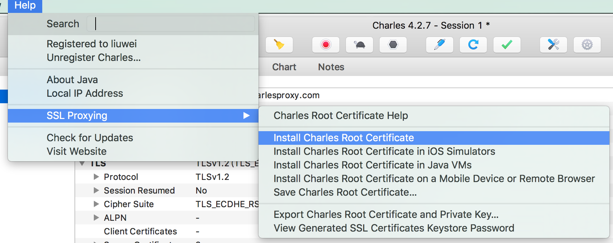
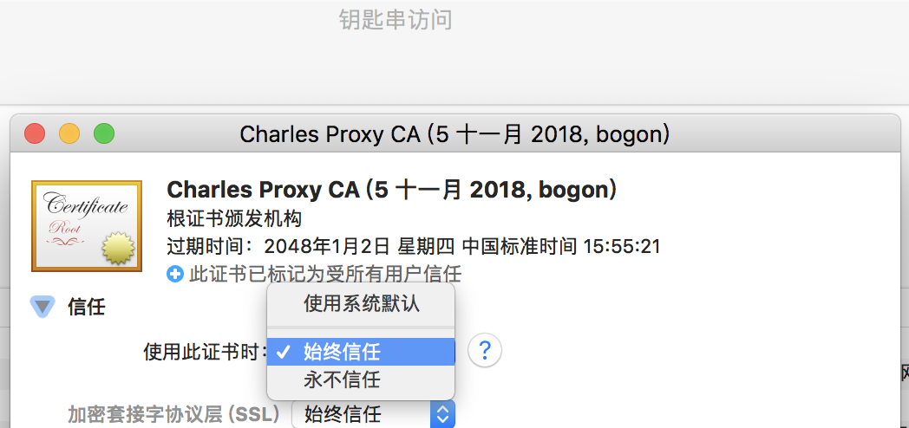
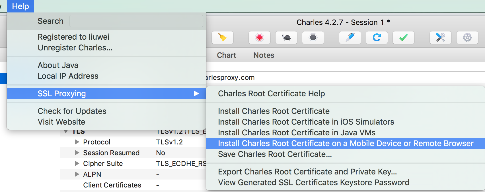
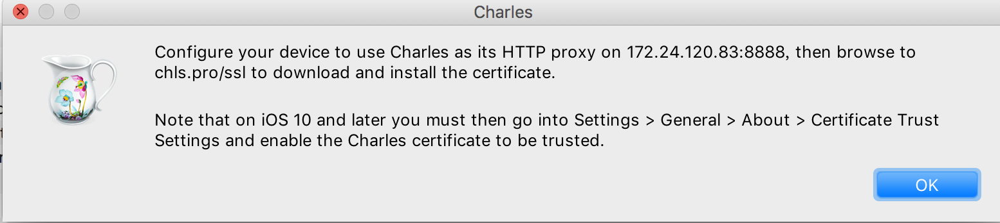
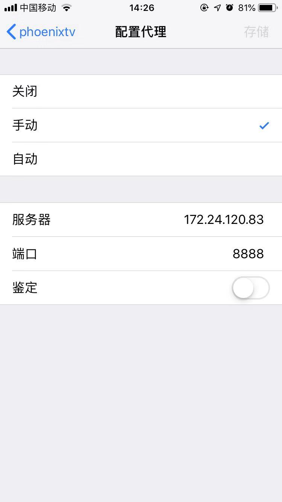
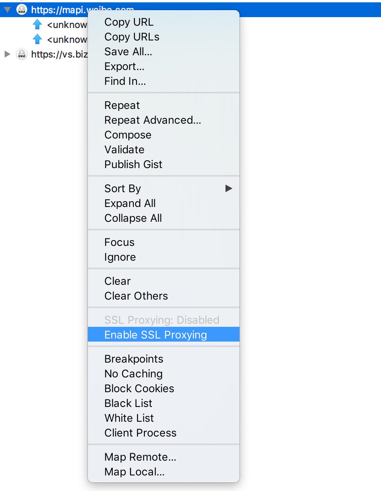

### 1. Charles 软件破解

https://github.com/8enet/Charles-Crack

https://www.zzzmode.com/mytools/charles/

发现一个更好用的抓包软件, 免费

https://github.com/ProxymanApp/Proxyman

### 2. Charles Mac Chrome抓包

需要注意的是，Chrome 和 Firefox 浏览器默认并不使用系统的代理服务器设置，而 Charles 是通过将自己设置成代理服务器来完成封包截取的，所以在默认情况下无法截取 Chrome 和 Firefox 浏览器的网络通讯内容。

1. 访问: chrome://settings/   
2. 然后下拉到最后的高级，下来在“系统”（倒数第二个）的条目下找到“打开代理设置”，然后双击打开之后，打开之后找到代理的tab点开，点开之后可以看到请选择一个协议进行配置，这个时候找到“网页代理(http)”和“安全网页代理(https)”，进行相应的配置就可以了，一般来说自己不做其他处理，直接配置代理服务器为“127.0.0.1”，端口(就是冒号:)后是“8888”。
3. 如何抓https网站, 在charles左侧该网址右键 Enable SSL Proxying

<!-- more -->

### 3. Charles 手机 Https抓包

##### 1. 安装电脑端证书  在`Help`菜单下的路径,下载根证书,并且在`钥匙串`里设置信任此证书.

##### 2. 安装手机证书

在相关的手机中打开`Safari`,输入下图中默认的地址`chls.pro/ssl`，手机会自动跳转到证书下载界面，按照提示安装即可.

安装后,设置信任此证书.

##### 3. 配置手机Wifi代理和开启Charles SSL Proxy

最新系统多了一道程序:

+ 需要在关于本机->证书信任设置->再次信任一下证书

### 4. Charles可以抓取https报文的原理

原理就是: **中间人攻击**

> Charles 作为一个中间人来进行 HTTPS 的代理，让我们检测到浏览器和 SSL web 服务端之间的明文通信。
>  Charles 把自己变成一个中间人来达到这一目的。你的浏览器是收不到服务端证书的，Charles 会用自己的根证书动态签发一张证书，然后 Charles 来接受服务端的证书，你的浏览器接受 Charles 的证书。
>  …
>  Charles 仍然通过 SSL 与服务端进行通信，但通信是通过浏览器到 Charles，然后在从 Charles 到服务器。

通俗版SSL协议原理:

- 小明和小王是一对好基友，但是远隔万水千山，只能通过写信来传递消息。俩人每天的信件都是通过邮递员小红来传递的，这俩人每天纸条上明文写着信息，小红也天天看的不亦乐乎，这就是 HTTP。
- 时间久了，两人发现不行，比如有时候会传递一些不和谐的内容，不希望小红这样的腐女看到；于是小明灵机一动，换成葬爱家族的杀马特火星文来进行通信；小王看后，心领神会。由于转换方式两人都知道，这就是对称加密技术。
- 然而好景不长，小红勤学苦练，终于练成了火星文十级，又能看懂俩人加密的内容了。俩人必须要更换加密方式，但是更换的加密方式也只能通过小红来传递，所以这个加密的手段很难瞒住小红，这就是 HTTP 的不安全性。
- 正好小明是一位博学的哲♂学家，他立刻写了封信给小王：把你家储物间箱子的上那把挂锁寄过来！小王看后立刻拿出了那把 82 年的挂锁，把它打开并寄给了小明。这个锁大家都能看到，但只有小王有钥匙，这就是传说中的非对称加密，锁就是公钥，小王的钥匙就是私钥。
- 小明收到后，仔细研究了那把锁，上面烫着『隔壁老王』四个鎏金大字，正是王家祖传的锁，这就是验证服务端的数字证书。
   于是小明放心的把新的加密方式写在信中，放到盒子里，然后用锁锁上。由于小红没有钥匙，没法查看盒子里到底写了啥，只能原样送过去。小王收到后，用自己的钥匙打开了锁，获得了新的加密方式。这就完成了 SSL 协议的握手。

利用Charles之后的场景:

- 小红拿到锁以后，先扣着不发，然后掏出了自己的锁寄给小明，这就是 Charles 签发了自己根证书；
- 小明一看这把锁不是正宗王家的，但是小红家的锁，似乎也可以相信，这就是信任了 Charles 的根证书；
- 小明把加密方式写进去，然后用小红的锁锁起来了，小红打开之后研究了加密方式，发现两人是在用水星文进行交流，瞬间水星文也达到了十级，然后在换上小王的锁锁上了盒子，还给了小王；
- 小王毫不知情，之后俩人用水星文进行交流，但内容已经全被小红捕获到了。

参考链接:

+ https://blog.devtang.com/2015/11/14/charles-introduction/  Charles 从入门到精通
+ https://www.ruanyifeng.com/blog/2014/09/illustration-ssl.html  图解SSL/TLS协议
+ https://www.laoqingcai.com/https-mitm/ 中间人攻击