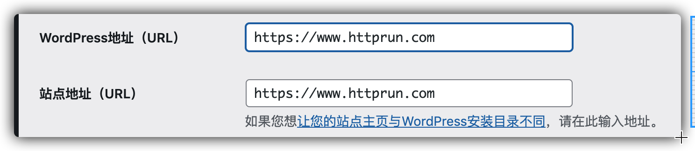

# 1. 安装插件需要ftp

Wordpress安装主题或者插件的时候会遇到需要输入FTP的情况，这种情况是由于网站目录权限引起的。

<!-- more -->

1. 在wp-config.php文件添加以下代码：

```bash
define('FS_METHOD','direct');
```

2. 修改wp安装目录权限

```bash
chmod -R 755 /var/www/wordpress/
chown -R nobody:nobody /var/www/wordpress/  # 不知道用户可以把目录权限改成777
```


# 2. 配置 https


1. 使用腾讯云免费1年的证书(域名)

2. 配置 nginx

   ```nginx
   server {
       listen 80;
       listen [::]:80;
       server_name httprun.com www.httprun.com;
       return 301 https://www.httprun.com$request_uri;
   }
   
   
   server {
     listen 443;
     listen [::]:443;
     server_name httprun.com www.httprun.com;
   
     ssl on;
     ssl_certificate /etc/nginx/ssl/wordpress/1_www.httprun.com_bundle.crt;
     ssl_certificate_key /etc/nginx/ssl/wordpress/2_www.httprun.com.key;
     ssl_session_timeout 5m;
     ssl_protocols TLSv1 TLSv1.1 TLSv1.2;
     ssl_ciphers ECDHE-RSA-AES128-GCM-SHA256:HIGH:!aNULL:!MD5:!RC4:!DHE;
     ssl_prefer_server_ciphers on;
   
     root   /var/www/wordpress/;
   
     location / {
             index  index.html index.htm index.php;
     }
   
     location ~ \.php {
             fastcgi_pass   127.0.0.1:9000;
             fastcgi_index  index.php;
             fastcgi_param  SCRIPT_FILENAME  $document_root$fastcgi_script_name;
             include        fastcgi_params;
     }
   }
   ```

   


3. 进入WP后台，进入设置-常规 将WordPress地址（URL）、站点地址（URL）两项修改为：https。

   


4. 登录和后台强制开启SSL, 修改WP-config.php文件

   ```bash
   define('FORCE_SSL_LOGIN', true);
   define('FORCE_SSL_ADMIN', true);
   ```


5. 修改数据库的历史 url

   ```mysql
   update wp_posts set post_content = replace(post_content, 'http://www.httprun.com','https://www.httprun.com');
   ```


# 3. 参考资料

+ https://www.wpcom.cn/tutorial/101.html

+ https://ws234.com/344.html