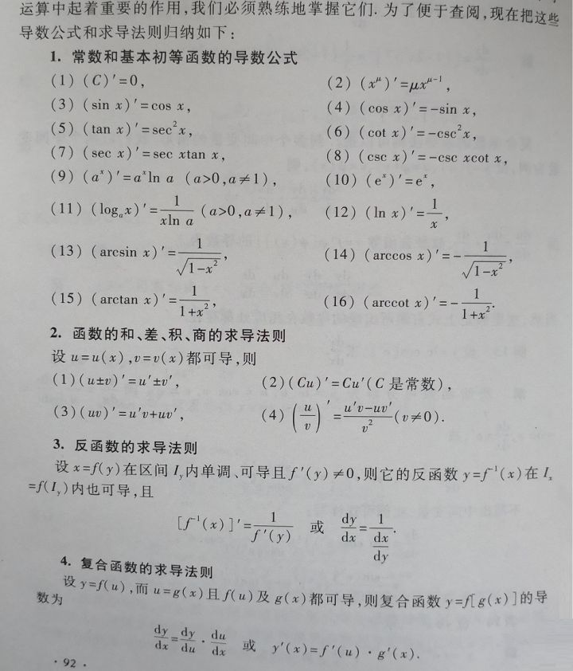
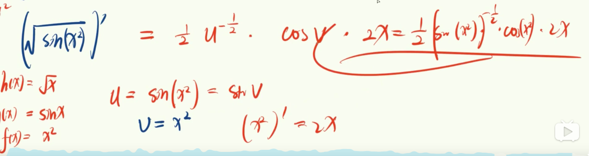
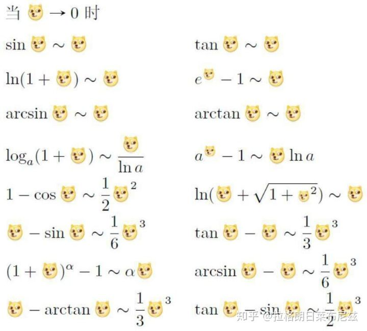

做题, 不刷视频!!!!!!!!! 不会再找视频看

<!-- more -->

# 1. 基础

### 1.1 三角函数

sin    1 2 3              2为底

cos   3 2 1             2为底

tan    3 9 27          3为底

### 1.2 对数

其实是求指数的

+ 真数如果有次数, 直接提前 loga(B^2) = 2 logaB
+ 换底公式, logaB   = lgB/lga

### 1.3 导数

##### 1.3.1 导数运算

+ 相加相减, 就是求导后依次相加,相减
+ 相乘  左导右不导 + 右导左不导
+ 相除  (左导右不导 - 右导左不导) / (右)^2

##### 1.3.2 复合函数求导

+ 链式法则, 先把里面的当成一个未知数来看, 先求外面的导, 再乘以里面未知数的求导
+ 最后再把未知数给带回去

##### 1.3.3 洛必达法则

+ 是对0/0, 正无穷/正无穷 的值的时候, 上下都求导
+ 如果导一次分母还是0, 就一直导下去, 类似洛神
+ 可能无法化简, 或者洛必达之后极限不存在, 说明洛必达失效, 而不是原函数没有极限

# 2. 高数

### 2.1 无穷小量

趋向于0的动态变量, 比较: 都是无穷小, 谁快谁高阶

+ 高阶: 0/k = 0 先到达水晶

+ 低阶 k/0 = 正无穷

+ 同阶,  k(k!=1)  能量大小差不多数 
+ 相等, 1

##### 2.1.1 常用等价无穷小量 波浪线~

##### 2.1.2 求无穷小量的阶数

### 2.2 微分

+ dF(x) 是 F(x)的微分

### 2.3 积分

+ 定积分  Sa,b   f(x) dx

+ 不定积分 F(x) = S f(x) dx

  

### 2.5 极限

x->0+   x 从右侧趋近于0

x->0-   x 从左侧趋近于0

### 2.6 间断点

+ 第一类间断点

  + 可去间断点   左右极限存在且相等, 但是中间没有值
  + 跳跃间断点  左右极限存在不相等

+ 第二类间断点

  有一个极限不存在

+ 总结
  + 先看定义域, 再看极限

#### 2.7 拐点

+ 两次导, 等于的0的点
+ `>0` 凹区间
+ `<0` 凸区间

#### 2.8 驻点

一次导=0的点

### 2.6 泰勒公式

