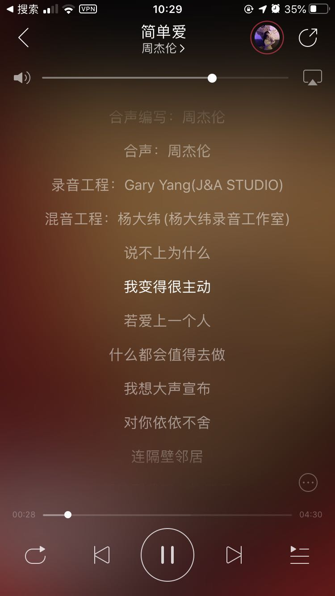
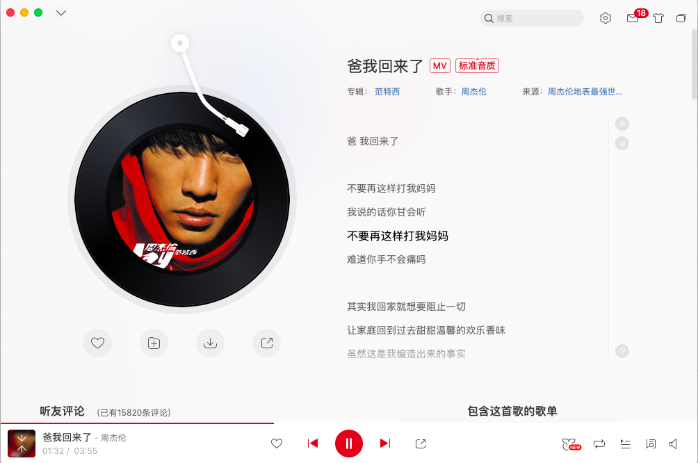

### 0. 前言

谈起音乐软件, 只钟情网易云音乐. 奈何版权太少, 歌单里好多音乐涉及到版权的问题无法听, 即使开了VIP也不行.

但是我们可以通过一些“奇淫技巧”来实现解锁灰色无版权歌曲，效果比开了黑胶VIP 还要强大.

声明：本工具只提供大家免费测试学习使用，请勿用作任何商业用途。

<!-- more -->

### 1. 项目介绍

https://github.com/nondanee/UnblockNeteaseMusic

其原理是通过流量进入代理后来匹配网易链接进行劫持，然后将requests请求修改重新发送一个新的链接（这个链接就是provider的），请求到音乐以后再重新将provider的response改写成网易的，然后返回到应用，通俗的说是修改http请求和响应。

整个配置参考了这个项目,  唯一不足的是教程散落在仓库的各大 issue. 因为只常用 ios 和 mac 的设备,所以只测试了这两个平台, 上测试效果图:






### 2. 配置

把项目下载到云服务器上, 直接 node app.js 即可运行. 因为 ios 和 mac 平台的特殊性, 需要加一些参数,参考下面配置.


##### 2.1 先给域名加个解析

我这里给 music.liuvv.com 解析到云服务器ip


##### 2.2 启动systemctl 配置

 ```
[Unit]
Description=music
After=network.target
[Service]
ExecStart=/usr/bin/node /opt/UnblockNeteaseMusic/app.js -e https://music.liuvv.com -s -p 8080:8081
Restart=always
RestartSec=5
[Install]
WantedBy=default.target
 ```

这里启动的参数格式是 node app.js -e 域名 -s -p  http端口:https端口


##### 2.2 nginx 配置

```nginx
server {
  listen 443;
  server_name music.liuvv.com; # 改为自己的域名

  ssl on;
  ssl_certificate /etc/nginx/ssl/music/cert.pem; # 改为自己申请得到的 crt 文件的名称
  ssl_certificate_key /etc/nginx/ssl/music/key.pem; # 改为自己申请得到的 key 文件的名称
  ssl_session_timeout 5m;
  ssl_protocols TLSv1 TLSv1.1 TLSv1.2;
  ssl_ciphers ECDHE-RSA-AES128-GCM-SHA256:HIGH:!aNULL:!MD5:!RC4:!DHE;
  ssl_prefer_server_ciphers on;

  location / {
    proxy_pass http://localhost:8080; # 转发
  }
}
```


这里`ssl_certificate`和`ssl_certificate_key` 需要用 acme.sh 生成证书.

 https://github.com/acmesh-official/acme.sh

```bash
acme.sh --installcert -d music.liuvv.com \ 
--key-file       /etc/nginx/ssl/music/key.pem  \ 
--fullchain-file /etc/nginx/ssl/music/cert.pem 
```


### 3. ios 使用

教程散落在这个 issue  https://github.com/nondanee/UnblockNeteaseMusic/issues/65

+ 去美区 appstore, 下载个小火箭

- 右上角加号添加节点
- 类型选择 HTTP
- 服务器填写你的服务器公网 IP
- 端口填写你启动服务的端口号（默认为 8080）
- 然后底部找到配置 点击本地文件 -> default.conf -> 编辑配置
- 添加三条规则 选项选择你刚刚添加的节点
  - `USER-AGENT`: `NeteaseMusic*`
  - `DOMAIN-SUFFIX`: `163.com`
  - `DOMAIN-SUFFIX`: `126.net`

+ 打开网易云, 搜索周杰伦


### 4. mac 使用

mac 因为最新版本的原因(我的版本2.3.2 (832)),  需要通过自签证书解决https 请求.

教程散落在这个 issue https://github.com/nondanee/UnblockNeteaseMusic/issues/48


+ 安装仓库内的 CA证书到系统钥匙链, 并始终信任. 
+ 在系统偏好设置里, 网络->代理->自动代理配置里, 填写 url  `http://公网ip:8080/proxy.pac`
+ 打开网易云, 搜索周杰伦


### 5. 一边科学上网一边

在 mac下, 虽然可以通过系统代理达到目的, 但还是建议走代理软件. 

我用的是 clashX, 先上 mac 的 clashX 配置

```yaml
port: 7890
socks-port: 7891
allow-lan: false
mode: Rule
log-level: silent
external-controller: 127.0.0.1:9090

dns:
  enable: true
  listen: 0.0.0.0:53
  enhanced-mode: fake-ip
  nameserver:
   - 119.29.29.29
   - 223.5.5.5

Proxy:
- name: "UnblockMusic"
  type: http
  server: 公网ip
  port: 8080

Proxy Group:
- name: "Netease Music"
  type: select
  proxies: 
    - UnblockMusic
    - DIRECT

Rule:
# Unblock Netease Music
- DOMAIN,api.iplay.163.com,Netease Music
- DOMAIN,apm3.music.163.com,Netease Music
- DOMAIN,apm.music.163.com,Netease Music
- DOMAIN,interface3.music.163.com,Netease Music
- DOMAIN,interface.music.163.com,Netease Music
- DOMAIN,music.163.com,Netease Music
- DOMAIN,music.126.net,Netease Music
- DOMAIN-SUFFIX,163yun.com,Netease Music
- DOMAIN-SUFFIX,mam.netease.com,Netease Music
- DOMAIN-SUFFIX,hz.netease.com,Netease Music

# CIDR规则
- IP-CIDR,39.105.63.80/32,Netease Music
- IP-CIDR,45.254.48.1/32,Netease Music
- IP-CIDR,47.100.127.239/32,Netease Music
- IP-CIDR,59.111.160.195/32,Netease Music
- IP-CIDR,59.111.160.197/32,Netease Music
- IP-CIDR,59.111.181.35/32,Netease Music
- IP-CIDR,59.111.181.38/32,Netease Music
- IP-CIDR,59.111.181.60/32,Netease Music
- IP-CIDR,101.71.154.241/32,Netease Music
- IP-CIDR,103.126.92.132/32,Netease Music
- IP-CIDR,103.126.92.133/32,Netease Music
- IP-CIDR,112.13.119.17/32,Netease Music
- IP-CIDR,112.13.122.1/32,Netease Music
- IP-CIDR,115.236.118.33/32,Netease Music
- IP-CIDR,115.236.121.1/32,Netease Music
- IP-CIDR,118.24.63.156/32,Netease Music
- IP-CIDR,193.112.159.225/32,Netease Music
- IP-CIDR,223.252.199.66/32,Netease Music
- IP-CIDR,223.252.199.67/32,Netease Music
- IP-CIDR,59.111.21.14/31,Netease Music
- IP-CIDR,59.111.179.214/32,Netease Music
- IP-CIDR,59.111.238.29/32,Netease Music

# Advertising
- DOMAIN,admusicpic.music.126.net,REJECT
- DOMAIN,iadmat.nosdn.127.net,REJECT
- DOMAIN,iadmusicmat.music.126.net,REJECT
- DOMAIN,iadmusicmatvideo.music.126.net,REJECT

# Final
- MATCH,DIRECT
```

启动这个配置再打开网易云, 加载速度就会特别丝滑. 

但是大多数情况下需要一边科学上网一边听歌, 所以只需要把上面这个 Rule 规则合并你翻墙的规则里即可. 因为有规则优先级的顺序问题, 需要把上述 Rule 配置放到自己的 Rule 配置前面.


### 6. 参考资料

+ https://github.com/nondanee/UnblockNeteaseMusic
+ https://www.yfriend.xyz/155.html